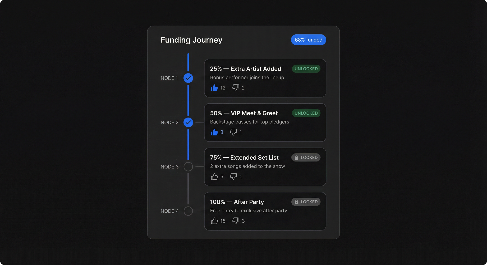
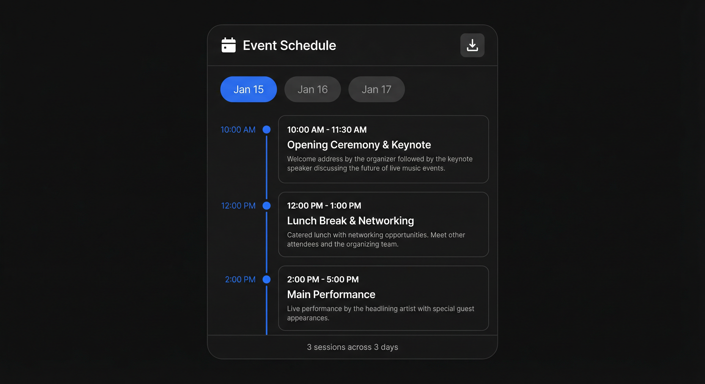
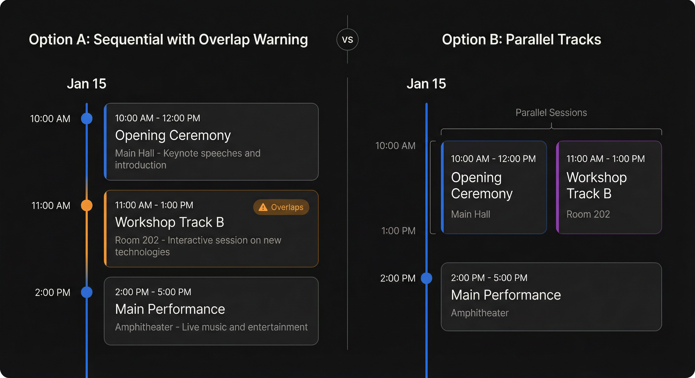

r# Crowd Funding Event — Features

This document lists **implemented features**, **unused endpoints**, **completed phases**, and **unimplemented items**.

---

## Currently Implemented

### Authentication & Users
- Firebase Auth (email/password), backend token verify, login/register screens
- Roles: admin, organizer, customer
- Profile (GET/PATCH /me): display name, phone, username (mandatory)
- Email hidden everywhere except admin dashboard

### Venues
- CRUD for organizers (create, read, update, delete)
- List: organizers see own; customers see all
- Inline venue creation on the Create Event page
- **Search bar** on Venues page — filter by name, address, or capacity
- **Mapbox address autocomplete** on venue creation — typing an address shows Mapbox Geocoding v6 suggestions; selecting a suggestion auto-fills address, city, province, and lat/lng (hidden fields); green checkmark and coordinates shown when location is resolved
- Lat/lng fields hidden from user — auto-populated from geocoding selection

### Events — CRUD & Lifecycle
- Create event (organizer/admin) with genre (required), posts toggle, funding fields
- **Community rules toggle** on create/edit (draft only) — applies platform community rules to any event regardless of genre; locked once event leaves draft
- **Two-date system:** Event Date (start/end) and Funding Deadline are independent — at least one must be set before publishing
- **Publish validation:** Cannot publish without setting at least one of `funding_end_at` or `start_time`; frontend shows inline hint and disables button until satisfied
- **Mandatory funding goal:** When a funding deadline is set, a funding goal is required (enforced on both create and update)
- **Edit event:** Draft and unpublished (pending_approval) events edit freely; only **substantive field changes** (title, description, dates, funding settings, genre, etc.) on approved/waiting events move to `pending_approval` for re-approval. **Operational changes** (venue, capacity, ticket strategy, posts toggle) never trigger re-approval. Admin edits bypass approval entirely.
- **Delete event:** Only `draft` or `cancelled` events can be permanently deleted
- Cancel event (with mandatory reason) — available for unpublished, approved, and waiting_event_date events (direct cancel); **selling_tickets requires admin approval** (organizer sends cancellation request, admin reviews and approves/rejects)
- Reactivate cancelled event (cancelled -> draft)
- Publish draft event (draft -> approved); status label shows **"Under Review"** instead of "Unpublished" for `pending_approval`
- **Clone completed events** into a new draft with **editable title** (dialog prompts for new title, defaults to "Original Title (Copy)"), all parameters pre-filled (no dates, preserves community rules)
- **Venue picker** — full-page searchable screen for selecting a venue (highlights current selection)
- **Strategy picker** — full-page searchable screen for selecting a ticket strategy (shows tier details, highlights current selection)

### Event Lifecycle State Machine
- **Statuses:** `draft` → `pending_approval` → `approved` → `selling_tickets` / `waiting_event_date` → `live` → `completed`
- **Both Fund + Event date set:** After funding deadline passes → `selling_tickets` (pledge/unregister blocked, buy tickets only) → at event start → `live` → at event end → `completed`
- **Only Fund date set:** After funding deadline → `waiting_event_date` (organizer has configurable grace period to set event date, default 7 days via `event_date_grace_days` admin setting). If deadline passes without date → auto-cancel + refund registered users (guest pledges held for admin). Once date set → `selling_tickets` → `live` → `completed`
- **Only Event date set:** Goes to `selling_tickets` (no funding phase) → `live` → `completed`
- **Auto-transition:** Status transitions are checked automatically on every event fetch (no cron jobs)
- **State restrictions:** Pledge and unregister blocked in `selling_tickets`, `waiting_event_date`, `live`, `completed`
- **Spot release on live transition:** All unredeemed reserved spots from pledges are released (set to 0) when the event transitions to `live`, recalculating capacity based on actual tickets sold
- **Terminal state:** `completed` is the only true dead-end — no transition out; only action is to clone into a new draft
- **Near-terminal:** `live` can only transition to `completed` (automatic on end_time) or `cancelled`
- **Status-aware organizer actions:**
  - **Funding phase** (`approved`): increase capacity, change venue, change ticket strategy
  - **Waiting for event date** (`waiting_event_date`): increase capacity, change venue, change ticket strategy, set event date, extend funding
  - **Selling tickets** (`selling_tickets`): increase capacity, increase ticket price; cannot change venue or edit event details
  - **Live** (`live`): increase capacity, increase ticket price; venue and event details locked
  - **Completed** (`completed`): read-only summary; clone only

### Refund Policy
- Refund deadline auto-calculated as **20% of funding duration** (organizer can customize within that range)
- **Backend enforces max 20% cap** on both create and update — returns error if exceeded
- Refund deadline shown as an interactive **slider** (not text field) capped at the calculated max
- Refund deadline field only appears in create/edit when funding deadline is set
- Customers refunded if they unregister before the refund cutoff; no refund after

### Event Discovery & Search
- Multi-parameter search: text, status, registration type, date range, city, has-funding, has-tickets, min/max capacity, genre
- **Home tab search:** Real search bar on the home tab searches events by name, venue, or genre — results displayed as a grid directly on the home tab
- **Genre chip filter:** Tapping a genre chip on the home tab filters events by that genre in-place (toggle on/off); combinable with text search
- Genre filter on Explore tab (community, music, tech, sports, arts, food, charity, education, business, other)
- Featured sections: Trending (by registration count), Popular (by pledge amount), Coming Soon (future approved), **Community Events** (events with community rules enabled), **Near Me** (events within 25km of user's location via geolocation)
- "My Events" tab for logged-in customers (events they're registered to, including cancelled); **auto-reloads** when switching to the tab or pull-to-refresh; genre chips + text search
- Status filter hides draft/pending/cancelled for customers; shows all for organizers/admins
- When searching/filtering on home tab, featured sections are replaced by search results grid with filter banner and "Clear" button
- **Map View on Explore tab** — List/Map toggle pill switches between event grid and interactive Mapbox map (dark-v11 style); markers show event locations with green pins for live events; blue count badges for multiple events at one venue; **venue name label** displayed above each pin; tapping a marker opens a bottom sheet listing all events at that venue with navigation to event details
- **Location-Based Discovery** — "Near Me" section on Home tab uses device geolocation (geolocator package) to fetch events within 25km radius; graceful fallback when location permission is denied

### Co-Organizer Management
- Main organizer can **add/remove co-organizers** for their event
- **Permission levels:** `read` (view info, management stats, scan tickets) or `full` (all organizer actions including edit, discounts, etc.)
- Dedicated **Co-Organizers screen** (`/events/{id}/co-organizers`) with add form, permission selector (ChoiceChip), team list, and **full dark mode support**
- Main organizer always has `full` permission; co-organizers cannot modify the organizer team
- `user_can_edit_event` enforced server-side — only `full` co-organizers can write; `read` co-organizers can only view via `user_can_read_event_mgmt`

### Registration & Waitlist
- Open/closed (waitlist) registration
- Register, unregister, check registration status
- Capacity checks, waitlist auto-promote on type change
- Registration count denormalized on event model
- **Two distinct waitlist types:**
  - **Fund Waitlist** — registrations placed on waitlist when event is at capacity during funding phase
  - **Ticket Waitlist** — tickets purchased after capacity is reached are placed on a ticket waitlist (`TicketSaleStatus.waitlisted`)
- **Unified Waitlist screen** with segmented toggle filter to switch between Fund Waitlist and Ticket Waitlist views, with live count badges on each tab
- **Per-event Waitlist** (`/events/{id}/waitlist`) — shows both fund and ticket waitlist for that specific event with approve/reject actions
- **Global Waitlist** (`/manage/waitlist`) — aggregates both fund and ticket waitlists across all organiser events with search, accessible from Manage tab
- Both waitlist views support search, count badges, and approve/reject actions
- **Capacity impact preview on waitlist:** Each waitlist card shows what capacity would become if approved; ticket waitlist cards warn in red when approval would exceed capacity; capacity summary bar at top shows tickets sold, reserved spots, available slots with progress indicator

### Funding & Pledges
- Pledge money to event (customer) — only during `approved` (funding active) status
- **Unregistered customers** trying to pledge see a "Please register first" disclaimer
- Unpledge with refund (non-guest pledges)
- Guest pledge with non-refundable disclaimer
- Funding goal (mandatory when funding deadline is set), min pledge, funding deadline
- **Detailed time remaining:** Funding cards show days + hours + minutes left (e.g. "2d 5h 30m left"), with color-coded urgency (green → orange → red); deadline displays include date AND time
- Total pledged & time left displayed on event detail and event cards
- Pledging blocked after funding ends (selling_tickets / waiting / live / completed)
- **Pledge/unpledge buttons hidden for organizers and admins** — only customers see pledge actions in the Funding Card
- **Self-contained Funding Card** — pledge/unpledge actions only refresh the funding section (not the entire page); card loads its own data via `getFundingSummary()` and shows backers count, progress bar, deadline, and min pledge
- **Spot Reservation during Funding** — customers can reserve ticket spots while pledging; see dedicated section below

### Spot Reservation during Funding
- **Concept:** During the funding phase, customers can pledge money and simultaneously reserve a specific number of ticket spots, giving pledgers first-chance access to tickets
- **Organizer-defined limit:** `max_reserved_spots_per_user` field on event (set during create/edit) — controls how many spots each user can reserve
- **Minimum pledge enforcement:** Each reserved spot requires a minimum pledge of `min_pledge_cents` × spots; the pledge amount must be >= `reserved_spots × min_pledge_per_spot`
- **Capacity tracking:** Reserved spots count towards `max_capacity` — capacity formula: `tickets_sold + total_reserved_spots`
- **Guest restriction:** Unregistered (guest) users cannot reserve spots, as they cannot purchase tickets later
- **3-step pledge flow:** Spot selector (choose spots + enter amount) → Invoice preview (shows pledge details, reserved spots, platform commission, net to organizer) → Receipt screen (full confirmation with receipt number)
- **Receipt number generation:** Unique receipt number format `PLG-YYYYMMDD-eventId-pledgeId` generated on each pledge
- **Pledge receipt screen:** Dedicated screen showing receipt number, event title, pledge amount, reserved spots, fee breakdown (platform fee %, net to organizer), and reserved spot info banner
- **Pledge discount adjustment:** When a user has reserved spots, the pledge-based discount is divided by the number of reserved spots to compute the per-ticket discount; users with no reserved spots get the full pledge discount
- **Reserved spot consumption on ticket purchase:** When a user with reserved spots buys tickets, their reserved spots are consumed first before affecting general ticket capacity; ticket invoice dialog shows "Using 1 of your X reserved spot(s) from pledging"
- **Unredeemed spot release:** When the event transitions to `live` status, any unredeemed reserved spots are released back into the general capacity pool (`reserved_spots` set to 0 for all active pledges)
- **Capacity decrease guard:** Organizers cannot reduce `max_capacity` below the sum of already sold tickets + unredeemed reserved spots
- **Funding Card display:** Shows "X spots reserved" alongside backers count; capacity display shows `reg + reserved / max` when reserved spots exist
- **Capacity info endpoint:** `GET /events/{id}/capacity-info` returns `max_capacity`, `tickets_sold`, `total_reserved_spots`, `occupied`, `available`, `registration_count`

### Funding Milestones
- **Percentage-based milestones** on funded events — organizers define milestones that unlock as funding reaches each percentage threshold
- **Milestone model:** `FundingMilestone` (id, event_id, title, description, unlock_percent, benefit_description, sort_order, like_count, dislike_count)
- **Per-milestone reactions:** `MilestoneReaction` (like/dislike per user per milestone, same toggle pattern as event reactions)
- **Automatic unlock:** `is_unlocked` computed from `total_pledged_cents / goal_cents * 100 >= unlock_percent`
- **6 API endpoints** under `/events/{id}/milestones`: list (public), create/update/delete (organizer), react and get-my-reaction (authenticated)
- **Feature-flagged:** All endpoints gated by `feature_milestones_enabled` admin setting
- **Milestone Timeline widget** on event detail below FundingCard — vertical progress bar with circular nodes (blue+checkmark when unlocked, grey+lock when locked), milestone cards with percentage, title, benefit description, UNLOCKED/LOCKED badges, per-milestone like/dislike
- **Organizer milestone builder** — collapsible section in create/edit event forms (after Funding Settings, visible when funding deadline is set); title, unlock % slider (1-100), benefit description

### Feature Flags (Admin Toggles)
- **Admin can enable/disable features platform-wide** from the Settings tab using Switch toggles
- **3 feature flags:** `feature_milestones_enabled`, `feature_schedule_enabled`, `feature_sponsors_enabled` (all default true)
- **Backend guard:** `require_feature()` dependency raises 403 when flag is disabled
- **Frontend:** `getFeatureFlags()` API method; UI sections hidden seamlessly when their flag is disabled
- Boolean settings auto-detected and rendered as switches (not text edit dialogs)

### Event Schedule / Agenda
- **Structured event schedule** — date/time-slot based agenda for multi-day events
- **Schedule model:** `EventScheduleItem` (id, event_id, date, start_time, end_time, title, description, sort_order)
- **`has_schedule` toggle** on Event model — organizer explicitly opts into structured schedule
- **Grouped by date** — API returns schedule items grouped into `ScheduleDayGroup` (date + items list), sorted by date then start_time
- **Overlap detection:** computed `overlaps: bool` per item when time ranges intersect on the same date
- **Excel export:** public `GET /export` endpoint generates `.xlsx` workbook with one sheet per date (via openpyxl)
- **6 API endpoints** under `/events/{id}/schedule`: list grouped (public), create/update/delete (organizer), bulk create (organizer), export .xlsx (public)
- **Feature-flagged:** All endpoints gated by `feature_schedule_enabled` admin setting
- **Schedule Timeline widget** on event detail — horizontal date tab pills, vertical timeline with blue nodes and time-slot cards, amber nodes/border for overlapping slots with "Overlaps" badge, Excel download button, summary footer
- **Organizer schedule builder** — collapsible section in create/edit event forms (after Dates, visible when both start and end dates set); "Use structured schedule" switch, date groups with constrained date pickers, time slot cards with start/end time pickers + title + description

### Ticket Strategies (Reusable Templates)
- **Separate reusable object** (like venues) — organizers create ticket strategies with named tiers
- Each strategy has tiers (e.g. "Platinum", "Diamond", "General") with name, description, price, and display order
- **No per-tier quantity** — capacity is enforced at the event level via `max_capacity`; excess purchases go to ticket waitlist
- Strategies linked to events via **full-page searchable picker** on create/edit/event-detail screens
- **Required when no funding deadline is set;** optional when funding deadline is set (can be added later during `waiting_event_date`)
- Inline strategy creation form on the Create Event page
- Tier descriptions explain what each ticket tier provides
- **Re-selecting the same strategy** re-populates tiers if they were manually deleted
- **Tier deletion prevented** during `selling_tickets` and `live` states (active sales exist)
- CRUD endpoints: list, create, get, update, delete strategies
- **Search bar** on Ticket Strategies page — filter by strategy name, tier name, or tier description

### Event Discounts
- **EventDiscount rules** attached to events — organizers create discount rules from the dedicated Discounts screen
- **Three discount types:** `ticket_percent` (% off ticket price), `pledge_percent` (% of customer's pledge amount as discount), `fixed_cents` (flat amount off)
- **Three targeting modes:** `all` (everyone), `pledgers` (only customers who pledged), `non_pledgers` (only customers who did NOT pledge)
- **Discount cap:** total discount (common + selective + pledge + event discounts) cannot exceed the ticket price
- **Customer view:** "Your Discounts" section on event detail shows applicable discount rules with calculated amounts
- Discounts stack with existing `common_discount_percent`, `pledge_discount_percent`, and `UserEventDiscount` (per-user selective)
- CRUD: `GET /events/{id}/discounts/rules`, `POST /events/{id}/discounts/rules`, `DELETE /events/{id}/discounts/rules/{discount_id}`
- Customer endpoint: `GET /events/{id}/my-discounts` returns applicable discounts with computed amounts

### Reusable Discount Strategies
- **Global discount strategies** — organizers create reusable discount templates from the Manage tab's Discounts page
- Two types: `ticket_percent` (% off ticket) and `pledge_percent` (% of pledge amount)
- Targeting: `all`, `pledgers`, `non_pledgers` (pledge_percent auto-excludes non_pledgers)
- **Attach to events:** searchable dropdown on event detail and create event pages (max 3 results)
- **Two attach modes:** "Add + Apply" (auto-applied to all eligible customers) or "Add" (customers must manually claim)
- **Customer-facing Discount Page** — customers browse and claim non-auto-apply discounts per event
- Discounts applied during ticket price computation; auto-apply and claimed discounts both considered
- Discount cap: total discount cannot exceed ticket price
- Discounts can be edited/attached without admin approval

### Customer Loyalty Tracking
- **OrganizerCustomerHistory** — auto-populated when a ticket is scanned (records organizer, customer, event, scan time)
- **Dedicated Customers screen** (`/manage/customers`) accessible from the Manage tab
- Lists all unique customers who attended the organizer's events, with **event count** and **"Loyal" badge** for repeat attendees (2+ events)
- Search bar + stats (total customers, repeat customers)
- Endpoint: `GET /me/customers`

### Organizer Trust Score
- **Trust score** = completed events / total published events (approved or beyond) for the organizer
- **Labels:** New (no completed events), Low (< 20%), Fair (20–49%), Good (50–79%), Excellent (80%+)
- **Trust badge pill** in event detail hero header — color-coded pill with icon (verified checkmark for Excellent, shield for Fair, warning for Low, person for New), shows label + percentage, tooltip shows "X completed / Y published events"
- **Funding Card trust indicator** — escrow banner includes trust score line with colored badge alongside the escrow message
- **Escrow Stage 1 bump** — organizers with trust score > 0.8 get 40% released at Stage 1 instead of the default 30%
- **Endpoints:** `GET /events/{id}/organizer-trust` (standalone), also included as `organizer_trust` in every `EventResponse`
- Backend: `get_organizer_trust_score()` in event service; integrated into `release_stage1()` in escrow service

### Tickets
- Ticket tiers copied from strategy to event on creation
- Ticket tier list on event detail screen with name, description, and price
- **Ticket tier edit & delete** — organizer can update name, description, price or delete tiers via edit/delete icons on the Manage Ticket Tiers section
- **Detailed discount breakdown** — each ticket tier shows a line-by-line price calculation: base price, common discount, selective discount, pledge discount, event-strategy discount, total discount, and final price; displayed for both customers (in ticket tiers section) and organizers (in manage ticket tiers section)
- **Free tickets from overwhelming discounts** — if combined discounts exceed the ticket price, final price is clamped to $0.00 and displayed as "FREE" (no negative prices)
- Price preview with discounts (common + pledge-based + selective + event discounts, capped at ticket price)
- **Multi-ticket purchase** — customers can buy 1–10 tickets in a single transaction via a quantity counter on the invoice dialog; all-or-nothing capacity check (either all tickets purchased or all waitlisted); reserved spots consumed first (`min(quantity, user_reserved)`), remainder checked against general capacity
- **Purchase group** — multi-ticket purchases are linked by `purchase_group_id` on `TicketSale`; each ticket gets its own unique `ticket_code` and `receipt_number`
- **Aggregated invoice** — quantity selector on the invoice dialog shows per-ticket and total price breakdown, total discount saved, total platform fee; button text adapts ("Buy 3 Tickets" / "Get Free Ticket")
- **Aggregated purchase receipt** — `PurchaseGroupReceiptScreen` shows purchase summary (event, organizer, attendee, tier, quantity, total paid, discount, commission) followed by individual ticket cards each with a unique QR code
- **Individual ticket receipt with QR code** — each ticket receipt displays a centered QR code between the TICKET and PAYMENT sections, encoding structured JSON (`receipt_number`, `event_id`, `user_id`, `sale_id`, `ticket_code`) for organizer scanning
- **QR code scanning** — organizer scans QR code to automatically mark the specific ticket as scanned; scan status viewable in ticket sales lists
- Scan ticket by QR code (organizer/admin) — **auto-records customer attendance** for loyalty tracking
- **Per-event Ticket Sales page** — full-page view with search, stats (total sold, revenue), per-sale detail (attendee, tier, code, amount, scan status); **scanned/total stats banner** shows "X scanned / Y total sold" with progress bar
- **Per-event Scanned Tickets page** — full-page filtered view showing only scanned tickets with search, "scanned by" info, and scanned/total stats banner
- **Global All Ticket Sales page** (`/manage/ticket-sales`) — aggregates sales across all organiser events with search, accessible from Manage tab; **single API call** via `GET /me/organizer-ticket-sales` (single SQL join query, no N+1); each card tappable to view full ticket receipt
- **Global Scanned Tickets page** (`/manage/scanned-tickets`) — aggregates scanned tickets across all events with search, accessible from Manage tab; uses same single-query endpoint with `scanned_only=true`
- **Per-event Ticket Sales page** titled "Event Ticket Sales" to distinguish from global view
- **Ticket Waitlist** — tickets purchased after event capacity is reached get `waitlisted` status; organizer can approve/reject from unified waitlist screen
- **"Your Tickets" section on event detail** — shows the customer's tickets for the current event with scanned count ("X of Y scanned"), mini-cards with status badges, and link to full receipt; "View All" navigates to My Tickets
- **My Tickets screen grouped by event** — tickets grouped under event headers with ticket count and scanned count; event header tappable to navigate to event detail; search, status filters (all/purchased/waitlisted/cancelled), scanned stat chip
- **Live management stat chips** on event detail — status-aware 2×2 grid of clickable chips; early phases show registered count, fund waitlist, capacity badge; selling/live phases show tickets sold, scanned, ticket waitlist, revenue; completed shows all as read-only summary
- **Capacity badge** — "Registered/Max Capacity" visual indicator with color coding (green → orange → red)

### Terms and Conditions Agreement
- **Signup agreement** — organizers and customers must agree to role-specific terms during registration via a checkbox with tappable "Terms and Conditions" link
- **Role-specific terms content** — organizer terms cover platform fees, escrow policy, refund rules, clawback, account suspension; customer terms cover pledging, spot reservation, refund policy, escrow protection, tickets, community rules
- **Terms screen** — dedicated `TermsScreen` displays formatted terms with role badge, accessible from signup (via link) and profile (Legal section)
- **Backend support** — `terms_accepted_at` timestamp on User model, passed during signup via `verifyToken()`, stored on user creation
- **Profile access** — "Terms & Conditions" ListTile in Legal section on Profile screen navigates to TermsScreen with the user's role
- **Router** — `/terms?role=customer|organizer` route for direct navigation

### Email Notifications (Provider-Agnostic)
- **Provider-agnostic architecture** — `EmailBackend` abstract base class with pluggable backends; swap providers by changing `EMAIL_PROVIDER` in `.env`
- **SendGrid backend** (default) — production email delivery via SendGrid v3 Web API
- **Console backend** — logs emails to stdout for development/testing without a real provider
- **Generic config** — `EMAIL_ENABLED` (master kill switch), `EMAIL_PROVIDER`, `EMAIL_API_KEY`, `EMAIL_FROM_ADDRESS`, `EMAIL_FROM_NAME`
- **Background sending** — all emails sent via FastAPI `BackgroundTasks` (or `asyncio.ensure_future` for lifecycle transitions) so API responses are never delayed
- **Graceful failure** — all email functions wrapped in try/except with logging; email errors never break the API
- **6 email types with Uber-themed HTML templates** (inline CSS, mobile-friendly, black/white/green accent):
  - **Event Cancelled** — sent to all registrants and ticket buyers when an event is cancelled
  - **Cancellation + Refund** — sent to pledgers when event is cancelled (includes individual refund amount)
  - **Ticket Purchased** — receipt email to buyer with tier, code, receipt number, amount, quantity, discount, commission
  - **Unpledge Refund** — confirmation when a user unpledges with refund details
  - **Unregister Refund** — confirmation when a user unregisters and receives a refund
  - **Waitlist Ticket Rejected** — notification to buyer when their waitlisted ticket is rejected
- **Trigger points:** cancel event endpoint, admin approve cancellation, auto-cancel lifecycle, purchase ticket, unpledge, unregister, reject waitlisted ticket
- **Cancellation email logic** — queries all affected users (registrants, pledgers, ticket buyers), deduplicates by email, sends refund variant to pledgers and generic variant to others

### Like / Dislike System
- Users (customers/organizers) see like & dislike buttons, can toggle reactions
- Like count visible to everyone (event detail + event cards)
- Dislike count hidden from users; admin sees both like & dislike counts (read-only, no buttons)
- One reaction per user per event; toggle off or switch
- **Self-contained `_ReactionBar` widget** — tapping like/dislike only refreshes the reaction counts, not the entire page
- Backend returns both `like_count` and `dislike_count` in react response for local state update

### Event Posts / Feed
- Registered users can post on event wall; **unregistered users see a "Please register first" disclaimer**
- Organizer can toggle posts on/off per event
- Posts listed with author name, time-ago display
- Delete option for post author, organizer, or admin
- **Self-contained `_EventFeed` widget** — posting/deleting only refreshes the feed section, not the entire page
- **Refresh button** in feed header — tap to manually reload posts

### Event Images / Gallery
- Add images by URL with optional caption
- Horizontal scrollable gallery on event detail
- Organizer/admin can add/delete images

### Sharing & Calendar
- Share event link (copy to clipboard)
- **Add to Calendar** — copies the `.ics` download URL for import into any calendar app
- Both actions now live in the **Quick Action Bar** on event detail (not in AppBar)

### Extend Funding (with Admin Approval)
- Organizer can request to extend funding deadline and/or funding goal from `waiting_event_date` events
- **Admin approval required** — organizer's request is stored as `pending_extension` on the event (includes new funding deadline and/or new funding goal)
- Admin approves/rejects via the **Extensions tab** in the Admin Dashboard or inline on event detail
- When approved, funding parameters are applied and status reverts from `waiting_event_date` to `approved` (re-opens funding)
- Admins can apply extensions directly (no pending state)
- Dialog with fields for new funding deadline and new funding goal

### Set Event Date (Direct Action)
- Organizer can set event start/end times directly from `waiting_event_date` status — **no admin approval needed**
- Setting the event date transitions the event from `waiting_event_date` → `selling_tickets`
- Separate dialog from Extend Funding with start time and end time pickers
- "Set Event Date By" deadline label shown on event detail

### Admin Dashboard
- Overview tab: platform stats (total users, events, revenue)
- Pending Approval tab: events edited by organizers needing re-approval (approve/reject)
- **Extensions tab:** events with pending funding extension requests (new deadline + goal) — admin approve/reject with details
- Drafts tab: draft events list with publish/delete actions
- Users tab: full user list with email visible (masked for non-admin)
- **Settings tab:** all platform settings displayed with distinct icons/colors and intelligent formatting (cents → dollars, percents, days); includes commission rates, community rules thresholds, escrow percentages, grace period days — all admin-editable
- **Escrow tab:** events with held funds, stage timeline, freeze/unfreeze
- **Requests tab:** pending cancellation requests from organizers (for events ≥80% funded OR events in selling_tickets status); context label shows funding % or event status as applicable

### Dark Mode
- **Full dark mode support** — toggleable from the Profile screen via `ThemeProvider`
- **Persistent theme** — user's preference saved to `SharedPreferences` and restored on app launch
- **`AppTheme` dark palette** — dedicated dark colors (`_dkSurface`, `_dkCard`, `_dkTextPrimary`, `_dkTextSecondary`, `_dkDivider`, `_dkInputFill`) with context-aware helpers (`cardOf()`, `textPrimaryOf()`, `surfaceOf()`, etc.)
- **Comprehensive screen coverage** — dark mode applied to: Home, Explore, Manage, Profile, Event Detail (management section, stat chips, capacity badge, status bar), Ticket Sales, Ticket Strategies, Discounts, Co-Organizer, Venue Picker, Ticket Receipt (QR code forced white background), My Tickets, bottom navigation bar (accent color for active tab)
- **Near-black color detection** — chips and badges dynamically swap near-black colors to `accentColor` in dark mode for visibility

### Frontend Screens & UX
- **Uber-inspired UI** — black/white/green accent, Inter font, rounded containers, subtle shadows
- **Bottom navigation bar** with 4 tabs: Home, Explore, Manage (organizer/admin) / My Events (customer), Profile
- **Manage tab** — quick-action cards: Row 1 (Create Event, Venues, Tickets, Admin); Row 2 (All Sales, Scanned, Waitlist); Row 3 (Discounts) — each opens a global management page; Waitlist card opens unified screen with fund/ticket toggle
- **Profile tab** embedded directly in the bottom nav — shows user avatar, name, phone, role badge, grouped menu sections (Account, Management), sign-out button. Bottom bar persists.
- **Close (X) icon** on all inner screens — uses safe pop navigation: returns to the tab/page the user came from (falls back to home if no history)
- Login screen: Uber-styled with custom "CF" logo, bold headings, grey-filled inputs, full-width black sign-in button
- Home tab: hero header with user greeting, real search bar, genre chips, featured event carousels
- Explore tab: dedicated search + advanced filters, events in grid
- **Uber-style lifecycle bar** on every event card and detail screen showing progress through stages
- **Event Detail — Modern Layout:**
  - **Hero header:** large bold title (28px), inline status pill with color dot, genre pill, "X joined" pill
  - **Quick Action Bar:** pill-shaped container with Register/Registered, Share, and Calendar buttons side-by-side; registered state shows green "Registered" with checkmark; unregister by tapping it
  - **Self-contained reaction bar** (like/dislike) — updates only itself
  - **About card** — description in a white bordered card with "About" section header
  - **Funding Card** — self-contained widget with progress bar, raised/goal, backers, deadline, min pledge, inline Pledge/Unpledge buttons; refreshes only itself
  - **Details card** — icon-badge rows with small label + bold value for dates, capacity, registration type, refund policy; color-coded values
  - **Event Feed** — self-contained widget with refresh button; post/delete only updates the feed
  - Ticket tiers, discounts, state banners, buy tickets, organizer actions, management section
  - **Transparent AppBar** with circular close button
  - State-dependent actions (register/pledge only during funding; buy tickets during selling_tickets/live)
  - **Cancel flow:** direct cancel for pre-selling statuses; "Request Cancellation" button for organizer during selling_tickets (sends to admin queue, shows pending banner); admin can cancel selling_tickets directly
  - Clone button for completed events with editable title dialog, "Set Event Date" & "Extend Funding" for waiting_event_date
  - Co-Organizers & Discounts management links, pending extension banner (admin approve/reject inline)
  - "Your Discounts" section for customers
  - **Status-aware organizer actions** — modern card-based UI with `_primaryActionCard` (publish, reactivate, start selling, clone), `_setupTile` grid (event date, venue, strategy, capacity), and `_menuTile` list (edit, toggle posts, change venue, increase capacity, extend funding, cancel, delete) — all conditionally shown based on event status
- **Create Event form layout:** Title/Description/Genre → Community Rules toggle → Dates & Funding Deadline (with refund slider) → Max Capacity & Registration Type → Venue (searchable picker) → Ticket Strategy (searchable picker + inline create) → Funding Settings (if applicable) → Posts/Publish toggles
- Edit Event: pre-filled form with date pickers, warning banner for live/approved events; **Community Rules toggle visible only in draft state** (locked after leaving draft)
- **Modern error/success toasts** (`AppToast`) — floating rounded snackbar with icon, color-coded (red error, green success, orange warning, blue info), auto-dismisses, swipe to dismiss; replaces all raw `SnackBar` calls across the entire app
- **Backend error extraction** (`ApiService.extractError`) — automatically pulls `detail` message from FastAPI error responses, handles Pydantic validation arrays, connection timeouts, and auth errors; used by all provider catch blocks and `AppToast.fromError()`
- Profile, Venues, Admin Dashboard

### API Documentation
- Swagger at `/api/v1/docs`, redirect from `/docs`

---

## Completed Features (by Phase)

| Phase | Features |
|-------|----------|
| Phase 1 | Display names (hide email), phone field, share button, mandatory username |
| Phase 2 | Cancel reason, unpledge/refund, guest pledge disclaimer, multi-param search, trending/popular/coming-soon |
| Phase 3 | Event post/feed system, event genres/categories, event image gallery |
| Post-Phase 3 | Edit event with approval rules (draft=free, live=needs approval), like/dislike system, edit event screen, admin pending-approval tab |
| Phase 4 | Two-date event lifecycle (fund datetime + event datetime), new statuses (selling_tickets, waiting_event_date, completed), auto-transition engine, clone completed events, refund deadline as 20% of funding duration, state-dependent UI actions, Uber-style lifecycle progress bar, funding deadline picker on create/edit |
| Phase 5 | Reusable ticket strategies with tiers (name, description, price), inline creation, event linkage, ticket-strategy CRUD endpoints, ticket tier display & purchase on event detail |
| Phase 6 — UI Polish | Uber-inspired UI overhaul (theme, login, home, event cards, bottom nav), profile tab in bottom bar, close (X) icon on all inner screens, home-tab search & genre filter, form layout reorder (dates before venue/tickets), refund slider with 20% cap enforcement, edit/cancel/delete for unpublished events, ticket tier URL fixes |
| Phase 7 — Event Mgmt Tools | Add-to-Calendar button, Waitlist Approve/Reject UI, Ticket Tier Edit & Delete, Ticket Sales Dashboard with stats, Scanned Tickets sub-tab, backend `description` passthrough for tier create/update |
| Phase 7b — Global Mgmt & Search | Per-event sales/scanned/waitlist as full pages with search; Global aggregated pages (/manage/ticket-sales, /manage/scanned-tickets, /manage/waitlist) accessible from Manage tab; Live 2×2 stat chips on event detail (sold, scanned, waitlisted, revenue); Search bars on Venues and Ticket Strategies pages; Close (X) uses safe pop navigation to return to source tab |
| Phase 8 — Organizer Tools | **Co-Organizer Management** with read/full permissions; **Event Discounts** (pledge %, ticket %, fixed, targeting pledgers/non-pledgers/all, capped at ticket price); **Reusable Discount Strategies** (global templates, attach with auto-apply or customer-claim modes, customer discount page); **Customer Loyalty Tracking** (auto-records attendance on ticket scan, Customers page with repeat badges); **Extend Funding with Admin Approval** (pending extension → admin approve/reject in Dashboard + inline); Admin Dashboard Extensions tab; Manage tab Discounts quick-action |
| Phase 8b — Reactive UI & UX | **Self-contained widgets:** Funding Card (pledge/unpledge refresh only card), Reaction Bar (like/dislike refresh only itself), Event Feed (post/delete refresh only feed + refresh button); **Registration gate:** unregistered users see "Please register first" for pledge and feed post; **Modern event detail redesign:** hero header with status/genre/joined pills, Quick Action Bar (register + share + calendar), About card, Details grid with icon badges, transparent AppBar; **My Events tab auto-reload** on tab switch + pull-to-refresh |
| Phase 9c — Post-Business Polish | **Mandatory funding goal** when funding deadline is set; **Detailed funding time display** (days+hours+minutes with color-coded urgency); **Configurable grace period** for setting event date after funding ends (`event_date_grace_days` admin setting, default 7 days); **Delete restricted** to draft/cancelled only; **Pledge/unpledge hidden** from organizers/admins on Funding Card; **Refactored Extend Funding** into separate "Extend Funding" (deadline + goal, needs admin approval) and "Set Event Date" (direct, no approval); **Detailed discount breakdown** per ticket tier (base, common, selective, pledge, event-strategy, total, final price) for customers and organizers; **Free tickets** from overwhelming discounts (clamped to $0, displayed as FREE); **Community event rules** decoupled from genre — toggle switch on create/edit (draft only), backend enforced, `community_rules` boolean on Event model, admin-configurable thresholds, "Community Events" section on home page; **Navigation fix** — proper pop/refresh after event creation |
| Phase 9d — Event Management & UX Polish | **Status-aware event management UI** — modernized organizer actions on event detail with card-based layout (`_primaryActionCard`, `_setupTile`, `_menuTile`) that adapts to event lifecycle status; **Status-aware live management stats** (`_LiveMgmtStats`) showing different metrics per phase (registered/waitlist/capacity in early phases, sold/scanned/revenue in selling/live); **Capacity badge** (registered/max with color coding); **Ticket waitlist system** — purchases exceeding capacity get `waitlisted` status with approve/reject flow; **Unified waitlist screens** — per-event and global waitlist screens combined with segmented Fund/Ticket toggle filter and live count badges; **Removed tier quantity** — capacity enforced at event level only, no per-tier quantity; **Searchable venue & strategy pickers** — full-page screens with search, current selection highlighting; **Selective re-approval** — only substantive field changes trigger `pending_approval` (operational changes like venue/capacity/strategy bypass re-approval); **Strategy re-application** — re-selecting same strategy recreates tiers if manually deleted; **Tier deletion prevention** during selling_tickets/live; **Clone with editable title** — dialog prompts for new title; **"Under Review" label** for pending_approval status; **Publish validation** — requires at least one of event date or funding deadline; **Modern error toasts** (`AppToast`) — floating, color-coded, icon-bearing snackbar replacing all raw SnackBar calls across 18 screens; **Backend error extraction** (`ApiService.extractError`) — auto-pulls `detail` from FastAPI responses for all provider catch blocks; **Organizer Trust Score** — score = completed/published events ratio, labels (New/Low/Fair/Good/Excellent), color-coded badge pill in event hero header + funding card escrow banner, trusted organizers (>0.8) get Stage 1 escrow bumped to 40% |
| Phase 10 — Spot Reservation during Funding | **Spot Reservation system** — customers reserve ticket spots while pledging, giving pledgers priority access to tickets. `max_reserved_spots_per_user` on Event model, `reserved_spots` + `receipt_number` on Funding model. Alembic migration with backfill. **3-step pledge flow** (spot selector → invoice preview → receipt screen) replacing old single dialog. **Pledge invoice** shows amount, reserved spots, platform commission %, net to organizer. **Pledge receipt screen** with receipt number (`PLG-YYYYMMDD-eventId-pledgeId`), fee breakdown, reserved spot info banner. **Pledge discount adjustment** — discount divided by reserved spots for per-ticket calculation. **Reserved spot consumption** on ticket purchase — spots consumed first before general capacity; ticket invoice shows "Using 1 of X reserved spots". **Unredeemed spot release** on `live` transition — sets `reserved_spots=0` for all pledges. **Capacity decrease guard** — `max_capacity` floor = `tickets_sold + total_reserved_spots`. **Guest restriction** — guests cannot reserve spots. **Waitlist capacity preview** — each waitlist card shows projected capacity impact if approved; capacity summary bar with progress indicator, tickets sold, reserved spots, available; ticket cards warn in red when approval would exceed capacity. **Capacity info endpoint** `GET /events/{id}/capacity-info`. **Funding Card** shows reserved spots count; capacity display shows `reg + reserved / max`. **Both receipts** (pledge + ticket) display platform commission fee. Backend: new helpers (`get_user_reserved_spots`, `get_total_reserved_spots`, `consume_one_reserved_spot`), updated `create_pledge()`, `compute_ticket_price()`, `purchase_ticket()`, `auto_transition_status()`, `update()` with capacity floor. API: pledge preview, pledge receipt, capacity info endpoints. Frontend: updated Event/Funding Dart models, create/edit event screens, pledge flow, ticket invoice, waitlist screen, pledge receipt screen |
|| Phase 11 — Terms and Conditions | **Terms Agreement** — role-specific terms (organizer: fees, escrow, clawback; customer: pledging, refund, escrow). Checkbox on signup, `terms_accepted_at` on User model, Terms screen accessible from signup + profile. |
|| Phase 12 — Multi-Ticket Purchase & QR | **Multi-ticket purchase** — quantity counter (1–10) on invoice, all-or-nothing capacity, `purchase_group_id` linking tickets. **Aggregated receipt** with individual ticket cards. **QR codes** on every ticket receipt (structured JSON). **Scanned stats** on ticket sales screens. **My Tickets grouped by event**. **"Your Tickets" section** on event detail. |
|| Phase 13 — Email Notifications | **Provider-agnostic email system** — `EmailBackend` ABC with SendGrid + Console backends, generic config (`EMAIL_PROVIDER`, `EMAIL_API_KEY`), `BackgroundTasks` sending. 6 email types: event cancelled, cancellation refund, ticket purchased, unpledge refund, unregister refund, waitlist rejected. Uber-themed HTML templates. Integrated into cancel, purchase, unpledge, unregister, reject, auto-cancel lifecycle. |
|| Phase 16 — Map View, Location Discovery & Venue Geocoding | **Map View** — Mapbox dark-v11 interactive map on Explore tab with List/Map toggle, venue-grouped markers (black pins, green for live, blue count badges, venue name labels), bottom sheet listing events per venue. **Location Discovery** — "Near Me" section on Home tab via device geolocation (25km radius). **Venue Geocoding** — Mapbox Geocoding v6 address autocomplete on standalone and inline venue creation forms; auto-fills city, province, lat/lng from selected suggestion; lat/lng fields hidden from user. |
|| Phase 17 — Dark Mode & UI Polish | **Full dark mode** — `ThemeProvider` with `SharedPreferences` persistence, toggled from Profile screen. `AppTheme` dark palette with context-aware helpers (`cardOf()`, `textPrimaryOf()`, `surfaceOf()`, `dividerOf()`, etc.). Applied across all screens: Home, Explore, Manage, Profile, Event Detail (management stats, capacity badge, status bar), Ticket Sales, Ticket Strategies, Discounts, Co-Organizer, Venue Picker, Ticket Receipt (QR forced white bg), My Tickets, bottom nav. Near-black color detection swaps to `accentColor` in dark mode. **Map venue name labels** above pins. **Single API for All Ticket Sales** (`GET /me/organizer-ticket-sales`) replacing N+1 per-event calls. **Tappable receipt cards** in global ticket sales. **Per-event title** renamed to "Event Ticket Sales". |
|| Phase 18a — Feature Flags | **Admin toggle system** — `get_bool()` helper for boolean settings, `require_feature()` FastAPI guard dependency (returns 403 when disabled), 3 feature flag keys (`feature_milestones_enabled`, `feature_schedule_enabled`, `feature_sponsors_enabled`) seeded in PlatformSettings. Admin Settings tab renders boolean settings as Switch toggles. Frontend `getFeatureFlags()` API method for conditional UI hiding. |
|| Phase 18 — Funding Milestones | **Funding milestones** — percentage-based unlock goals on funded events. `FundingMilestone` + `MilestoneReaction` models with Alembic migration. Service layer with CRUD + like/dislike reactions (same toggle pattern as EventReaction). 6 API endpoints under `/events/{id}/milestones` (list, create, update, delete, react, my-reaction), all gated by `feature_milestones_enabled` flag. **Milestone Timeline widget** on event detail below FundingCard — vertical progress bar with circular nodes (blue+checkmark when unlocked, grey+lock when locked), milestone cards with percentage, title, benefit description, UNLOCKED/LOCKED badges, per-milestone like/dislike buttons. **Organizer milestone builder** — collapsible section in create/edit event forms (after Funding Settings, visible when funding deadline is set); title TextField, unlock % slider (1-100), benefit description; create screen uses local state with batch POST after event creation, edit screen uses live API CRUD. Dark mode compatible. |
|| Phase 19 — Event Schedule | **Structured event schedule** — date/time-slot based agenda. `EventScheduleItem` model + `has_schedule` boolean on Event, Alembic migration with composite index. Service layer with CRUD, bulk create, overlap detection (same-date time range intersection → `overlaps: bool` flag per item), and Excel export via `openpyxl` (one sheet per date). 6 API endpoints under `/events/{id}/schedule` (list grouped by date, create, bulk create, update, delete, export .xlsx), all gated by `feature_schedule_enabled` flag. **Schedule Timeline widget** on event detail — horizontal scrollable date tab pills, vertical timeline with blue circular nodes + time-slot cards (left blue border, time range + title + description), overlapping slots shown with amber nodes/border + "Overlaps" warning badge, Excel download button, summary footer ("N sessions across M days"). **Organizer schedule builder** — collapsible section in create/edit event forms (after Dates, visible when both start and end dates set); "Use structured schedule" switch toggle; date groups with date picker (constrained to event range), time slot cards with start/end time pickers + title + description; create screen uses local state with batch POST, edit screen uses live API CRUD with per-item save/delete buttons. Dark mode compatible. |

### Phase 11 — Terms and Conditions Agreement (COMPLETED)

| # | Feature | Status |
|---|---------|--------|
| 11.1 | **User Model & Migration** | Done — `terms_accepted_at` DateTime column on users table, Alembic migration |
| 11.2 | **Backend Auth Integration** | Done — `verify_and_upsert_user()` accepts and stores `terms_accepted_at` for new users; verify endpoint passes it through |
| 11.3 | **Role-Specific Terms Content** | Done — `terms_content.dart` with `organizerTerms` (platform fees, escrow, refund, clawback, suspension) and `customerTerms` (pledging, spot reservation, refund, escrow, tickets, community rules) |
| 11.4 | **Terms Screen** | Done — `TermsScreen` displays formatted terms with role badge, accessible from signup and profile |
| 11.5 | **Signup Flow** | Done — Checkbox with tappable "Terms and Conditions" link on register screen; account creation blocked until agreed; `termsAcceptedAt` sent in verify request |
| 11.6 | **Profile Access** | Done — "Terms & Conditions" in Legal section on Profile screen; route `/terms?role=` |

### Phase 12 — Multi-Ticket Purchase & QR Codes (COMPLETED)

| # | Feature | Status |
|---|---------|--------|
| 12.1 | **Backend: purchase_group_id** | Done — `purchase_group_id` column on `TicketSale` model + Alembic migration + index |
| 12.2 | **Backend: Multi-ticket purchase** | Done — `purchase_ticket()` accepts `quantity` (1–10), creates N tickets in one transaction with shared `purchase_group_id`, all-or-nothing capacity check, reserved spot consumption (`min(quantity, user_reserved)`) |
| 12.3 | **Backend: Schemas** | Done — `TicketPurchaseBody.quantity` with validator, `TicketSaleResponse.purchase_group_id`, `TicketSummaryItem`, `PurchaseGroupReceiptResponse` (aggregated receipt), `TicketSalesStatsResponse` (sold/scanned counts), `TicketReceiptResponse.sale_id + user_id` |
| 12.4 | **Backend: Endpoints** | Done — `POST /events/{id}/purchase-ticket` returns `list[TicketSaleResponse]`, `GET /events/{id}/purchase-group/{group_id}/receipt`, `GET /events/{id}/ticket-sales-stats`, `GET /me/tickets` includes `purchase_group_id` + commission fields |
| 12.5 | **Frontend: Quantity counter** | Done — Invoice dialog has +/- quantity selector (1–10), aggregated totals (per-ticket × quantity), adapted button text, reserved spot consumption info adjusted for quantity |
| 12.6 | **Frontend: Purchase flow** | Done — `_purchaseTickets()` handles list response, navigates to `PurchaseGroupReceiptScreen` for multi-ticket or `TicketReceiptScreen` for single ticket |
| 12.7 | **Frontend: Aggregated receipt** | Done — `PurchaseGroupReceiptScreen` with purchase summary + individual ticket cards each with unique QR code, "View Full Receipt" link per card, "Buy More Tickets" button |
| 12.8 | **Frontend: QR code on receipt** | Done — Centered QR code on `TicketReceiptScreen` between TICKET and PAYMENT sections, encoding structured JSON (`receipt_number`, `event_id`, `user_id`, `sale_id`, `ticket_code`), "Scan for entry" label |
| 12.9 | **Frontend: My Tickets grouped** | Done — `MyTicketsScreen` groups tickets by event with `_EventTicketGroup` widget, event header (tappable), ticket/scanned counts, "View All" link |
| 12.10 | **Frontend: Your Tickets section** | Done — Event detail screen shows "Your Tickets" section for customers with mini-cards (receipt, code, status, scanned), scanned count, "View All" link to My Tickets |
| 12.11 | **Frontend: Scanned stats** | Done — `TicketSalesScreen` fetches `getTicketSalesStats()`, displays "X scanned / Y total sold" banner with progress bar on both scanned-only and all-sales views |
| 12.12 | **Frontend: Ticket model** | Done — `TicketSale` Dart model updated with `purchaseGroupId`, `commissionCents` fields |

### Phase 13 — Email Notifications (COMPLETED)

| # | Feature | Status |
|---|---------|--------|
| 13.1 | **Email Config** | Done — Generic config: `EMAIL_ENABLED`, `EMAIL_PROVIDER`, `EMAIL_API_KEY`, `EMAIL_FROM_ADDRESS`, `EMAIL_FROM_NAME` in `config.py`; `sendgrid` added to `requirements.txt` |
| 13.2 | **Email Service (Provider-Agnostic)** | Done — `EmailBackend` ABC, `SendGridBackend` (production), `ConsoleBackend` (dev), `get_email_backend()` factory, cached singleton, `send_email()` and `send_email_bulk()` top-level helpers with graceful error handling |
| 13.3 | **HTML Email Templates** | Done — 6 Uber-themed templates (inline CSS, mobile-friendly): event cancelled, cancellation refund, ticket purchased, unpledge refund, unregister refund, waitlist ticket rejected. Shared layout wrapper with black header, green accent, detail tables |
| 13.4 | **Email Notifications Module** | Done — `email_notifications.py` with 5 high-level functions: `notify_event_cancelled` (queries registrants + pledgers + ticket buyers, deduplicates, sends refund variant to pledgers), `notify_ticket_purchased`, `notify_unpledge_refund`, `notify_unregister_refund`, `notify_waitlist_ticket_rejected` |
| 13.5 | **Cancel Integration** | Done — `cancel_event` endpoint, `approve_cancellation` endpoint, and `auto_transition_status()` lifecycle all trigger cancellation emails via `BackgroundTasks` or `asyncio.ensure_future` |
| 13.6 | **Purchase Integration** | Done — `purchase_ticket` endpoint sends receipt email with tier, code, receipt number, amount, quantity, discount, commission |
| 13.7 | **Unpledge Integration** | Done — `unpledge` endpoint sends refund confirmation email when `refunded_cents > 0` |
| 13.8 | **Unregister Integration** | Done — `unregister` endpoint sends refund email when `refunded_cents > 0` |
| 13.9 | **Waitlist Reject Integration** | Done — `reject_waitlisted_ticket` endpoint sends rejection notice to buyer |

### Phase 14 — Parking / Transport Info (COMPLETED)

| # | Feature | Status |
|---|---------|--------|
| 14.1 | **Event Model & Migration** | Done — 4 new nullable text columns on `Event`: `parking_info`, `transit_info`, `rideshare_info`, `accessibility_info`. Alembic migration `dd4e5f6a7b8c_transport_info.py` |
| 14.2 | **Backend Schemas** | Done — Fields added to `EventCreate`, `EventUpdate`, `EventResponse`. `directions_url` (computed) added to `EventResponse` |
| 14.3 | **Directions URL** | Done — `_directions_url()` helper in API builds Google Maps directions link from venue address or event lat/lng. Auto-included in every event response |
| 14.4 | **Create / Update Pass-through** | Done — `create()` and `update()` service functions accept and persist all 4 transport fields |
| 14.5 | **Dart Model** | Done — 5 new fields on `Event` model (`parkingInfo`, `transitInfo`, `rideshareInfo`, `accessibilityInfo`, `directionsUrl`) + `hasTransportInfo` getter |
| 14.6 | **Event Detail — "Getting There" Card** | Done — Conditional card with icon rows for each transport type + "Get Directions" button using `url_launcher`. Only shown when at least one field is set |
| 14.7 | **Create Event Form** | Done — Collapsible "Parking & Transport Info (Optional)" section with 4 text fields (parking, transit, rideshare, accessibility), each with icon prefix and hint text |
| 14.8 | **Edit Event Form** | Done — Same collapsible section pre-populated from existing event data. Supports clearing fields by leaving blank |

### Phase 15 — Ticket QR Encryption (COMPLETED)

| # | Feature | Status |
|---|---------|--------|
| 15.1 | **Config** | Done — `TICKET_ENCRYPTION_KEY` (64-char hex / 32 bytes AES-256) in `config.py`. Empty = plaintext fallback for dev mode |
| 15.2 | **Dependencies** | Done — `cryptography>=42.0.0` added to `requirements.txt` |
| 15.3 | **Crypto Service** | Done — `ticket_crypto.py` with `encrypt_ticket_qr()` and `decrypt_ticket_qr()` using AES-256-GCM. 12-byte random nonce, base64-encoded `nonce+ciphertext+tag`. Graceful fallback to plaintext JSON when key is unset |
| 15.4 | **Schema Updates** | Done — `encrypted_qr_payload` field on `TicketSaleResponse`, `TicketReceiptResponse`, `TicketSummaryItem`. `ScanTicketBody` accepts `encrypted_payload` (preferred) or `ticket_code` (legacy) with model validator |
| 15.5 | **API Response Wiring** | Done — `_ticket_sale_to_response()`, `get_ticket_receipt()`, and `get_purchase_group_receipt()` all populate `encrypted_qr_payload` via `encrypt_ticket_qr()` on every response |
| 15.6 | **Scan Endpoint** | Done — `POST /events/{id}/scan-ticket` decrypts `encrypted_payload`, cross-validates `event_id` against URL path, falls back to `ticket_code` for backward compat |
| 15.7 | **Dart Model** | Done — `encryptedQrPayload` field on `TicketSale` model, parsed from `json['encrypted_qr_payload']` |
| 15.8 | **Receipt Screens** | Done — `ticket_receipt_screen.dart` and `purchase_group_receipt_screen.dart` use `encrypted_qr_payload` for QR codes with plaintext JSON fallback |
| 15.9 | **API Service** | Done — `scanTicket()` sends `encrypted_payload` (preferred) or `ticket_code` (legacy) via named parameters |

### Phase 16 — Map View, Location Discovery & Venue Geocoding (COMPLETED)

| # | Feature | Status |
|---|---------|--------|
| 16.1 | **Flutter Dependencies** | Done — `flutter_map`, `latlong2`, `geolocator`, `http` added to `pubspec.yaml` |
| 16.2 | **Mapbox Access Token** | Done — `MAPBOX_ACCESS_TOKEN` added to `.env` (user provides own token) |
| 16.3 | **MapEvent Model** | Done — Lightweight `MapEvent` model in `models/map_event.dart` with `venueId`, `venueName`, `isLive` fields |
| 16.4 | **Backend: MapEventMarker Schema** | Done — Added `venue_id` and `venue_name` to `MapEventMarker` schema; `_event_to_marker()` populates venue info; `list_events_for_map()` eagerly loads venue |
| 16.5 | **API Service** | Done — `getMapEvents()` method with optional `lat`, `lng`, `radiusKm`, `city`, `live` parameters calling `GET /events/map` |
| 16.6 | **Mapbox Geocoding Service** | Done — `MapboxGeocodingService.search()` using Mapbox Geocoding v6 forward API; returns `GeocodingResult` with `fullAddress`, `city`, `province`, `lat`, `lng`; debounced (400ms) |
| 16.7 | **Location Helper** | Done — `LocationHelper.getCurrentPosition()` wrapping `geolocator` with permission handling and graceful fallback |
| 16.8 | **EventMapWidget** | Done — Full interactive map with Mapbox `dark-v11` tiles (fallback to OpenStreetMap), auto-reload on pan/zoom (debounced 500ms), markers grouped by venue with count badges, tap opens bottom sheet with event list per venue |
| 16.9 | **Map Markers** | Done — Black pins with white icons (green for live events), blue count badges for multi-event venues, white shadow for depth, **venue name label** displayed above each pin |
| 16.10 | **Venue Events Bottom Sheet** | Done — `DraggableScrollableSheet` with venue name header, event count, event list with status dots, LIVE badges, date formatting, tap to navigate to event detail |
| 16.11 | **Explore Tab Toggle** | Done — List/Map toggle pill (black rounded container with white active state) on Explore tab results header; switches between event grid and full `EventMapWidget` |
| 16.12 | **Near Me Section** | Done — Home tab loads "Near Me" featured section using device geolocation (25km radius); only attempted once per session; graceful handling when location unavailable |
| 16.13 | **Venue Auto-Geocoding (Standalone)** | Done — `create_venue_screen.dart` rewritten with Mapbox address autocomplete; suggestion dropdown auto-fills address, city, province, lat/lng; green checkmark when location resolved; lat/lng fields hidden |
| 16.14 | **Venue Auto-Geocoding (Inline)** | Done — Inline venue form in `create_event_screen.dart` updated with same Mapbox address autocomplete, suggestion dropdown, auto-fill city/province/lat/lng, visual feedback |

### Phase 17 — Dark Mode & UI Polish (COMPLETED)

| # | Feature | Status |
|---|---------|--------|
| 17.1 | **ThemeProvider** | Done — `ThemeProvider` with `SharedPreferences` persistence; `themeMode` getter/setter; auto-restores theme on app launch |
| 17.2 | **AppTheme Dark Palette** | Done — Dark colors (`_dkSurface` #121212, `_dkCard` #1E1E1E, `_dkTextPrimary` #EAEAEA, `_dkTextSecondary` #9E9E9E, `_dkDivider` #2C2C2C, `_dkInputFill` #252525); `darkTheme` getter with full `ThemeData` including `ColorScheme.dark`, `ChipThemeData`, `InputDecorationTheme`, `BottomNavigationBarTheme` |
| 17.3 | **Context-Aware Color Helpers** | Done — `AppTheme.cardOf(context)`, `textPrimaryOf(context)`, `textSecondaryOf(context)`, `surfaceOf(context)`, `dividerOf(context)`, `inputFillOf(context)`, `shimmerOf(context)` — auto-switch between light and dark palettes |
| 17.4 | **Profile Toggle** | Done — Dark mode switch on Profile screen; persists across app restarts |
| 17.5 | **Screen-by-Screen Dark Mode** | Done — Hardcoded `Colors.white`, `Colors.black87`, `Colors.grey[...]`, static `AppTheme.cardColor`/`surfaceColor`/`textSecondary` replaced with context-aware helpers across: Home, Explore, Manage, Profile, Event Detail, Ticket Sales, Ticket Strategies, Discounts, Co-Organizer, Venue Picker, Ticket Receipt, My Tickets, bottom nav bar |
| 17.6 | **Near-Black Color Detection** | Done — Stat chips, capacity badges, and other colored elements detect near-black colors in dark mode and swap to `accentColor` (blue) for visibility |
| 17.7 | **QR Code Dark Mode** | Done — QR code container forced to white background with black data modules; "Scan for entry" text uses theme-aware color |
| 17.8 | **Bottom Nav Active Tab** | Done — Active tab icon/label and pill background use `accentColor` instead of near-black `primaryColor` in dark mode |
| 17.9 | **Map Venue Name Labels** | Done — Venue name displayed as a pill-shaped label above each map pin; color matches pin (green for live, primary otherwise); truncates with ellipsis |
| 17.10 | **Single API for Global Ticket Sales** | Done — `GET /me/organizer-ticket-sales` endpoint returns all ticket sales across organizer's events in one SQL join query; replaces N+1 per-event API calls; `scanned_only` query param for scanned-only view |
| 17.11 | **Global Ticket Sales Receipt Navigation** | Done — Each card in "All Ticket Sales" (Manage tab) is tappable and navigates to `TicketReceiptScreen` with `saleId` and `eventId` |
| 17.12 | **Per-Event Sales Title** | Done — Per-event ticket sales screen title changed from "All Ticket Sales" to "Event Ticket Sales" to distinguish from global view |

### Phase 18a — Feature Flags (COMPLETED)

| # | Feature | Status |
|---|---------|--------|
| 18a.1 | **Feature Flag Defaults + `get_bool()`** | Done — 3 feature flag keys (`feature_milestones_enabled`, `feature_schedule_enabled`, `feature_sponsors_enabled`) added to `DEFAULTS` in `platform_settings` service; `get_bool(db, key)` helper returns boolean from DB or default |
| 18a.2 | **`require_feature()` Guard** | Done — Reusable FastAPI dependency in `dependencies.py`; raises 403 when flag is disabled; applied to all milestone endpoints |
| 18a.3 | **Migration & Seeding** | Done — Alembic migration seeds 3 feature flag keys into `platform_settings` table with descriptions |
| 18a.4 | **Admin Toggle UI** | Done — Admin Settings tab detects boolean settings (`value == "true"/"false"`) and renders Switch widget instead of text edit dialog; green color and toggle icon for feature flag keys |
| 18a.5 | **Frontend Feature Flags** | Done — `getFeatureFlags()` API method fetches feature flags; Milestone Timeline widget checks flag before rendering |

### Phase 18 — Funding Milestones (COMPLETED)

| # | Feature | Status |
|---|---------|--------|
| 18.1 | **Milestone Model & Migration** | Done — `FundingMilestone` table (id, event_id, title, description, unlock_percent, benefit_description, sort_order, like_count, dislike_count, created_at) + `MilestoneReaction` table (id, milestone_id, user_id, reaction, created_at; unique constraint on milestone+user). Alembic migration for both tables. Relationship on Event model |
| 18.2 | **Milestone Schemas** | Done — `MilestoneCreate` (title, unlock_percent 1-100, description?, benefit_description?, sort_order?), `MilestoneUpdate` (all optional), `MilestoneResponse` (with computed `is_unlocked` field), `MilestoneReactionResponse` (action, reaction, like_count, dislike_count) |
| 18.3 | **Milestone Service** | Done — `list_milestones()` (sorted by unlock_percent, computes is_unlocked from funding summary), `create_milestone()` (validates organizer permission + funding goal + status), `update_milestone()`, `delete_milestone()`, `react_to_milestone()` (toggle/switch/add pattern mirroring EventReaction), `get_my_reaction()` |
| 18.4 | **Milestone API Endpoints** | Done — 6 endpoints under `/events/{event_id}/milestones`: GET list (public), POST create (organizer), PATCH update (organizer), DELETE (organizer), POST `/{id}/react` (authenticated), GET `/{id}/my-reaction` (authenticated). All gated by `require_feature("feature_milestones_enabled")` |
| 18.5 | **Dart Model & API Methods** | Done — `FundingMilestone` model with `fromJson`. 6 API methods: `getMilestones`, `createMilestone`, `updateMilestone`, `deleteMilestone`, `reactToMilestone`, `getMyMilestoneReaction` |
| 18.6 | **Milestone Timeline Widget** | Done — `_MilestoneTimeline` self-contained widget on event detail below FundingCard. Vertical timeline with circular nodes (accent-color+checkmark when unlocked, grey+lock when locked). Milestone cards with percentage, title, benefit description, UNLOCKED/LOCKED badges. Per-milestone like/dislike buttons. Feature flag check hides widget when disabled. Dark mode compatible |
| 18.7 | **Organizer Milestone CRUD** | Done — Collapsible "Funding Milestones (Optional)" section in create/edit event screens, visible when funding deadline is set. Each milestone: title TextField, unlock % slider (1-100), benefit description TextField, delete button. Create screen: local state, batch-submitted via POST after event creation. Edit screen: live CRUD against API with save/delete per milestone. Milestones editable in draft/pending_approval/approved states |

### Phase 19 — Event Schedule / Agenda (COMPLETED)

| # | Feature | Status |
|---|---------|--------|
| 19.1 | **Schedule Model & Migration** | Done — `EventScheduleItem` table (id, event_id, date, start_time, end_time, title, description, sort_order, created_at; composite index on event_id+date+sort_order). `has_schedule` boolean added to Event model. Alembic migration for both |
| 19.2 | **Schedule Schema & Service** | Done — `ScheduleItemCreate` (date ISO, start_time HH:MM, end_time HH:MM, title, description?, sort_order), `ScheduleItemUpdate` (all optional), `ScheduleItemResponse` (with computed `overlaps: bool`), `ScheduleDayGroup` (date + items list). Service: `list_schedule()` (grouped by date, sorted by date+start_time, overlap detection via time range intersection), `create_item()` (validates end>start, date in event range, organizer permission), `update_item()`, `delete_item()`, `bulk_create()`, `export_schedule_xlsx()` (openpyxl workbook, one sheet per date) |
| 19.3 | **Schedule API Endpoints** | Done — 6 endpoints under `/events/{event_id}/schedule`: GET list grouped by date (public), POST create single (organizer), POST `/bulk` batch create (organizer), PATCH `/{id}` update (organizer), DELETE `/{id}` (organizer), GET `/export` download .xlsx (public, StreamingResponse). All gated by `require_feature("feature_schedule_enabled")` |
| 19.4 | **Dart Model & API Methods** | Done — `ScheduleItem` and `ScheduleDay` models with `fromJson`. 6 API methods: `getSchedule`, `createScheduleItem`, `bulkCreateSchedule`, `updateScheduleItem`, `deleteScheduleItem`, `getScheduleExportUrl`. `hasSchedule` field added to Dart Event model |
| 19.5 | **Schedule Timeline Widget** | Done — `_EventSchedule` self-contained widget on event detail below milestone section. Horizontal scrollable date tab pills, vertical timeline with blue circular nodes + time-slot cards (blue left border, time range in 12h format + title + description). Overlapping slots: amber node, amber left border, "Overlaps" warning badge. Excel download button. Summary footer ("N sessions across M days"). Feature flag check hides widget when disabled. Dark mode compatible |
| 19.6 | **Organizer Schedule Builder** | Done — Collapsible "Event Schedule (Optional)" section in create/edit event screens, visible when both start and end dates are set. "Use structured schedule" switch toggle. Create screen: date groups with date picker (constrained to event range), time slot cards with start/end time pickers + title + description + delete; local state with batch POST via `bulkCreateSchedule` after event creation. Edit screen: flat list of schedule items loaded from API, live CRUD with per-item save/delete buttons. `has_schedule` sent in event create/update payload |

---

## Unimplemented Features (To Do)

### No Backend Yet — Needs Full Implementation

| # | Feature | Description | Priority |
|---|---------|-------------|----------|
| 1 | **Organizer Verification** | Verification flow for organizers (identity/contact check before they can publish events) | Medium |
| 2 | **File Upload for Images** | Replace URL-based image adding with actual file upload to cloud storage (S3/GCS) | Medium |
| 3 | **Verify Organizer via External Apps** | Use third-party verification service or app for organizer identity | Low |
| 4 | **Chatbot for Support** | In-app chatbot for user support and FAQ | Low |
| 5 | **Newcomer / Trending Badges** | Newcomer badge for new organizers, trending indicator on tickets/events | Low |
| 6 | ~~**Event Schedule / Agenda**~~ | ~~Moved to Phase 19 — COMPLETED~~ | ~~Done~~ |
| 7 | **Sponsor Marketplace** | New Sponsor user role with company profile; organizer creates sponsorship categories (stalls, billboards, announcements) with spot counts; sponsors bid (amount + proposal) with back-and-forth negotiation; organizer approves winners; in-app payment with platform commission; auto-generated Sponsor Ticket (identification, not entry) listing all won categories; customers see approved sponsor logos as carousel only | **High — Phase 20** |
| 8 | **Microservices Migration** | Modular monolith refactor (domain-based folders), then optional microservice extraction when scaling triggers are met (3+ devs, independent scaling needs, different deployment cadences) | **Low — Phase 24 (future)** |

### Phase 9 — Business Logic (COMPLETED)

| # | Feature | Status |
|---|---------|--------|
| 9.1 | **Platform Commission (Tickets + Funding)** | Done — `PlatformSettings` model, `ticket_commission_percent` (5%), `funding_commission_percent` (3%), commission on every ticket sale & pledge, admin Settings tab, commission displayed on receipts, ticket sales pages, funding card |
| 9.2 | **Admin Approval at 80% Pledge + Selling Tickets** | Done — `pending_cancellation` JSON on Event, cancel blocked when ≥80% funded OR when event is in `selling_tickets` status (non-admin), routes to admin approval queue, admin dashboard Requests tab shows cancellations with context (funding % or event status), organizer sees "Cancellation Pending" banner, "Request Cancellation" button with reason dialog for selling_tickets organizers |
| 9.3 | **Free Tickets / Flexible Pricing** | Done — Schema validates `price_cents >= 0`, "FREE" badge on tiers, "Get Ticket" button, discount/commission skipped on $0 tickets |
| 9.4 | **Community Event Rules** | Done — Decoupled from genre: `community_rules` boolean toggle on create/edit (draft only). Rules: max 14-day duration, max $50/tier, $10 listing fee. All thresholds admin-configurable in `PlatformSettings`. "Community Events" featured section on home page |
| 9.5 | **Fund Escrow & Release Gates** | Done — `FundEscrow` + `EscrowRelease` models, 3-stage release (30/40/30), auto Stage 1 on goal+date+venue, admin Escrow tab with stage timeline + freeze/unfreeze, escrow trust indicator on Funding Card |
| 9.6 | **Organizer Trust Score** | Done — Score = completed / published events. Labels: New/Low/Fair/Good/Excellent. Color-coded badge pill on event detail header + Funding Card. Trusted organizers (>80%) get Stage 1 escrow bumped to 40%. Endpoint: `GET /events/{id}/organizer-trust` + included in `EventResponse` |

### Phase 10 — Spot Reservation during Funding (COMPLETED)

| # | Feature | Status |
|---|---------|--------|
| 10.1 | **Spot Reservation Model & Migration** | Done — `max_reserved_spots_per_user` on Event, `reserved_spots` + `receipt_number` on Funding, Alembic migration with backfill for existing pledges |
| 10.2 | **Pledge Flow with Spot Selection** | Done — 3-step flow (spot selector → invoice preview → receipt), pledge amount validated against `spots × min_pledge_per_spot`, guest restriction enforced, per-user limit and capacity checks |
| 10.3 | **Pledge Invoice & Receipt** | Done — Preview endpoint shows cost breakdown with commission; receipt screen with unique `PLG-YYYYMMDD-eventId-pledgeId` number, fee breakdown, reserved spot info |
| 10.4 | **Pledge Discount Adjustment** | Done — Pledge discount divided by user's reserved spots for per-ticket calculation; full discount for users with no reserved spots |
| 10.5 | **Reserved Spot Consumption on Ticket Purchase** | Done — `purchase_ticket()` consumes reserved spots first via `consume_one_reserved_spot()` before checking general capacity; ticket invoice shows consumption info |
| 10.6 | **Unredeemed Spot Release at Live Transition** | Done — `auto_transition_status()` sets `reserved_spots=0` for all active pledges when event transitions to `live` |
| 10.7 | **Capacity Guards** | Done — `max_capacity` floor enforced at `tickets_sold + total_reserved_spots`; capacity info endpoint for management screens |
| 10.8 | **Waitlist Capacity Preview** | Done — Capacity summary bar on waitlist screen; per-card impact text ("If approved: X/Y occupied"); red warning when approval would exceed capacity |
| 10.9 | **Commission on Receipts** | Done — Both pledge receipt (fee breakdown section) and ticket receipt (Platform Fee line) display platform commission |

---

## Planned Phases (Upcoming)

### Phase 9 — Business Logic (Backend + Frontend)

Core money and platform rules. Estimated: **2–3 sessions**.

#### 9.1 — Platform Commission (Tickets + Funding)

**Goal:** The platform takes a configurable percentage on **both** ticket sales and funding (pledge) amounts as revenue. Two separate rates so admin can tune them independently.

**Commission on Tickets**

| Layer | What to Build |
|-------|---------------|
| **Model** | New `PlatformSettings` table (key-value) — `ticket_commission_percent` (default 5%), stored as integer (e.g. 5 = 5%) |
| **Migration** | Create `platform_settings` table, seed with `ticket_commission_percent = 5` |
| **Admin API** | `GET /admin/settings` — returns all settings; `PATCH /admin/settings` — update a setting (admin only) |
| **Ticket Purchase** | In `ticket_service.purchase_ticket()`, after computing `final_price_cents`: calculate `commission_cents = final_price_cents * ticket_commission_percent // 100`. Store on `TicketSale`. Net to organizer = `final_price_cents - commission_cents` |
| **TicketSale model** | Add columns: `commission_cents` (int, default 0), `net_to_organizer_cents` (int) |
| **Customer View** | Receipt in purchase snackbar: "Paid $X.XX (includes $Y.YY platform fee)" |

**Commission on Funding (Pledges)**

| Layer | What to Build |
|-------|---------------|
| **PlatformSettings** | `funding_commission_percent` (default 3%), stored as integer |
| **Migration** | Seed `funding_commission_percent = 3` alongside ticket commission |
| **Pledge Service** | In `create_pledge()`: calculate `platform_cut_cents = pledge_amount * funding_commission_percent // 100`. Store on the Funding record. Net to organizer = `pledge_amount - platform_cut_cents` |
| **Funding model** | Add columns: `platform_cut_cents` (int, default 0), `net_to_organizer_cents` (int) |
| **Unpledge** | On unpledge: refund the full pledge amount to customer (platform absorbs the cut loss, or recalculate — admin-configurable policy) |
| **Funding Card** | Show "Raised $X (platform fee: Y%)" subtle text under the progress bar |
| **Organizer View** | Funding summary shows: Total Pledged, Platform Fee, Net to You |

**Shared Admin & Reporting**

| Layer | What to Build |
|-------|---------------|
| **Admin Dashboard** | New "Settings" tab — cards for ticket commission % (1–20%) and funding commission % (1–10%) with save buttons. Overview tab: add "Total Ticket Commission" and "Total Funding Commission" stat cards |
| **Organizer View** | In manage pages, show combined platform fees: ticket commission total + funding commission total. Per-sale breakdown in ticket lists |
| **Event Detail** | Revenue stat chip shows gross; sub-text shows "after X% ticket + Y% funding commission" |

#### 9.2 — Admin Approval at 80% Pledge

**Goal:** When an event reaches ≥80% of its funding goal, the organizer can no longer cancel or delete it without admin approval — protects backers from losing a nearly-funded event.

| Layer | What to Build |
|-------|---------------|
| **Backend Check** | In `cancel_event()` and `delete_event()` services: if `total_pledged / funding_goal >= 0.80`, block the action and create a pending cancellation request instead |
| **Event Model** | Add `pending_cancellation` JSON column (like `pending_extension`) — stores `{ reason, requested_at, requested_by }` |
| **Migration** | Add `pending_cancellation` column to events |
| **Admin API** | `POST /admin/events/{id}/cancellation/approve` and `POST /admin/events/{id}/cancellation/reject` |
| **Admin Dashboard** | New "Cancellations" sub-section in Pending Approval tab (or its own tab) showing events with pending cancellation — approve/reject buttons |
| **Organizer UX** | When cancel is blocked: show dialog "This event is 82% funded. Your cancellation request has been sent to admin for approval." Event detail shows "Cancellation Pending" banner |
| **Threshold** | Use `PlatformSettings` key `cancel_approval_threshold_percent` (default 80) so admin can adjust |

#### 9.3 — Free Tickets / Flexible Pricing

**Goal:** Support $0 ticket tiers for free events, RSVP-only events, or free-tier + paid-tier combos.

| Layer | What to Build |
|-------|---------------|
| **Backend** | Remove any `price_cents > 0` validation on `TicketTier` creation/update (currently not enforced, just allow `0`) |
| **Frontend** | In ticket tier display: if `price_cents == 0`, show "FREE" badge instead of "$0.00". In purchase dialog: "Get Ticket" instead of "Buy" for free tiers. Skip commission on $0 tickets |
| **Discount Logic** | If base price is 0, skip all discount computation (no negative prices) |
| **Validation** | `price_cents >= 0` enforced in schema (no negative values) |

#### 9.4 — Community Event Rules (Decoupled from Genre)

**Goal:** Community events have special restrictions to keep them accessible. Rules are applied via a `community_rules` toggle (not tied to any genre), configurable by admin.

| Rule | Community Rules ON | Community Rules OFF |
|------|-------------------|---------------------|
| **Max duration** | 14 days (funding + event combined) | No limit |
| **Listing fee** | $10 flat fee charged to organizer on publish | No fee |
| **Funding commission override** | Uses global `funding_commission_percent` from 9.1 (or higher community override if configured) | Uses global `funding_commission_percent` from 9.1 |
| **Max ticket price** | $50 per tier | No limit |

| Layer | What Was Built |
|-------|---------------|
| **Event Model** | `community_rules` boolean field (default false), independent of `genre` |
| **Backend Validation** | In `create_event()` / `update_event()`: if `community_rules == true`, enforce max duration, max tier price. On publish, deduct listing fee. `community_rules` can only be changed while event is in `draft` status |
| **PlatformSettings** | Keys: `community_max_duration_days=14`, `community_listing_fee_cents=1000`, `community_max_ticket_price_cents=5000`, `community_funding_commission_override=null` (null = use global rate) — all admin-configurable |
| **Frontend Create** | Toggle switch "Community Event Rules" with description — available on create and edit (draft only); shows info banner with active rules when enabled |
| **Frontend Edit** | Toggle visible only when event status is `draft`; hidden and locked for all other statuses |
| **Home Page** | "Community Events" featured section showing events with `community_rules=true` |
| **Backend Filter** | `GET /events?community_rules=true` query parameter to list community events |
| **Admin** | Settings tab shows community-specific rules alongside other platform settings |

#### 9.5 — Fund Escrow & Release Gates

**Goal:** Never release pledged money to organizers in one lump sum upfront. Hold it in escrow and release in stages tied to real proof that the event is progressing and will actually happen. This is the platform's core leverage.

**How it works — 3-stage release:**

| Stage | Trigger | % Released | What It Proves |
|-------|---------|------------|----------------|
| **Stage 1 — Planning** | Funding goal met + event date confirmed + venue confirmed | **30%** | Organizer committed to a real date and place — not vapourware |
| **Stage 2 — Ready** | 48 hours before event start (auto) OR admin manual release | **40%** | Event is imminent; organizer needs funds for final logistics (vendors, setup, etc.) |
| **Stage 3 — Completed** | Event marked `completed` + minimum scan threshold met (e.g. ≥25% of tickets scanned) | **30%** | Event actually happened — we have ticket-scan proof of attendance |

**If the organizer fails at any stage:**

| Scenario | What Happens |
|----------|-------------|
| Goal met but no event date set within X days | Admin notified → warning to organizer → if no response, auto-refund all backers, organizer flagged |
| Event cancelled before Stage 2 | Unreleased funds returned to backers (minus any already-released Stage 1) |
| Event cancelled after Stage 2 | Admin reviews case — partial refund from Stage 1+2 if organizer cooperates, or platform insurance pool covers it |
| Event happens but scan threshold not met | Stage 3 held for 14 days → admin reviews → can manually release or refund |
| Organizer never marks event completed | Auto-check: if `end_time` has passed + 7 days with no completion, admin notified to investigate |

**Additional leverage mechanisms:**

| Mechanism | Description |
|-----------|-------------|
| **Organizer Deposit** | First-time organizers must place a refundable deposit (e.g. $50) before publishing a funded event. Returned after first successful event (Stage 3 complete). Stored in `PlatformSettings` as `new_organizer_deposit_cents` |
| **Trust Score** | **IMPLEMENTED** — Computed as completed events / published events. Labels: New (0), Low (<20%), Fair (20–49%), Good (50–79%), Excellent (80%+). Displayed as color-coded badge pill in event detail header + inside Funding Card escrow indicator. Organizers with score > 0.8 get escrow Stage 1 bumped from 30% to 40%. Endpoint: `GET /events/{id}/organizer-trust`. Also included in `EventResponse.organizer_trust` on every event fetch. |
| **Payout Freeze** | Admin can freeze any organizer's pending payouts with one click if fraud is suspected. New admin action: `POST /admin/organizers/{id}/freeze-payouts` |
| **Terms Agreement** | On publish, organizer must accept terms: "I agree that funds are held in escrow and released upon meeting milestones. Failure to deliver the event may result in fund clawback and account suspension." Stored as `terms_accepted_at` on Event |

**Data model:**

| Model | Fields |
|-------|--------|
| **FundEscrow** (new) | `event_id`, `total_held_cents`, `stage1_released_cents`, `stage1_released_at`, `stage2_released_cents`, `stage2_released_at`, `stage3_released_cents`, `stage3_released_at`, `status` (holding / partially_released / fully_released / refunded / frozen) |
| **EscrowRelease** (new, audit log) | `escrow_id`, `stage` (1/2/3), `amount_cents`, `released_at`, `released_by` (system/admin), `reason` |
| **Event** (updated) | `terms_accepted_at`, `payout_frozen` (bool) |
| **PlatformSettings** | `escrow_stage1_percent=30`, `escrow_stage2_percent=40`, `escrow_stage3_percent=30`, `scan_threshold_percent=25`, `new_organizer_deposit_cents=5000`, `stage3_grace_days=14`, `event_date_deadline_days=30` |

**Admin Dashboard additions:**

- "Escrow" tab showing all events with held funds, current stage, amounts, and release/freeze buttons
- Per-event escrow timeline: visual progress (Stage 1 ✓ → Stage 2 pending → Stage 3 locked)
- "Frozen Payouts" section with organizer details and investigation notes

**Organizer Dashboard additions:**

- "My Earnings" section showing: Total Pledged → Platform Fee → Escrow Breakdown (released / pending / locked)
- Clear milestone checklist: "Set event date ✓ → Confirm venue ✓ → 48h before event → Complete event"
- Banner: "30% of funds released — next release: 48 hours before your event"

**Customer Funding Card:**

- "Your pledge is held in platform escrow until the event is confirmed and completed"
- Trust indicator based on organizer's score

#### Phase 9 Summary & Dependencies

```
PlatformSettings (new model)
    ├── ticket_commission_percent → 9.1 (tickets)
    ├── funding_commission_percent → 9.1 (pledges)
    ├── cancel_approval_threshold_percent → 9.2
    ├── community_* settings → 9.4 (community rules, decoupled from genre)
    ├── event_date_grace_days → 9c (configurable grace period)
    ├── escrow_stage*_percent → 9.5
    ├── scan_threshold_percent → 9.5
    ├── new_organizer_deposit_cents → 9.5
    └── stage3_grace_days, event_date_deadline_days → 9.5

TicketSale (updated)
    ├── commission_cents → 9.1
    └── net_to_organizer_cents → 9.1

Funding (updated)
    ├── platform_cut_cents → 9.1 (applied to ALL events with funding)
    └── net_to_organizer_cents → 9.1

FundEscrow (new) → 9.5
    └── tracks held / released / frozen funds per event

EscrowRelease (new, audit log) → 9.5
    └── immutable record of every release

Event (updated)
    ├── pending_cancellation (JSON) → 9.2
    ├── community_rules (bool) → 9.4 (decoupled from genre)
    ├── terms_accepted_at → 9.5
    └── payout_frozen → 9.5

Recommended build order: 9.3 (smallest) → 9.1 (revenue) → 9.2 (cancel protection) → 9.5 (escrow — the big one) → 9.4 (genre rules) → 10 (spot reservation)
```

### Phase 18a — Feature Flags (Admin Toggle System)

Estimated: **0.5 session** (built as foundation before Phase 18).

| # | Feature | Effort | What to Build |
|---|---------|--------|--------------|
| 18a.1 | **Feature Flag Settings** | Small | Backend: Add boolean feature flag keys to `PlatformSettings` — `feature_milestones_enabled` (default true), `feature_schedule_enabled` (default true), `feature_sponsors_enabled` (default true). Add `get_bool(db, key)` helper to `platform_settings` service that returns `True`/`False` (default from `DEFAULTS` dict) |
| 18a.2 | **Backend Guard Middleware** | Small | Backend: Create `require_feature(key)` dependency that checks the flag and raises `403 Feature disabled` if off. Apply to all feature-specific endpoint groups (milestones, schedule, sponsorships). Example: `feature_guard = Depends(require_feature("feature_milestones_enabled"))` on all milestone endpoints |
| 18a.3 | **Admin Toggle UI** | Small | Frontend: Update admin Settings tab to render boolean settings as toggle switches (on/off) instead of text input dialogs. Auto-detect boolean keys (value is `"true"` or `"false"`). Non-boolean settings keep the existing number/text edit dialog |
| 18a.4 | **Frontend Feature Check** | Small | Frontend: Add `getFeatureFlags()` API method that fetches all `feature_*` settings. Cache flags on app startup / event detail load. Conditionally hide UI sections (milestone timeline, schedule section, sponsorship button/carousel) when their flag is disabled. Show nothing — not an error, just hidden |

**Design concept:**
- Admin can toggle any feature on/off from the existing Settings tab using simple switches
- When a feature is disabled: backend returns 403 on all related endpoints; frontend hides the entire UI section seamlessly
- New features automatically get a flag added to `PlatformSettings` DEFAULTS
- Flags are global (not per-event) — admin enables/disables features platform-wide

**Existing PlatformSettings keys (unchanged):**
- `ticket_commission_percent` (5%) — ticket sales commission
- `funding_commission_percent` (3%) — pledge commission
- `cancel_approval_threshold_percent` (80%) — cancellation approval threshold
- `event_date_grace_days` (7) — grace period for setting event date

**New feature flag keys:**
- `feature_milestones_enabled` (true) — Phase 18 Funding Milestones
- `feature_schedule_enabled` (true) — Phase 19 Event Schedule
- `feature_sponsors_enabled` (true) — Phase 20 Sponsor Marketplace

### Phase 18 — Funding Milestones

Estimated: **2–3 sessions**.

| # | Feature | Effort | What to Build |
|---|---------|--------|--------------|
| 18.1 | **Milestone Model & Migration** | Medium | Backend: `FundingMilestone` table (id, event_id, title, description, unlock_percent 1–100, benefit_description, sort_order, like_count, dislike_count, created_at). `MilestoneReaction` table (id, milestone_id, user_id, reaction, created_at; unique constraint on milestone+user). Alembic migration for both tables |
| 18.2 | **Milestone Schema & Service** | Medium | Backend: Pydantic schemas (MilestoneCreate, MilestoneUpdate, MilestoneResponse with computed `is_unlocked` field, MilestoneReactionResponse). Service layer: list, create, update, delete milestones; react/toggle like-dislike (same pattern as EventReaction); compute unlock status from `total_pledged_cents / goal_cents * 100 >= unlock_percent` |
| 18.3 | **Milestone API Endpoints** | Medium | Backend: 6 endpoints under `/events/{event_id}/milestones` — GET list (public, includes unlock status), POST create (organizer, before funding ends), PATCH update (organizer), DELETE (organizer), POST `/{id}/react` (authenticated, like/dislike toggle), GET `/{id}/my-reaction` |
| 18.4 | **Dart Model & API Methods** | Small | Frontend: `FundingMilestone` model with `fromJson`. 6 API service methods: getMilestones, createMilestone, updateMilestone, deleteMilestone, reactToMilestone, getMyMilestoneReaction |
| 18.5 | **Milestone Timeline Widget** | Large | Frontend: `_MilestoneTimeline` widget in event detail screen below FundingCard. Vertical progress bar (blue filled to current funding %, grey for remaining). Circular nodes at each milestone: filled blue + checkmark when unlocked, hollow grey when locked. Cards to the right of each node showing percentage, title, benefit description, UNLOCKED/LOCKED badge. Like/dislike row below each card (thumbs up/down with counts, same UX as event ReactionBar). Dark mode compatible via AppTheme helpers |
| 18.6 | **Organizer Milestone CRUD** | Medium | Frontend: Milestone management section in create/edit event screens, visible when funding goal is configured. Add/remove/edit milestones (title, unlock %, benefit). Milestones editable anytime before funding ends. Create screen: stored locally, submitted via batch POST after event creation. Edit screen: live CRUD against API |

**Design concept:**
- Top-to-bottom timeline (git-log style) with a vertical progress bar showing funding progress
- Each milestone is a node on the bar at its unlock percentage
- Unlocked milestones: filled accent-color node with checkmark, green badge
- Locked milestones: hollow grey node, grey badge with lock icon
- Like/dislike on each milestone lets pledgers and users vote on which benefits excite them most
- Milestones unlock automatically as funding reaches each percentage threshold
- Organizers define milestones during event creation/editing (before funding ends)

**Create Event Form — Milestone Builder:**

The milestone builder section is placed **after Funding Settings** in the Create Event form (between "Max Reserved Spots Per User" and "Posts toggle"). It follows the same collapsible pattern as Parking & Transport.

- **Visibility:** Only appears when a **funding deadline is set** (same condition as Funding Settings). No funding = no milestones.
- **Collapsible header:** `🏆 Funding Milestones (Optional)` with expand/collapse arrow — starts collapsed, tap to expand. Uses `GestureDetector` + `AnimatedCrossFade` (same pattern as Parking & Transport section).
- **Description text:** "Define milestones that unlock as your event reaches funding goals."
- **Milestone cards:** Each milestone is a bordered card containing:
  - **Title** — required `TextField` (e.g. "DJ Sound System Upgrade")
  - **Unlock at** — `Slider` widget (1–100%) with current value label displayed alongside
  - **Benefit description** — optional `TextField` (e.g. "Premium sound system for all attendees")
  - **Delete button** — trash icon in the card header to remove the milestone
- **"Add Milestone" button:** Dashed-outline button at the bottom of the list to append a new empty milestone card
- **Local state on Create:** Milestones stored in a local `List` in widget state. They are **not** submitted individually — batch-created via `POST /events/{id}/milestones` after the event is successfully created (same pattern as inline ticket strategy tiers).
- **Live CRUD on Edit:** On the Edit Event screen, milestones are loaded from the API and each add/edit/delete operates directly against the backend in real-time.
- **Editable window:** Milestones can be added/edited anytime before funding ends (event status is `draft` or `approved`).

```
Form section order (with milestones + schedule):
  1. Basic Info (title, description, genre, community rules)
  2. Dates & Funding Deadline (event dates, funding deadline, refund slider)
  3. Event Schedule (collapsible) — only if start + end dates set
  4. Capacity & Registration
  5. Venue (searchable picker + inline create)
  6. Ticket Strategy (searchable picker + inline create)
  7. Discount Strategies
  8. Funding Settings (goal, min pledge, reserved spots) — only if funding deadline set
  9. Funding Milestones (collapsible) — only if funding deadline set
  10. Posts toggle
  11. Parking & Transport (collapsible)
  12. Publish/Draft toggle + submit button
```

**UI Mockup (dark mode):**



### Phase 19 — Event Schedule / Agenda

Estimated: **2–3 sessions**.

| # | Feature | Effort | What to Build |
|---|---------|--------|--------------|
| 19.1 | **Schedule Model & Migration** | Medium | Backend: `EventScheduleItem` table (id, event_id, date, start_time, end_time, title, description, sort_order, created_at; composite index on event_id+date+sort_order). Add `has_schedule` boolean to Event model. Alembic migration for both |
| 19.2 | **Schedule Schema & Service** | Medium | Backend: Pydantic schemas (ScheduleItemCreate, ScheduleItemUpdate, ScheduleItemResponse with `overlaps: bool` computed field, ScheduleDayGroup). Service layer: list (flat + grouped by date, detects overlaps per day), create (validates end > start, date within event range, allows overlaps), update, delete, bulk_create, export_schedule_xlsx (using `openpyxl`) |
| 19.3 | **Schedule API Endpoints** | Medium | Backend: 6 endpoints under `/events/{event_id}/schedule` — GET list grouped by date (public), POST create single item (organizer), POST `/bulk` batch create (organizer), PATCH `/{id}` update (organizer), DELETE `/{id}` (organizer), GET `/export` download Excel .xlsx (public, StreamingResponse) |
| 19.4 | **Dart Model & API Methods** | Small | Frontend: `ScheduleItem` and `ScheduleDay` models with `fromJson`. 6 API service methods: getSchedule, createScheduleItem, bulkCreateSchedule, updateScheduleItem, deleteScheduleItem, getScheduleExportUrl |
| 19.5 | **Schedule Timeline Widget** | Large | Frontend: `_EventSchedule` widget in event detail screen below description. Header with "Event Schedule" + calendar icon + Excel download button. Horizontal scrollable date tab pills (one per unique date). Vertical timeline for selected date: thin blue line on left, circular nodes at each time slot, time label left of node, card right of node with time range + title + description. Overlapping slots: amber node + amber left border on card + "Overlaps" warning badge. Summary footer "N sessions across M days". Dark mode compatible via AppTheme helpers |
| 19.6 | **Organizer Schedule Builder** | Medium | Frontend: In create/edit event screens — schedule toggle + builder **only visible when event has start and end dates set**. "Use structured schedule" switch below description. When ON: "Add Date" button (date picker constrained to event date range), time slot cards under each date (start/end time pickers, title, description fields, delete button), "Add Time Slot" button per date group. Create screen: stored locally, batch-submitted after event creation. Edit screen: live CRUD against API |

**Prerequisite:** Schedule option only appears when the event has both start and end dates set. Date picker for schedule days is constrained to the event's date range.

**Design concept:**
- Toggle between plain-text description and structured schedule (organizer choice)
- 3-layer hierarchy: Date → Time Slot (start/end) → Title + Description
- Vertical timeline with date tabs — select a date to see its time slots
- Each time slot is a node on the timeline with a card showing details
- Anyone can export the full schedule as an Excel (.xlsx) spreadsheet
- Dark mode compatible

**Overlapping time slots:** Allowed with a visual warning (Option A). When two time slots on the same date overlap, the overlapping card gets an amber/orange left border and an "Overlaps" warning badge. The timeline node turns amber instead of blue. Slots remain in sequential order sorted by start time. This approach keeps the UI simple while flagging potential conflicts to both the organizer and attendees.

**UI Mockup (dark mode):**



**Overlap Handling Mockup:**



### Phase 20 — Sponsor Marketplace

Estimated: **4–5 sessions** (recommended sub-phases: A Foundation, B Bidding, C Negotiation, D Payment+Ticket, E Carousel).

| # | Feature | Effort | What to Build |
|---|---------|--------|--------------|
| 20.1 | **Sponsor Role & Profile** | Medium | Backend: Add `sponsor` to `UserRole` enum. `SponsorProfile` model (user_id, company_name, contact_name, profession, logo_url, description, website_url). Schema + service for CRUD. API: `POST/GET/PATCH /me/sponsor-profile`. Frontend: Sponsor Onboarding Screen with company info form |
| 20.2 | **Sponsorship Categories** | Medium | Backend: `SponsorshipCategory` model (event_id, name, description, image_url, total_spots, filled_spots, min_bid_cents, sort_order). CRUD endpoints under `/{event_id}/sponsorships` (organizer only to create/edit/delete). GET list: **sponsor + organizer only** (hidden from customers), includes anonymous bid stats (count + amounts). Frontend: Sponsorship Categories Screen for sponsors to browse; category CRUD in create/edit event screens for organizers |
| 20.3 | **Bidding System** | Large | Backend: `SponsorBid` model (category_id, sponsor_user_id, amount_cents, proposal_text, status: pending/accepted/rejected/withdrawn/paid; unique constraint on category+sponsor). Endpoints: place bid (sponsor, validates min bid + spot availability), update bid (while pending), withdraw, list all bids for category (organizer only), accept bid (increments filled_spots), reject bid. Frontend: Place Bid dialog (amount input, proposal text, shows anonymous bid stats); Bid Management Screen for organizer (all bids with sponsor profiles, accept/reject buttons) |
| 20.4 | **Real-Time Negotiation Chat** | Large | Backend: `BidMessage` model (bid_id, sender_id, message, suggested_amount_cents nullable). **WebSocket endpoint** `WS /{event_id}/sponsorships/{cat_id}/bids/{bid_id}/chat` for real-time messaging (auth via token query param); messages persisted to DB + broadcast to connected clients. REST endpoints: `GET .../messages` for chat history on initial load, `POST .../messages/read` for unread tracking. **WebSocket Connection Manager** (`ws_manager.py`): tracks active connections per bid, broadcasts to other party, checks if recipient is online. **Push notifications**: when recipient is NOT connected via WebSocket, sends push notification (email via Phase 13 system) — "New message from [Company/Organizer] on your bid for [Category]". **Chat lifecycle**: chat is only active while bid status is `pending`; when bid is accepted/rejected/withdrawn/paid, server closes the WebSocket connection, sends a final system message ("Bid accepted — chat closed"), and the chat becomes read-only (history viewable but no new messages). Frontend: `BidChatService` (WebSocket wrapper with auto-reconnect), Negotiation Chat Screen — WhatsApp-style real-time chat UI, message bubbles with sender/timestamp, counter-offer messages highlighted with accent border + bold amount ("Suggested: $2,500"), "Suggest Amount" button, auto-scroll on new messages, unread badge on bid cards, typing indicator (optional). Read-only mode shows chat history with a banner "This negotiation has ended". Dark mode compatible |
| 20.5 | **In-App Payment** | Medium | Backend: `SponsorPayment` model (bid_id, amount_cents, platform_cut_cents, net_to_organizer_cents, receipt_number, status: pending/completed/refunded). `sponsor_commission_percent` added to `PlatformSettings`. Pay endpoint computes commission, creates payment, updates bid status to `paid`. Frontend: payment confirmation flow for accepted bids |
| 20.6 | **Sponsor Ticket** | Medium | Backend: `SponsorTicket` model (event_id, sponsor_user_id, qr_data_encrypted, receipt_number format `SPT-YYYYMMDD-eventId-ticketId`, scanned_at; unique on event+sponsor). Auto-generated on first payment for an event, QR data updated if sponsor wins additional categories. QR encrypted with AES-256-GCM (reuse Phase 15). Scan endpoint returns: company info, all won category names, category count. Frontend: Sponsor Ticket Screen with QR code + category list + count; scan result view for organizers |
| 20.7 | **Sponsor Carousel** | Small | Backend: `GET /{event_id}/sponsors` — public endpoint returning approved sponsor profiles (company_name, logo_url only) where status is `paid`. Frontend: horizontal scrollable row of round `CircleAvatar` logos at bottom of event detail page, visible to customers only; tap shows company name + website in bottom sheet |
| 20.8 | **Role-Based Visibility** | Medium | Frontend: hide sponsorship categories from customers entirely; block regular ticket purchase for sponsor-role users (buttons hidden/disabled with message); show "My Sponsor Ticket" button for sponsors with paid bids; show "Manage Sponsorships" for organizers. Backend: category listing endpoint restricted to sponsor + organizer roles |
| 20.9 | **Sponsor Dashboard** | Medium | Frontend: section in Manage tab or Profile for sponsors — my active bids across events, bid statuses, sponsor tickets with QR codes, payment history |

**Role-based visibility rules:**

| Content | Customer | Sponsor | Organizer |
|---------|----------|---------|-----------|
| Event info (details, funding, etc.) | Full view | Full view | Full view |
| Sponsorship categories (stalls, billboards...) | Hidden | Visible (browse + bid) | Visible (manage) |
| Approved sponsor logos (carousel) | Visible (bottom of event page) | Visible | Visible |
| Regular ticket purchasing | Can buy | Blocked | N/A |
| Sponsor Ticket | N/A | Auto-generated after payment | Can scan to verify |

**Design concept:**
- New `sponsor` user role with dedicated onboarding (company info, logo URL, profession)
- Organizer creates sponsorship categories per event with spot counts and minimum bid amounts
- Sponsors bid (amount + proposal); bids are semi-public (count + amounts visible, identities hidden)
- **Real-time WebSocket chat** between organizer and individual sponsors for negotiation — messages appear instantly (WhatsApp-style), with counter-offer amounts highlighted; push notification (email) sent when the other party is offline; unread badge tracking
- Organizer approves winners; payment in-app with platform commission
- One combined Sponsor Ticket per sponsor per event (identification only, not event entry); QR scan shows all won categories and count
- Customers only see approved sponsor logos in a carousel — they never see the bidding/category system

### Phase 21 — Media

Estimated: **1 session**.

| # | Feature | Effort | What to Build |
|---|---------|--------|--------------|
| 1 | **File Upload for Images** | Large | Backend: S3/GCS integration, upload endpoint. Frontend: file picker replacing URL input |

### Phase 22 — Trust & Security

Estimated: **1–2 sessions**.

| # | Feature | Effort | What to Build |
|---|---------|--------|--------------|
| 1 | **Organizer Verification** | Large | Backend: verification request model, document upload, admin review queue. Frontend: verification status badge, submission form |

> **Note:** Feature Flags / Admin Controls originally planned here have been moved to **Phase 18a** and built as a foundational system before all new features.

### Phase 23 — Nice to Have

Lowest priority. Estimated: **1–2 sessions**.

| # | Feature | Effort | What to Build |
|---|---------|--------|--------------|
| 1 | **Newcomer / Trending Badges** | Small | Backend: badge logic based on organizer age / event stats. Frontend: badge display on cards |
| 2 | **Verify Organizer via External Apps** | Large | Third-party API integration — scope TBD |
| 3 | **Chatbot for Support** | Large | Standalone feature — could use an off-the-shelf widget or build custom |

### Phase 24 — Microservices Migration (Future Consideration)

**Status:** Not recommended yet. Revisit when scaling triggers are met.

**Current architecture:** Monolithic FastAPI backend + Flutter frontend, single database, all features in one deployable unit. The codebase uses a modular structure (`models/`, `schemas/`, `services/`, `api/v1/`) that already separates concerns cleanly.

**Why NOT now:**
- Solo/small team — microservices add massive operational overhead (Docker orchestration, API gateway, service discovery, distributed tracing, per-service databases) with no development speed benefit
- Data is deeply interconnected: Sponsor Tickets reuse AES-256-GCM encryption (Phase 15), milestones need `funding_service.get_summary()`, schedule depends on Event date fields, feature flags gate everything from one `PlatformSettings` table
- Current traffic does not require independent scaling of any component
- Splitting into services turns every cross-feature interaction into a distributed transaction problem

**When to revisit (any of these become true):**
- 3+ developers working simultaneously and experiencing merge conflicts / deployment bottlenecks
- One feature needs independent horizontal scaling (e.g., sponsor bidding gets 10x traffic vs. the rest)
- Different teams want different deployment cadences (sponsors team ships weekly, events team ships monthly)
- A component needs a different tech stack (e.g., real-time bidding engine in Go/Rust for performance)

**Recommended intermediate step — Modular Monolith:**

Before going full microservices, reorganize into domain-based folders:

```
Backend/app/
  domains/
    events/        (models, schemas, services, routes)
    funding/       (models, schemas, services, routes)
    tickets/       (models, schemas, services, routes)
    milestones/    (models, schemas, services, routes)
    schedule/      (models, schemas, services, routes)
    sponsors/      (models, schemas, services, routes)
    platform/      (settings, feature flags)
  shared/          (db, auth, encryption, utils)
```

Each domain is a self-contained module that **could** become a microservice later. They all deploy as one app and share one database today, but have clean boundaries that make extraction trivial when needed.

| # | Feature | Effort | What to Build |
|---|---------|--------|--------------|
| 24.1 | **Modular Monolith Refactor** | Medium | Reorganize `Backend/app/` into domain-based folders (events, funding, tickets, milestones, schedule, sponsors, platform). Move models/schemas/services/routes into their respective domain folders. Update all imports. Shared utilities (db, auth, encryption) into `shared/` |
| 24.2 | **Domain API Contracts** | Small | Define clear interfaces between domains (e.g., `funding.get_summary()` is the contract milestones use). Document which domains depend on which. No cross-domain direct model access — go through service functions |
| 24.3 | **Microservice Extraction** | Very Large | Only when triggers above are met. Extract one domain at a time into its own FastAPI service with its own database. Add API gateway (e.g., Kong, Traefik), inter-service HTTP/gRPC calls, distributed tracing (OpenTelemetry), message queue for async events (e.g., Redis Streams or RabbitMQ) |

**Recommended order:** Phase 9 (done) → 10 (done) → 11 (done) → 12 (done) → 13 (done) → 14 (done) → 15 (done) → 16 (done) → 17 (done) → 18a (done) → 18 (done) → 19 (done) → 20 (done) → **21 (next)** → 22 → 23 → 24 (only when scaling triggers are met). Phases 9–10 add real business value (commission, spot reservations). Phase 11 adds trust (terms agreement). Phase 12 enables multi-ticket purchases + QR codes. Phase 13 adds email notifications. Phase 14 adds transport/parking info. Phase 15 adds ticket QR encryption (AES-256-GCM). Phase 16 adds map view, location discovery, and venue geocoding. Phase 17 adds dark mode, venue name map labels, and API efficiency improvements. Phase 18a adds admin feature flag toggles — `get_bool()` service helper, `require_feature()` backend guard, toggle switch UI in admin Settings tab, frontend flag caching; all subsequent features (18, 19, 20) are gated by their respective flags. Phase 18 adds funding milestones with timeline UI, per-milestone like/dislike, and organizer CRUD. Phase 19 adds structured event schedule with date/time/description hierarchy, timeline UI, and Excel export. **Phase 20 adds sponsor marketplace** with new sponsor role, sponsorship categories, bidding system, in-app payment with platform commission, auto-generated sponsor tickets with QR (reuses AES-256-GCM), public sponsor carousel, role-based visibility, and sponsor dashboard. Real-time negotiation chat (20.4) deferred. Phases 21–23 are enhancements. Phase 24 is a future architecture migration — modular monolith refactor first, microservice extraction only when team/traffic scaling triggers are met.

---

## File Location

- **Path:** `Crowd_Funding_Event/FEATURES.md`
- Update this file as features are implemented or new requests are added.
