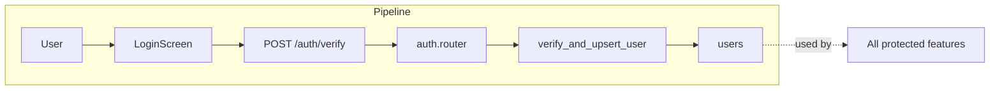

# Authentication & Users

## Initiator

- **Who:** User (login/register) or any authenticated request (profile).
- **When:** Login/Register screens; every protected route uses current user.

## Frontend flow

- **Screen/Widget:** `LoginScreen` (`/login`), `RegisterScreen` (`/register`), `ProfileScreen` (profile tab or `/profile`).
- **User action:** Enter email/password → sign in with Firebase; or register with role (customer/organizer/sponsor), display name, terms checkbox → then backend verify.
- **API calls:** `verifyToken()` (POST `/api/v1/auth/verify` with `id_token`, `role`, `display_name`, `terms_accepted_at`); `getMe()` (GET `/api/v1/me`); `updateMe(data)` (PATCH `/api/v1/me`).

## Backend routing

- **Entry:** `main.py` → `api_router` prefix `/api/v1` → `auth.router` prefix `/auth`, `users.router` prefix `/me`.
- **Handler:** `auth.py` → `POST /verify` → `verify()`; `users.py` → `GET ""` → `get_me()`, `PATCH ""` → `update_me()`.

## Service layer

- **Module(s):** `app.services.auth`, `app.core.security` (get_current_user via Firebase token).
- **Main functions:** `verify_and_upsert_user()` (validates Firebase ID token, creates or updates user in DB); profile updates in route (direct PATCH on current_user).

## Models and DB

- **Models:** `User`.
- **Tables updated/read:** `users` (insert on signup, update on verify and profile PATCH).

## Dependencies

- **Requires:** None (auth is the entry point).
- **Triggers / side effects:** All other features that require `CurrentUser` or `require_role()` depend on this.

## Prompt

Implement the **Authentication & Users** feature for the Crowd Funding Event app (Flutter Web, FastAPI, PostgreSQL, Firebase Auth). Backend: POST `/auth/verify` to validate Firebase ID token and upsert user (role, display_name, terms); GET/PATCH `/me` for profile. Frontend: Login/Register screens, verify token and call verify API; use current user and Bearer token on all protected requests. Follow the flow, dependencies, and diagrams in this document.

## Flow diagram

## Vulnerabilities

- Auth rate limit is 10/min on `/verify`; brute-force on Firebase is external. Consider optional CAPTCHA or account lockout after N failures if Firebase does not enforce.
- Token in request body (not only header); ensure HTTPS and no logging of body.

## Improvements

- Consider returning minimal user payload from verify (e.g. role, id) and loading full profile via GET /me in one place to avoid duplication.
- Username (mandatory per FEATURES) could be validated for uniqueness and format in update_me.

## Feedback

- Auth and profile are split across `/auth` and `/me`; clear and consistent. Role is set only at signup (no add-role yet per FEATURES).
