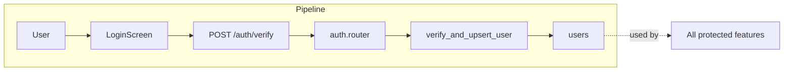

# Authentication & Users

## Initiator

- **Who:** User (login/register) or any authenticated request (profile).
- **When:** Login/Register screens; every protected route uses current user.

## Frontend flow

- **Screen/Widget:** `LoginScreen` (`/login`), `RegisterScreen` (`/register`), `ProfileScreen` (profile tab or `/profile` — **ProfileContactSection:** premium gradient header, brand-coloured social badges (IG/X/FB/LinkedIn/YT/TT), bio textarea, contact email, website, social handle fields; organizer and sponsor profiles wire nine TextEditingControllers; contact section saved via UpdateProfileRequest).
- **User action:** Enter email/password → sign in with Firebase; or register with role (customer/organizer/sponsor), display name, **birthday** (required for all roles for age verification), terms checkbox → then backend verify. Create Account is disabled until birthday is selected; age must be at least 13. Edit profile: bio, website, contact email, Instagram, Twitter, Facebook, LinkedIn, YouTube, TikTok (AppUser, PublicProfile, SponsorPublicProfile, UpdateProfileRequest include these; hasContactInfo getter).
- **API calls:** `verifyToken()` (POST `/api/v1/auth/verify` with `id_token`, `role`, `display_name`, `terms_accepted_at`, **`birthday`** required for new signups); `getMe()` (GET `/api/v1/me`); `updateMe(data)` (PATCH `/api/v1/me` — accepts **bio, website_url, contact_email, instagram, twitter, facebook, linkedin, youtube, tiktok** for profile contact and social presence).

## Backend routing

- **Entry:** `main.py` → `api_router` prefix `/api/v1` → `auth.router` prefix `/auth`, `users.router` prefix `/me`.
- **Handler:** `auth.py` → `POST /verify` → `verify()`; `users.py` → `GET ""` → `get_me()`, `PATCH ""` → `update_me()`.

## Service layer

- **Module(s):** `app.services.auth`, `app.services.age_verification` (calculate_age), `app.core.security` (get_current_user via Firebase token).
- **Main functions:** `verify_and_upsert_user()` (validates Firebase ID token, creates or updates user in DB; **for new users, birthday is required** — raises if missing; parses and validates age ≥ 13); profile updates in route (direct PATCH on current_user).

## Models and DB

- **Models:** `User` (includes `birthday`, optional in DB for backward compatibility; required at signup for new users; **contact/social:** bio, website_url, contact_email, instagram, twitter, facebook, linkedin, youtube, tiktok — migration **zz11** adds these nine nullable columns).
- **Tables updated/read:** `users` (insert on signup with birthday, update on verify and profile PATCH; PATCH `/me` persists contact/social fields). **Public profile responses** (organizer and sponsor) include contact/social so public profile screens can show Contact & Social card.

## Dependencies

- **Requires:** None (auth is the entry point).
- **Triggers / side effects:** All other features that require `CurrentUser` or `require_role()` depend on this.

## Prompt

Implement the **Authentication & Users** feature for the Crowd Funding Event app (Flutter Web, FastAPI, PostgreSQL, Firebase Auth). Backend: POST `/auth/verify` to validate Firebase ID token and upsert user (role, display_name, terms, **birthday required for new users** for age verification; enforce age ≥ 13); GET/PATCH `/me` for profile. Frontend: Login/Register screens; register requires **birthday** for all roles (customer, organizer, sponsor)—disabled submit until selected, validate age; verify token and call verify API; use current user and Bearer token on all protected requests. Follow the flow, dependencies, and diagrams in this document.

## Flow diagram

## Vulnerabilities

- Auth rate limit is 10/min on `/verify`; brute-force on Firebase is external. Consider optional CAPTCHA or account lockout after N failures if Firebase does not enforce.
- Token in request body (not only header); ensure HTTPS and no logging of body.

## Improvements

- Consider returning minimal user payload from verify (e.g. role, id) and loading full profile via GET /me in one place to avoid duplication.
- Username (mandatory per FEATURES) could be validated for uniqueness and format in update_me.

## Feedback

- Auth and profile are split across `/auth` and `/me`; clear and consistent. Role is set only at signup (no add-role yet per FEATURES). **Birthday is mandatory at signup for all roles** (customer, organizer, sponsor) for age verification; backend rejects new signups without birthday; frontend disables Create Account until birthday is set and enforces age ≥ 13. Age-restricted actions (tickets, sponsorship, funding, registration) use `app.services.age_verification` and may require profile birthday if missing.
