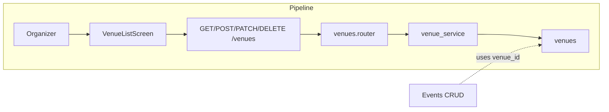

# Venues

## Initiator

- **Who:** Organizer or Admin (create/update/delete); Customer or unauthenticated (list, get).
- **When:** Venue list screen, create venue screen, event create/edit (venue picker).

## Frontend flow

- **Screen/Widget:** `VenueListScreen` (`/venues`), `CreateVenueScreen`, `VenuePickerScreen` (from event create/edit).
- **User action:** List/filter venues; create venue (name, address, city, province, lat/lng, capacity); edit or delete own venue.
- **API calls:** `getVenues()`, `getVenue(id)`, `createVenue(data)`, `updateVenue(id, data)`, `deleteVenue(id)` → GET/POST/GET/PATCH/DELETE `/api/v1/venues` and `/api/v1/venues/{id}`.

## Backend routing

- **Entry:** `api_router` → `venues.router` prefix `/venues`.
- **Handler:** `venues.py` → `GET ""`, `POST ""`, `GET /{venue_id}`, `PATCH /{venue_id}`, `DELETE /{venue_id}` → `list_venues`, `create_venue`, `get_venue`, `update_venue`, `delete_venue`.

## Service layer

- **Module(s):** `app.services.venue`.
- **Main functions:** `list_venues()`, `get_or_404()`, `create()`, `update()`, `can_edit_venue()`; delete checks event count then deletes.

## Models and DB

- **Models:** `Venue`.
- **Tables updated/read:** `venues` (CRUD). Event count check via `events` for delete guard.

## Dependencies

- **Requires:** [Auth](01-auth-users.md) for organizer/admin (create/update/delete); optional auth for list/get (customers see all).
- **Triggers / side effects:** Events reference venue_id; no cascade delete (blocked if events use venue).

## Prompt

Implement the **Venues** feature for the Crowd Funding Event app. Backend: CRUD for venues (name, address, capacity, etc.) under `/api/v1/venues`; organizer or admin only. Frontend: venue picker in event create/edit; list and map views as needed. Follow the flow, dependencies, and diagrams in this document.

## Flow diagram

## Vulnerabilities

- Organizer can only see/edit own venues (enforced in handler with `can_edit_venue`). IDOR on get_venue for organizer: mitigated by ForbiddenError if venue.organizer_id != current_user.id.
- List filtered by organizer_id for organizers; customers see all. No sensitive data on Venue.

## Improvements

- Search bar (name, address, capacity) is frontend-only; backend could support `search` query param for large datasets.
- Mapbox geocoding is frontend; lat/lng optional on backend—consider validating lat/lng range when provided.

## Feedback

- Venue ownership is clear; single service file. List logic (organizer vs customer) lives in route; could move to service for testability.
