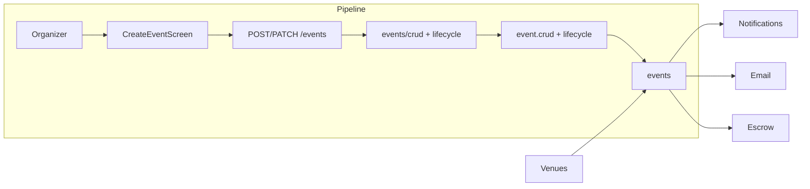

# Events CRUD & Lifecycle

## Initiator

- **Who:** Organizer or Admin (create, update, delete, publish, cancel, reactivate, clone, extend, set date); Customer (read).
- **When:** Create Event wizard, Edit Event, Event Detail (lifecycle actions), Admin Dashboard.

## Frontend flow

- **Screen/Widget:** `CreateEventScreen` (`/events/create`), `EditEventScreen`, `EventDetailScreen` (`/events/:id`); Admin tabs for approve/extensions/requests.
- **User action:** Create event (wizard steps); edit event; publish draft; cancel (with reason); reactivate; clone completed; extend funding; set event date; admin approve/reject event or extension or cancellation.
- **API calls:** `getEvents()`, `getEvent(id)`, `createEvent(data)`, `updateEvent(id, data)`, `deleteEvent(id)`, `publishEvent(id)`, `cancelEvent(id, reason)`, `reactivateEvent(id)`, `cloneEvent(id)`, `extendFunding(id, data)`, `setEventDate(id, data)`, `decideExtension(id, action)`; admin: `adminApproveEvent(id, approved)`, etc.

## Backend routing

- **Entry:** `api_router` → `events_router` prefix `/events`.
- **Handler:** `events/crud.py` → GET "", POST "", GET `/{event_id}`, PATCH `/{event_id}`, DELETE `/{event_id}`, GET `/{event_id}/calendar.ics`; `events/lifecycle.py` → POST `/{event_id}/cancel`, `/extend-funding`, `/set-event-date`, `/start-selling`, `/reactivate`, `/publish`, `/clone`, `/extension-decision`, `/cancellation/approve`. Admin: `admin.py` → POST `/events/{id}/approve`, etc.

## Service layer

- **Module(s):** `app.services.event.crud`, `app.services.event.lifecycle`, `app.services.event.permissions`.
- **Main functions:** `create_event()`, `update_event()`, `get_or_404()`, `list_events()`; `cancel_event()`, `reactivate()`, `publish()`, `clone()`, `extend_funding()`, `set_event_date()`, `approve_extension()`, `user_can_edit_event()`.

## Models and DB

- **Models:** `Event`, `EventOrganizer`, `EventDiscount`, `TicketTier`, etc.
- **Tables updated/read:** `events` (CRUD and status fields: status, pending_cancellation, cancellation_reason, pending_extension); related tables for tiers, discounts, organizers.

## Dependencies

- **Requires:** [Auth](01-auth-users.md), [Venues](02-venues.md) (venue_id), [Ticket Strategies](14-ticket-strategies.md) (optional), [Feature Flags](12-feature-flags.md) where used.
- **Triggers / side effects:** [Notifications](34-in-app-notifications.md), [Email](21-email-notifications.md) (cancel, approve/reject); [Fund Escrow](29-fund-escrow.md) on funding; lifecycle transitions affect [Registration](08-registration-waitlist.md), [Funding](09-funding-pledges.md), [Tickets](19-tickets.md).

## Flow diagram

## Vulnerabilities

- Edit/delete/cancel enforce `user_can_edit_event` (main or full co-organizer) or admin. Draft/cancelled delete is allowed; ensure no orphaned related rows (cascade or explicit delete).
- Publish moves to pending_approval; admin approve required. No IDOR on event_id for organizers (permission check on event).

## Improvements

- Event create/update payload is large; consider versioning or partial PATCH to reduce payload and conflict surface.
- Lifecycle logic is spread between lifecycle.py (API) and event/lifecycle.py (service); keep transition rules in one place (service).

## Feedback

- CRUD and lifecycle are clearly separated in API (crud vs lifecycle routers). Status transitions documented in [04-event-lifecycle-state-machine](04-event-lifecycle-state-machine.md).
