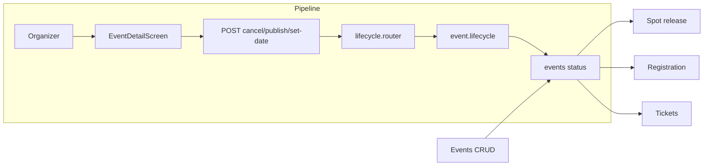

# Event Lifecycle State Machine

## Initiator

- **Who:** System (on event fetch) and Organizer/Admin (publish, cancel, set date, extend, start selling, reactivate).
- **When:** Every event fetch runs transition checks; user actions trigger state changes.

## Frontend flow

- **Screen/Widget:** Same as [Events CRUD](03-events-crud-lifecycle.md); status pill and lifecycle bar on event cards and Event Detail.
- **User action:** Publish, cancel, set event date, extend funding, reactivate, clone; admin approve/reject.
- **API calls:** Same as 03; GET event returns current status; POST lifecycle endpoints change status.

## Backend routing

- **Entry:** Same as 03; lifecycle handlers in `events/lifecycle.py`; transition logic in `app.services.event.lifecycle` and applied on event load (e.g. in get_or_404 or list).

## Service layer

- **Module(s):** `app.services.event.lifecycle`, `app.services.event.crud` (where transition check is invoked).
- **Main functions:** `cancel_event()`, `reactivate()`, `publish()`, `set_event_date()`, `extend_funding()`, `approve_extension()`, **schedule_event_transitions()** (enqueues ARQ jobs at trigger datetimes), **transition_event_status** (ARQ job, idempotent), **reconcile_event_statuses** (safety-net cron). Time-based transitions are no longer applied inline on GET (read-only session); they use deferred ARQ jobs and a cron.

## Models and DB

- **Models:** `Event` (status, start_time, end_time, funding_end_at, pending_cancellation, pending_extension).
- **Tables updated/read:** `events`. Status enum: draft, pending_approval, approved, selling_tickets, waiting_event_date, live, completed, cancelled.

## Dependencies

- **Requires:** [Events CRUD](03-events-crud-lifecycle.md), [Auth](01-auth-users.md). Depends on platform_settings for grace period, cancel threshold.
- **Triggers / side effects:** [Spot Reservation](10-spot-reservation-funding.md) (spot release on live); [Tickets](19-tickets.md), [Registration](08-registration-waitlist.md) (which actions allowed per status); [Notifications](34-in-app-notifications.md), [Email](21-email-notifications.md).

## Prompt

Implement the **Event Lifecycle State Machine** (draft, approved, waiting_event_date, selling_tickets, live, completed, cancelled) for the Crowd Funding Event app. Backend: enforce valid transitions in event service and lifecycle endpoints; status and pending_cancellation/pending_extension fields. Frontend: show status and only allow valid actions (publish, set date, start selling, etc.). Follow the flow, dependencies, and diagrams in this document.

## Flow diagram

## Recently implemented (deferred transitions and cron)

- **Problem:** Transitions (e.g. live→completed) were skipped on GET because `auto_transition_status` saw a read-only replica session and refused to write; event list showed stale status.
- **Solution:** **Deferred ARQ jobs** — `transition_event_status` job enqueued at the exact trigger datetime for each date field (funding_end_at, start_time, end_time). Idempotency token (field + ISO ts); stale jobs (date changed) exit without side effects. **Job chaining:** approved→waiting_event_date job enqueues the follow-up cancellation-deadline job. **schedule_event_transitions()** called from every path that sets or changes dates: create/update event, set-event-date, extend-funding, extension-decision approve, start-selling, publish, admin approve, admin resolve-review. Late-approval gap fixed: publish, admin approve, resolve-review enqueue fresh transition jobs. **Safety-net cron:** `reconcile_event_statuses` (interval: admin `cron_event_reconcile_interval_min`, default 60 min) replaces the 5-min advance_live_events sweep and covers all four transitional states. Inline **approved→selling_tickets** when ticket tier is created for non-funded events (no ARQ). **advance_live_events** (5 min) cron uses a writable session to transition live→completed when end_time passed (event_repo.get_live_past_end_time).

## Vulnerabilities

- selling_tickets cancellation requires admin approval; ensure admin-only route for cancellation/approve.

## Improvements

- Centralize all transition rules in one module (e.g. `compute_next_status(event, now)`) and call from both get and list to avoid drift.
- Document state diagram (draft → … → completed) in this doc or FEATURES.md for quick reference.

## Feedback

- Lifecycle is the backbone of the product; keeping it in `event/lifecycle.py` with clear function names helps. Feature doc [03](03-events-crud-lifecycle.md) and this one split CRUD vs state machine.
