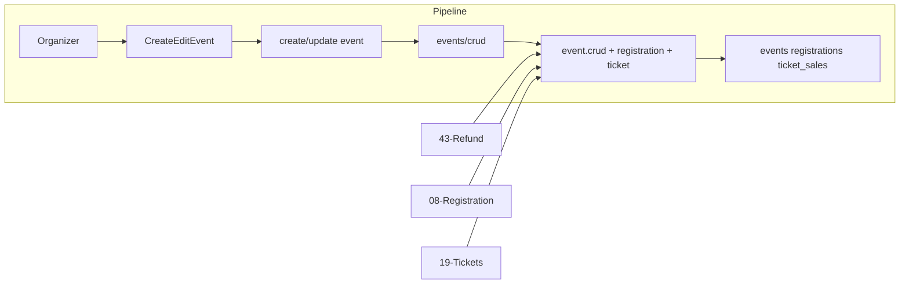

# Refund Policy

## Initiator

- **Who:** Organizer (set refund deadline on create/edit); Customer (unregister or request ticket refund within policy).
- **When:** Event create/edit when funding deadline is set; unregister flow; ticket refund request/approve.

## Frontend flow

- **Screen/Widget:** Create/Edit Event (refund deadline slider, capped at 20% of funding duration); Event Detail (unregister); My Tickets + Refund Requests (organizer).
- **User action:** Set refund cutoff (slider); unregister before cutoff; request ticket refund; organizer approve/reject refund request.
- **API calls:** Refund deadline is part of `createEvent()` / `updateEvent()`; unregister via `unregister(eventId)`; ticket refund via `requestTicketRefund()`, `approveTicketRefund()`, `rejectTicketRefund()`, `getRefundRequests()`.

## Backend routing

- **Entry:** Event create/update in `events/crud.py`; unregister in `events/registration.py`; refund request/approve/reject in `events/tickets.py`.
- **Handler:** Validation of refund_deadline (max 20%) in event service or schema; unregister applies refund if before cutoff; ticket refund state machine in ticket service.

## Service layer

- **Module(s):** `app.services.event.crud` (refund deadline validation), `app.services.registration` (unregister + refund), `app.services.ticket.sales` (refund request, approve, reject).
- **Main functions:** Event: refund deadline stored on Event; Registration: unregister checks cutoff, triggers refund if applicable; Ticket: `request_refund()`, `approve_refund()`, `reject_refund()`, ARQ refund tasks.

## Models and DB

- **Models:** `Event` (refund_deadline or equivalent), `Registration`, `Funding` (status refunded), `TicketSale` (status refund_requested, refunded).
- **Tables updated/read:** `events`, `registrations`, `fundings`, `ticket_sales`. Refund processing may touch payments/escrow.

## Dependencies

- **Requires:** [Events CRUD](03-events-crud-lifecycle.md), [Registration](08-registration-waitlist.md), [Tickets](19-tickets.md), [Refund Processing](43-refund-processing.md).
- **Triggers / side effects:** [Email](21-email-notifications.md) (refund confirmations); ARQ refund jobs.

## Flow diagram

## Vulnerabilities

- Backend must enforce 20% cap on refund deadline (reject create/update if exceeded). Ensure validation is server-side, not only frontend slider.
- Unregister refund: ensure idempotency and no double-refund if client retries.

## Improvements

- Expose refund_deadline and “last refund date” in event response so frontend can show “Refundable until …” without recomputing.
- Consider storing refund_cutoff_at (derived) on Event for simpler queries (refund if now <= refund_cutoff_at).

## Feedback

- Policy is split: deadline on event, behavior in registration (unregister) and ticket (request/approve). Single “refund policy” doc helps; see [43-refund-processing](43-refund-processing.md) for ARQ flow.
