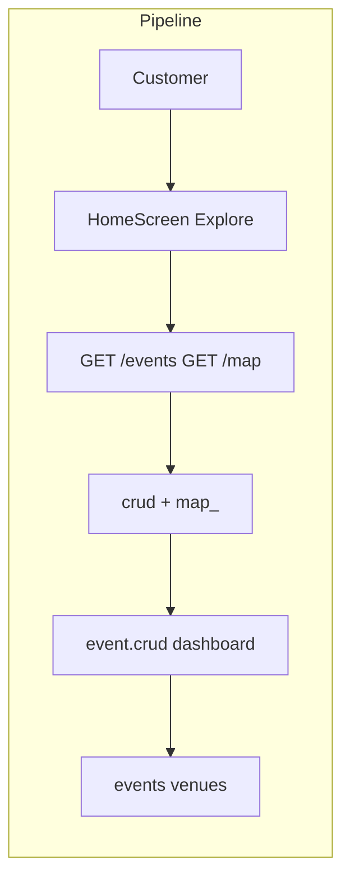

# Event Discovery & Search

## Initiator

- **Who:** Customer or unauthenticated (browse); Organizer/Admin (see own + all statuses).
- **When:** Home tab, Explore tab, Map view, Featured sections (Trending, Popular, Coming Soon, Near Me, Community).

## Frontend flow

- **Screen/Widget:** `HomeScreen` (search bar, genre chips, featured carousels, search results grid), `Explore` tab (filters, list/map toggle), Map (Mapbox markers), “Near Me” (geolocation).
- **User action:** Search text, select genre, filter by status/date/city/capacity/funding/tickets; toggle map view; allow location for Near Me.
- **API calls:** `getEvents(params)` (GET `/api/v1/events` with query params), `getFeaturedEvents()`, `getMapEvents(bounds)`, `getGenres()`; list_events supports search, city, status, date_from, date_to, has_funding, has_tickets, min/max_capacity, genre, community_rules, sponsorship_only, include_all_statuses.

## Backend routing

- **Entry:** `api_router` → `events_router` prefix `/events`; `map_.router` before events (GET `/events/map`).
- **Handler:** `events/crud.py` → `list_events`, `get_featured_events`; `crud.py` → GET `/{event_id}` for detail; `map_.py` → GET `/map` (under events prefix) → returns map markers.

## Service layer

- **Module(s):** `app.services.event.crud` (or dashboard), `app.services.dashboard` for trending/popular/coming-soon.
- **Main functions:** `list_events()` (filters, pagination), `get_trending_events()`, `get_popular_events()`, `get_coming_soon_events()`; map aggregates events by venue for markers.

### Map API

- **Path:** `app.api.v1.map_` (router mounted under events prefix; GET `/events/map` or `/map`).
- **Key functions:** Endpoint `map_events(db, lat, lng, radius_km, city, live, organizer_id, search, genre, status)` — delegates to `event_service.list_events_for_map()` with the same params; maps each event to `MapEventMarker` (id, title, lat, lng, start_time, end_time, status, is_live, venue_id, venue_name). Only events with non-null lat/lng are returned.
- **Integration:** Frontend map view calls `getMapEvents(bounds)` or equivalent with optional city, live, organizer, search, genre, status; backend returns list of markers for pins. Uses read-only DB session.

## Models and DB

- **Models:** `Event`, `Venue`; denormalized or joined for registration count, pledge totals, ticket counts, first image.
- **Tables updated/read:** `events`, `venues`, `registrations`, `fundings`, `ticket_sales`, `event_images` (for featured image).

## Dependencies

- **Requires:** [Auth](01-auth-users.md) (optional for list; affects include_all_statuses and organizer filter).
- **Triggers / side effects:** None (read-only discovery).

## Prompt

Implement **Event Discovery & Search** for the Crowd Funding Event app. Backend: GET `/events` with search, genre, status, date, city, capacity, has_funding, has_tickets; GET `/events/featured` (trending, popular, coming soon); GET `/events/map` for map markers; getGenres(). Frontend: Home/Explore with search bar, genre chips, featured carousels, list/map toggle, filters. Follow the flow, dependencies, and diagrams in this document.

## Flow diagram

## Vulnerabilities

- List is filtered by status for non-organizers (draft/pending/cancelled hidden). Organizers see own events with include_all_statuses. No sensitive data in list response.
- Map endpoint returns event markers; ensure only public event fields and no PII.

## Improvements

- Featured and list both hit DB; consider caching featured (short TTL) to reduce load.
- Near Me uses frontend geolocation then backend filter by lat/lng; ensure index on venue/event location for radius queries.

## Feedback

- Discovery is well parameterized; map and list share same event model. Genre and filters are consistent with FEATURES.md.
