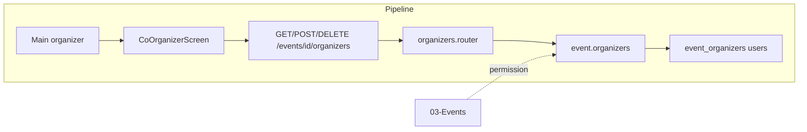

# Co-Organizer Management

## Initiator

- **Who:** Main organizer (add/remove co-organizers); Organizer or Admin with read/full permission (view list).
- **When:** Event Detail → Co-Organizers screen (`/events/:id/co-organizers`).

## Frontend flow

- **Screen/Widget:** `CoOrganizerScreen`; link from Event Detail management section.
- **User action:** View list of main + co-organizers; add co-organizer (user_id, permission: read/full); remove co-organizer.
- **API calls:** `getEventOrganizers(eventId)`, `addEventOrganizer(eventId, userId, permission)`, `removeEventOrganizer(eventId, userId)` → GET/POST/DELETE `/api/v1/events/{id}/organizers` and `/{id}/organizers/{user_id}`.

## Backend routing

- **Entry:** `events_router` → `organizers.router` (no extra prefix).
- **Handler:** `events/organizers.py` → `GET /{event_id}/organizers`, `POST /{event_id}/organizers`, `DELETE /{event_id}/organizers/{user_id}` → `list_event_organizers`, `add_event_organizer`, `remove_event_organizer`.

## Service layer

- **Module(s):** `app.services.event.organizers`, `app.services.event.permissions`.
- **Main functions:** `list_event_organizers()`, `add_event_organizer()`, `remove_event_organizer()`, `user_can_read_event_mgmt()`, `is_main_organizer()`.

## Models and DB

- **Models:** `EventOrganizer`, `User`.
- **Tables updated/read:** `event_organizers` (insert on add, delete on remove), `users` (for display name/email in list). Main organizer is event.organizer_id, not in event_organizers.

## Dependencies

- **Requires:** [Auth](01-auth-users.md), [Events CRUD](03-events-crud-lifecycle.md). Only main organizer can add/remove; co-organizers with full permission can edit event but cannot modify organizer list.
- **Triggers / side effects:** None (organizer list affects permission checks in event edit, lifecycle, tickets, etc.).

## Flow diagram

## Vulnerabilities

- Add organizer accepts user_id: ensure user exists and is organizer role (or allow any role per product rule). Prevent adding duplicate or main organizer.
- List returns email for co-organizers; ensure only visible to authorized users (user_can_read_event_mgmt).

## Improvements

- Consider not returning email for co-organizers in list if privacy is strict; or return only for main organizer.
- Add co-organizer by email or username might be better UX than by user_id (frontend can resolve).

## Feedback

- Permission model (read vs full) is clear; enforced in event service via user_can_edit_event and user_can_read_event_mgmt. Single place for organizer CRUD.
