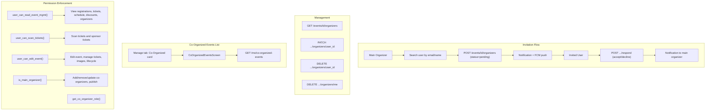

# Co-Organizer Management

## Initiator

- **Who:** Main organizer (invite/remove/update co-organizers); Co-organizer (accept/decline invitation, self-remove, view co-organized events list); Organizer or Admin with read/full permission (view list).
- **When:** Event Detail -> Co-Organizers screen (`/events/:id/co-organizers`); Manage tab -> Co-Organized Events (`/manage/co-organized`); Notifications screen (accept/decline invitation).

## Frontend flow

- **Screen/Widget:** `CoOrganizerScreen` (link from Event Detail management section); `CoOrganizedEventsScreen` (Manage tab quick-action "Co-Organized"). Invitation accept/decline via notification or a dedicated pending-invitations view.
- **User action:** View list of main + co-organizers; invite co-organizer (search by email/name, select permission: read/full); update permission; remove co-organizer; accept/decline invitation; self-remove; from Manage tab, open Co-Organized Events to see all events the user co-organizes (with search and status filters), tap to open event detail.
- **API calls:** `getEventOrganizers(eventId)`, `addEventOrganizer(eventId, userId, permission)`, `updateEventOrganizerPermission(eventId, userId, permission)`, `removeEventOrganizer(eventId, userId)`, `respondToInvitation(eventId, userId, accept)`, `selfRemoveFromEvent(eventId)`, `searchOrganizers(query)`, `getCoOrganizedEvents({ status, search, offset, limit })` -> GET/POST/PATCH/DELETE `/api/v1/events/{id}/organizers`, POST `/{id}/organizers/{user_id}/respond`, DELETE `/{id}/organizers/me`, GET `/api/v1/users/search-organizers?q=`, GET `/api/v1/me/co-organized-events?status=&search=&offset=&limit=`.

## Backend routing

- **Entry:** `events_router` -> `organizers.router` (no extra prefix); `users.router` (prefix `/me`) for co-organized events list.
- **Handler:** `events/organizers.py` -> `GET /{event_id}/organizers`, `POST /{event_id}/organizers`, `PATCH /{event_id}/organizers/{user_id}`, `POST /{event_id}/organizers/{user_id}/respond`, `DELETE /{event_id}/organizers/me`, `DELETE /{event_id}/organizers/{user_id}`. `users.py` -> `GET /me/co-organized-events` (status, search, offset, limit) -> returns list of events where current user is an accepted co-organizer.

## Service layer

- **Module(s):** `app.services.event.organizers`, `app.services.event.permissions`, `app.services.event.queries`, `app.services.notification_service`, `app.services.push_notification`.
- **Main functions:** `list_event_organizers()`, `add_event_organizer()` (creates with invitation_status=pending, sends notification + FCM push), `update_event_organizer_permission()`, `remove_event_organizer()`, `respond_to_invitation()`, `self_remove_from_event()`, `get_co_organized_events(db, user_id, status=, search=, offset=, limit=)` (events where user is accepted co-organizer), `user_can_read_event_mgmt()`, `user_can_edit_event()`, `user_can_scan_tickets()`, `is_main_organizer()`, `get_co_organizer_role(db, event, user)`.

## Models and DB

- **Models:** `EventOrganizer` (add `invitation_status` column: pending/accepted/declined), `User`.
- **Tables updated/read:** `event_organizers` (insert on invite, update on accept/decline/permission change, delete on remove), `users` (for display name/email in list, for user search). Main organizer is event.organizer_id, not in event_organizers. New migration adds `invitation_status` column (default "accepted" for backward compat with existing rows).

## Dependencies

- **Requires:** [Auth](01-auth-users.md), [Events CRUD](03-events-crud-lifecycle.md). Only main organizer can invite/remove/update permission; co-organizers with full permission can edit event but cannot modify organizer list. [In-App Notifications](34-in-app-notifications.md) and [FCM Push](62-fcm-push-notifications.md) for invitation notifications.
- **Triggers / side effects:** Invitation creates in-app notification + FCM push to invited user. Accept/decline creates notification to main organizer. Organizer list affects permission checks in event edit, lifecycle, tickets, schedule, images, discounts, registrations.

## Prompt

Implement **Co-Organizer Management** for the Crowd Funding Event app. Backend: EventOrganizer with invitation_status (pending/accepted/declined; migration default=accepted); GET list (includes invitation_status), POST invite (status=pending, notification+FCM), PATCH update permission, POST respond (accept/decline), DELETE self-remove, DELETE remove; filter permission checks by invitation_status==accepted; add get_co_organizer_role() and user_can_scan_tickets() (read co-organizers can scan tickets); expand user_can_read_event_mgmt to registrations, ticket sales, scanned tickets, stats, waitlisted; event detail returns viewer_co_organizer_permission; GET /users/search-organizers for invite search. Frontend: CoOrganizerScreen with debounced search, invitation status badges, permission update (popup), self-remove, pending-invitation accept/decline banner; event detail uses viewer_co_organizer_permission so co-organizers see management (read-only for read, full for full) and ticket scanner. Follow the flow, dependencies, and diagrams in this document.

## Flow diagram

## Vulnerabilities

- Add organizer accepts user_id: ensure user exists and has organizer role (or allow any role per product rule). Prevent adding duplicate or main organizer.
- List returns email for co-organizers; ensure only visible to authorized users (user_can_read_event_mgmt). Consider omitting email for non-main users if privacy is strict.
- Invitation status must be checked: only accepted co-organizers should gain permissions. Pending/declined rows should not pass permission checks.
- Self-remove must not allow main organizer to remove themselves (use organizer transfer instead if needed).
- No limit on co-organizers per event could be abused; consider a platform setting `max_co_organizers_per_event`.
- Permission update should be auditable (integrate with admin audit logging, feature 58).

## Implemented (current behavior)

- **Invitation flow** — EventOrganizer has `invitation_status` (pending/accepted/declined). New invites create with status=pending; only accepted co-organizers pass permission checks. Notifications + FCM on invite, accept, decline, and remove.
- **Endpoints** — PATCH update permission, POST respond (accept/decline), DELETE self-remove, DELETE remove; list response includes `invitation_status`. GET `/me/co-organized-events` returns events where the current user is an accepted co-organizer (filters: status, search; pagination: offset, limit).
- **User search** — GET `/users/search-organizers?q=` (organizer role, by email/display_name) used by CoOrganizerScreen for invite autocomplete.
- **Permissions** — `user_can_scan_tickets()` allows read and full co-organizers to scan tickets; scan-ticket and scan-sponsor endpoints use it. `user_can_read_event_mgmt` used for registrations list, ticket sales, scanned tickets, stats, waitlisted tickets. `get_co_organizer_role()` and event detail `viewer_co_organizer_permission` drive frontend visibility.
- **Frontend** — CoOrganizerScreen: debounced search, status badges, permission update (popup), self-remove, pending-invitation accept/decline banner. Event detail shows organizer management for co-organizers (read-only vs full based on permission). Manage tab has "Co-Organized" quick-action card; CoOrganizedEventsScreen shows all co-organized events with debounced search, status filter chips, paginated EventCard list, pull-to-refresh; tap opens event detail.

## Improvements (optional next)

- **Co-organizer limit** — Platform setting `max_co_organizers_per_event` (e.g. default 10); enforce in add_event_organizer.
- **Activity tracking** — Log add/remove/permission-change/accept/decline in admin audit log (feature 58).
- **Publish restriction in UI** — Disable publish button for full co-organizers with tooltip (backend already restricts to main organizer).

## Feedback

- Permission model (read vs full) is clear; enforced via `user_can_edit_event`, `user_can_read_event_mgmt`, and `user_can_scan_tickets`. Read co-organizers can view management data and scan tickets; full can also edit.
- Invitation flow and notifications are implemented; frontend uses event detail `viewer_co_organizer_permission` so co-organizers see the correct UI.
