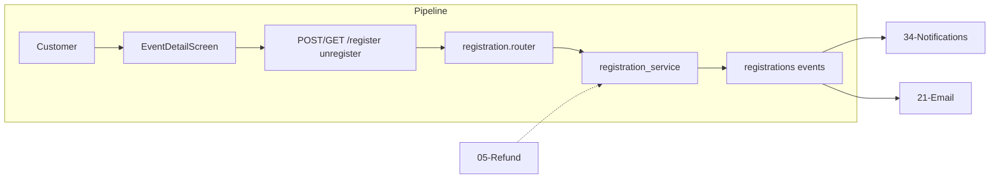

# Registration & Waitlist

## Initiator

- **Who:** Customer (register, unregister); Organizer/Admin (list registrations, approve/reject waitlist).
- **When:** Event Detail (Register / Unregister); Manage → Waitlist; Event waitlist screen.

## Frontend flow

- **Screen/Widget:** `EventDetailScreen` (register button, quick action bar); `WaitlistScreen` (per-event or global); Manage tab → Waitlist card.
- **User action:** Register for event; unregister; organizer views registrations and waitlist; approve or reject waitlist entry.
- **API calls:** `register(eventId)`, `unregister(eventId)`, `getMyRegistration(eventId)`, `getRegistrations(eventId)`, `decideRegistration(eventId, registrationId, action)` → POST/GET/POST `/api/v1/events/{id}/register`, `/unregister`, `/my-registration`, `/registrations`, `/registrations/{id}/decision`.

## Backend routing

- **Entry:** `events_router` → `registration.router`.
- **Handler:** `events/registration.py` → POST `/{event_id}/register`, GET `/{event_id}/my-registration`, POST `/{event_id}/unregister`, GET `/{event_id}/registrations`, POST `/{event_id}/registrations/{registration_id}/decision`.

## Service layer

- **Module(s):** `app.services.registration`.
- **Main functions:** `register()` (capacity check, waitlist if full; open vs closed registration type), `unregister()` (refund if before refund cutoff), `approve_waitlist()`, `reject_waitlist()` (or equivalent in decision endpoint).

## Models and DB

- **Models:** `Registration`, `Event` (registration_count denormalized, registration_type).
- **Tables updated/read:** `registrations` (insert on register, status update on approve/reject, delete or status change on unregister), `events` (registration_count), `fundings` (if unregister triggers refund).

## Dependencies

- **Requires:** [Auth](01-auth-users.md), [Events](03-events-crud-lifecycle.md), [Refund Policy](05-refund-policy.md) (unregister refund).
- **Triggers / side effects:** [Notifications](34-in-app-notifications.md) (confirmed, waitlisted, organizer notified); [Email](21-email-notifications.md) (unregister refund).

## Flow diagram

## Vulnerabilities

- Register is rate-limited (20/min). Capacity and waitlist logic must be atomic to avoid over-registering; consider advisory lock or serializable transaction for register.
- Decision endpoint: ensure only organizer/admin and only for waitlist status; validate registration_id belongs to event.

## Improvements

- Registration count denormalization: ensure it is updated in same transaction as register/unregister/approve to avoid drift.
- Waitlist approval could trigger email (see FEATURES); ensure notification type is wired.

## Feedback

- Clear split: customer register/unregister vs organizer list/decision. Two waitlist types (fund vs ticket) documented in FEATURES; ticket waitlist is in [19-tickets](19-tickets.md).
