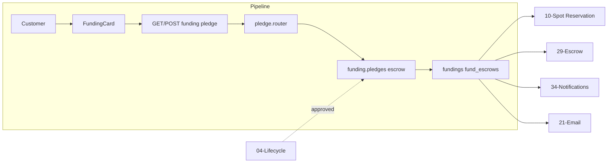

# Funding & Pledges

## Initiator

- **Who:** Customer (or Sponsor) during event status `approved` (funding phase).
- **When:** Event Detail → Funding Card → Pledge / Unpledge.

## Frontend flow

- **Screen/Widget:** `EventDetailScreen` → `FundingCard` (self-contained: loads funding summary, shows progress, backers, deadline, min pledge). **Button UX:** Pledge, Donate, and Unpledge buttons use consistent 16px icon size and labels wrapped in FittedBox for readable scaling; styles aligned for accessibility.
- **User action:** Enter amount (and optional reserved spots or tier reservations); tap Pledge → preview → confirm; or Unpledge.
- **API calls:** `getFundingSummary(eventId)`, `getPledgePreview(eventId, amountCents, reservedSpots)`, `pledge(eventId, body)`, `unpledge(eventId)`, `getPledgeReceipt(eventId, pledgeId)`, `getRefundStatus(eventId)` → GET/POST `/api/v1/events/{id}/funding`, `/pledge-preview`, `/pledge`, `/unpledge`, `/pledges/{pledge_id}/receipt`, `/refund-status`.

## Backend routing

- **Entry:** `api_router` → `events_router` prefix `/events` → `pledge.router`.
- **Handler:** `events/pledge.py` → GET `/{event_id}/pledge-preview`, POST `/{event_id}/pledge`, GET `/{event_id}/pledges/{pledge_id}/receipt`, POST `/{event_id}/unpledge`, GET `/{event_id}/refund-status`, GET `/{event_id}/funding`.

## Service layer

- **Module(s):** `app.services.funding.pledges`, `app.services.funding.summary`, `app.services.funding.reservations` (spot/tier), `app.services.escrow`, `app.services.notification_service`.
- **Main functions:** `pledge_preview()`, `create_pledge()` (capacity check, reserved spots, tier reservations if link_funding_to_tiers), `unpledge()`; funding summary for progress bar; escrow get_or_create on first pledge; notifications on pledge.

## Models and DB

- **Models:** `Funding`, `PledgeSpotReservation` (if tier-linked), `FundEscrow`, `Event` (denormalized totals if any).
- **Tables updated/read:** `fundings` (insert on pledge, status update on unpledge/refund), `pledge_spot_reservations`, `fund_escrows`, `events`.

## Dependencies

- **Requires:** [Auth](01-auth-users.md), [Event lifecycle](04-event-lifecycle-state-machine.md) (only approved allows pledge). Registration recommended for pledge (guest pledge allowed but no spot reserve).
- **Triggers / side effects:** [Spot Reservation](10-spot-reservation-funding.md), [Fund Escrow](29-fund-escrow.md), [Notifications](34-in-app-notifications.md), [Email](21-email-notifications.md) (e.g. unpledge refund).

## Prompt

Implement **Funding & Pledges** for the Crowd Funding Event app. Backend: GET funding summary, GET pledge-preview, POST pledge, POST unpledge, GET pledge receipt, GET refund-status; advisory lock for capacity; escrow get_or_create on first pledge. Frontend: FundingCard on event detail with progress, backers, pledge/unpledge flow, receipt. Follow the flow, dependencies, and diagrams in this document.

## Flow diagram

## Vulnerabilities

- Pledge is rate-limited (20/min). create_pledge uses advisory lock (pg_advisory_xact_lock) for capacity to prevent oversell. Ensure min_pledge and capacity checks are server-side.
- Guest pledge: non-refundable; ensure UI disclaimer and backend does not refund guest pledges on cancel (or per policy).

## Improvements

- Funding summary could cache total_pledged for list/detail to avoid recomputing every time; ensure invalidation on new pledge/unpledge.
- Receipt number format (PLG-...) is generated in service; keep unique and include in response for support.

## Feedback

- Self-contained Funding Card reduces full-page reload on pledge/unpledge. Pledge flow (preview → confirm → receipt) is clear in API.
