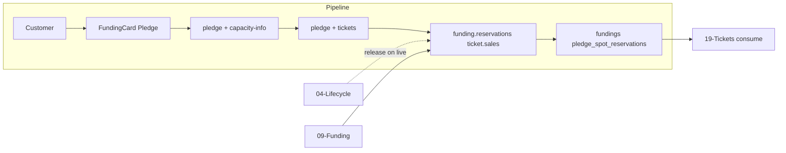

# Spot Reservation during Funding

## Initiator

- **Who:** Customer (with registration) during funding phase; guest cannot reserve spots.
- **When:** Same as [Funding & Pledges](09-funding-pledges.md); pledge flow with spot selector or tier-specific reservations.

## Frontend flow

- **Screen/Widget:** Event Detail → Funding Card → Pledge flow: spot selector (or tier-based if link_funding_to_tiers), then invoice preview, then receipt.
- **User action:** Choose number of spots (or per-tier spots), enter amount; confirm pledge. Later: buy tickets (reserved spots consumed first).
- **API calls:** Same as 09: `getPledgePreview()` with reserved_spots or tier_reservations; `pledge()` with body.reserved_spots or body.tier_reservations; `getCapacityInfo(eventId)` for capacity display (tickets_sold + total_reserved_spots).

## Backend routing

- **Entry:** Same as 09; capacity-info in `events/tickets.py` → GET `/{event_id}/capacity-info`.
- **Handler:** Pledge handlers in `events/pledge.py`; capacity-info returns max_capacity, tickets_sold, total_reserved_spots, occupied, available.

## Service layer

- **Module(s):** `app.services.funding.pledges`, `app.services.funding.reservations`, `app.services.ticket.sales` (consume reserved on purchase).
- **Main functions:** `create_pledge()` (validates reserved_spots vs max_reserved_spots_per_user and capacity); `get_total_reserved_spots()`, `get_user_reserved_spots()`, `get_reserved_spots_for_tier()`; on ticket purchase `consume_one_reserved_spot()` or tier-specific consume; on event → live, **schedule_reserved_spots_release()** (deferred ARQ job at configurable percent of selling_start→start_time window) zeros reserved spots and optionally per-tier caps; see [04-event-lifecycle-state-machine](04-event-lifecycle-state-machine.md).

## Models and DB

- **Models:** `Funding` (reserved_spots), `PledgeSpotReservation` (tier_id, pledge_id, spots), `TicketTier` (max_reserved_spots), `Event` (max_reserved_spots_per_user, link_funding_to_tiers, **reserved_spots_release_percent**, **release_tier_spot_limits**).
- **Tables updated/read:** `fundings`, `pledge_spot_reservations`, `ticket_tiers`, `events`. Capacity formula: tickets_sold + total_reserved_spots ≤ max_capacity.

## Dependencies

- **Requires:** [Funding & Pledges](09-funding-pledges.md), [Event lifecycle](04-event-lifecycle-state-machine.md) (spot release on live), [Tickets](19-tickets.md) (consume on purchase).
- **Triggers / side effects:** Capacity affects waitlist; decrease of max_capacity blocked if would go below tickets_sold + total_reserved_spots.

## Prompt

Implement **Spot Reservation during Funding** for the Crowd Funding Event app. Backend: pledge with reserved_spots or tier_reservations; get_total_reserved_spots, get_reserved_spots_for_tier; capacity-info endpoint (tickets_sold + total_reserved_spots); consume reserved spots on ticket purchase; release unredeemed on event live. Frontend: pledge flow with spot selector or per-tier reservations; capacity display. Follow the flow, dependencies, and diagrams in this document.

## Flow diagram

## Vulnerabilities

- Advisory lock on create_pledge and purchase_ticket prevents race; ensure reserved_spots and tier reservations are validated and committed atomically.
- Tier-linked: ensure min pledge covers spots × tier price per tier; backend must enforce.

## Improvements

- Capacity info endpoint used by frontend for “X spots reserved” and capacity bar; consider including in funding summary to reduce round-trips.
- Waitlist approval screen shows capacity impact; keep logic in one place (reservations service).

## Feedback

- Spot reservation is tightly coupled with pledge and ticket purchase; [42-tier-linked-funding](42-tier-linked-funding.md) documents per-tier reservation. Release on live is in lifecycle service.
