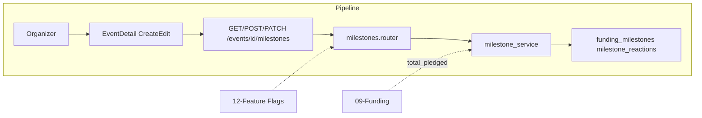

# Funding Milestones

## Initiator

- **Who:** Organizer (create/update/delete milestones); Customer/any authenticated (view list, react like/dislike).
- **When:** Event create/edit (milestone builder); Event Detail (Milestone Timeline widget).

## Frontend flow

- **Screen/Widget:** Create/Edit Event (Funding step — milestone section); Event Detail → Milestone Timeline below Funding Card.
- **User action:** Add milestone (title, unlock_percent, benefit_description); edit/delete; view timeline; like/dislike a milestone.
- **API calls:** `getMilestones(eventId)`, `createMilestone(eventId, data)`, `updateMilestone(eventId, milestoneId, data)`, `deleteMilestone(eventId, milestoneId)`, `reactToMilestone(eventId, milestoneId, reaction)`, `getMyMilestoneReaction(eventId, milestoneId)` → GET/POST/PATCH/DELETE `/api/v1/events/{id}/milestones`, POST/GET react endpoints.

## Backend routing

- **Entry:** `api_router` → `milestones.router` prefix `/events` (same as events).
- **Handler:** `milestones.py` → GET/POST `/{event_id}/milestones`, PATCH/DELETE `/{event_id}/milestones/{milestone_id}`, POST `/{event_id}/milestones/{milestone_id}/react`, GET my-reaction. All gated by `require_feature("feature_milestones_enabled")`.

## Service layer

- **Module(s):** `app.services.milestone`.
- **Main functions:** `list_milestones()` (with is_unlocked from total_pledged vs goal), `create_milestone()`, `update_milestone()`, `delete_milestone()`, react (toggle like/dislike per user per milestone).

## Models and DB

- **Models:** `FundingMilestone`, `MilestoneReaction`.
- **Tables updated/read:** `funding_milestones`, `milestone_reactions`. is_unlocked computed as total_pledged_cents / goal_cents * 100 >= unlock_percent.

## Dependencies

- **Requires:** [Auth](01-auth-users.md), [Events](03-events-crud-lifecycle.md), [Funding](09-funding-pledges.md) (for total_pledged), [Feature Flags](12-feature-flags.md).
- **Triggers / side effects:** Milestone snapshots for [41-milestone-early-bird-discounts](41-milestone-early-bird-discounts.md) (pledgers at unlock).

## Flow diagram

## Vulnerabilities

- Feature flag prevents access when disabled; 403 on all milestone endpoints. Organizer permission checked in service (event ownership or co-organizer full).
- React: one reaction per user per milestone; ensure unique constraint and upsert logic.

## Improvements

- list_milestones could accept optional funding summary to avoid extra fetch when frontend already has funding; or include in event detail response when feature enabled.
- Unlock percentage validation (1–100) in create/update.

## Feedback

- Milestones are feature-flagged and self-contained. Timeline UI and organizer builder documented in FEATURES.md.
