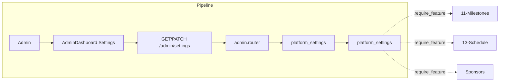

# Feature Flags (Admin Toggles)

## Initiator

- **Who:** Admin (view and toggle settings); Backend (require_feature on protected routes).
- **When:** Admin Dashboard → Settings tab; every request to milestone/schedule/sponsor endpoints.

## Frontend flow

- **Screen/Widget:** `AdminDashboardScreen` → Settings tab; switches for boolean settings (e.g. feature_milestones_enabled, feature_schedule_enabled, feature_sponsors_enabled).
- **User action:** Toggle a feature on/off; frontend calls getFeatureFlags() and hides/shows sections (milestones, schedule, sponsors).
- **API calls:** `getFeatureFlags()` (GET `/api/v1/admin/settings` or dedicated flags endpoint); PATCH `/api/v1/admin/settings/{key}` to update. Frontend may call GET /me or a dedicated flags endpoint to decide UI.

## Backend routing

- **Entry:** `api_router` → `admin.router` prefix `/admin`.
- **Handler:** `admin.py` → GET `/settings`, PATCH `/settings/{key}`. Feature guard: `require_feature("feature_milestones_enabled")` etc. in milestones.py, schedule.py, sponsors routes.

## Service layer

- **Module(s):** `app.services.platform_settings`.
- **Main functions:** `get_bool(db, key)`, `get_int(db, key)`, `get_all_with_descriptions()`, `set_value()`; `require_feature(key)` dependency calls get_bool and raises 403 if false.

## Models and DB

- **Models:** `PlatformSetting` (key, value, description).
- **Tables updated/read:** `platform_settings`. Boolean settings rendered as switches in admin UI.

## Dependencies

- **Requires:** [Auth](01-auth-users.md) (admin only for settings), [Admin Dashboard](28-admin-dashboard.md).
- **Triggers / side effects:** Disabling a flag returns 403 on all gated endpoints; frontend hides corresponding sections.

## Prompt

Implement **Feature Flags (Admin Toggles)** for the Crowd Funding Event app. Backend: GET/PATCH `/admin/settings` (admin only); platform_settings (key, value, description); require_feature(key) dependency for milestones/schedule/sponsors. Frontend: Admin Dashboard Settings tab with switches for feature_milestones_enabled, feature_schedule_enabled, feature_sponsors_enabled. Follow the flow, dependencies, and diagrams in this document.

## Flow diagram

## Vulnerabilities

- Only admin can change settings; ensure require_role(UserRole.admin) on settings endpoints. No sensitive keys should be exposed to non-admin (e.g. API keys in value).
- Feature flags are global; no per-event or per-tenant flags in current design.

## Improvements

- Dedicated GET /feature-flags (or include in /me) for frontend to avoid loading full settings list; return only feature_* keys and booleans.
- Consider caching get_bool in process with short TTL to reduce DB hits on every gated request.

## Feedback

- Three flags (milestones, schedule, sponsors) documented in FEATURES; adding a new feature flag requires migration or seed + dependency in route.
