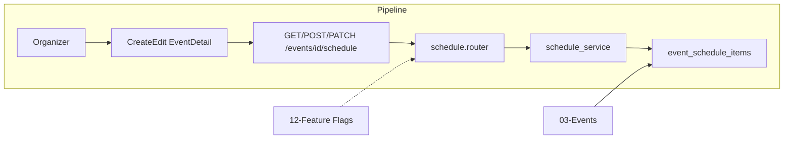

# Event Schedule / Agenda

## Initiator

- **Who:** Organizer (create/update/delete schedule items, bulk create, export); Anyone (view list).
- **When:** Event create/edit (schedule builder when has_schedule); Event Detail (Schedule Timeline); public export link.

## Frontend flow

- **Screen/Widget:** Create/Edit Event (Dates step — structured schedule section); Event Detail → Schedule Timeline (date pills, time slots, overlap badges, Excel download).
- **User action:** Enable "Use structured schedule"; add date groups and time slots (title, start/end, description); edit/delete; download Excel.
- **API calls:** `getSchedule(eventId)`, `createScheduleItem(eventId, data)`, `bulkCreateSchedule(eventId, items)`, `updateScheduleItem(eventId, itemId, data)`, `deleteScheduleItem(eventId, itemId)`, schedule export (GET `/api/v1/events/{id}/schedule/export` or similar) → GET/POST/PATCH/DELETE `/api/v1/events/{id}/schedule`.

## Backend routing

- **Entry:** `api_router` → `schedule.router` prefix `/events`. All endpoints gated by `require_feature("feature_schedule_enabled")`.
- **Handler:** `schedule.py` → GET `/{event_id}/schedule`, POST `/{event_id}/schedule`, POST `/{event_id}/schedule/bulk`, PATCH/DELETE `/{event_id}/schedule/{item_id}`, GET export (e.g. `/export`).

## Service layer

- **Module(s):** `app.services.schedule`.
- **Main functions:** `list_schedule()` (grouped by date, overlap detection), `create_item()`, `bulk_create()`, `update_item()`, `delete_item()`, export to .xlsx (openpyxl).

## Models and DB

- **Models:** `EventScheduleItem` (event_id, date, start_time, end_time, title, description, sort_order).
- **Tables updated/read:** `event_schedule_items`. Event.has_schedule toggle. Overlaps computed when time ranges intersect on same date.

## Dependencies

- **Requires:** [Events](03-events-crud-lifecycle.md), [Feature Flags](12-feature-flags.md).
- **Triggers / side effects:** None (read-only for public; write organizer only).

## Flow diagram

## Vulnerabilities

- Organizer permission (or co-organizer full) checked in service. Export is public for event; ensure event is not draft if export should be restricted (or allow for organizer only).
- Overlap detection is computed; no DB constraint. Consider validating in create/update that slots do not overlap if business rule requires.

## Improvements

- Bulk create reduces round-trips; ensure transaction and consistent sort_order. Excel export could be async for very large schedules (optional).
- Frontend date pickers constrained to event start/end; backend could validate item date within event range.

## Feedback

- Schedule is feature-flagged and well isolated. Timeline widget and Excel export documented in FEATURES.
