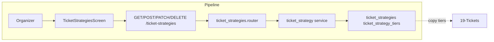

# Ticket Strategies (Reusable Templates)

## Initiator

- **Who:** Organizer or Admin (CRUD strategies).
- **When:** Manage → Ticket Strategies; Event create/edit (strategy picker, inline create).

## Frontend flow

- **Screen/Widget:** `TicketStrategiesScreen`; `StrategyPickerScreen` (from event create/edit/detail); inline create on Create Event.
- **User action:** List strategies (search by name/tier); create strategy (name + tiers: name, description, price, order); edit/delete; select strategy for event.
- **API calls:** `getTicketStrategies()`, `getTicketStrategy(id)`, `createTicketStrategy(data)`, `updateTicketStrategy(id, data)` (via PATCH), `deleteTicketStrategy(id)` → GET/POST/GET/PATCH/DELETE `/api/v1/ticket-strategies` and `/{strategy_id}`.

## Backend routing

- **Entry:** `api_router` → `ticket_strategies.router` prefix `/ticket-strategies`.
- **Handler:** `ticket_strategies.py` → list_my_strategies (GET ""), create_strategy (POST ""), get_strategy (GET /{id}), update (PATCH), delete (DELETE).

## Service layer

- **Module(s):** `app.services.ticket_strategy`.
- **Main functions:** `list_strategies(organizer_id)`, `get_or_404()`, `create()` (with tiers), `update()` (name and/or tiers), `delete()` (check not in use by events or allow cascade).

## Models and DB

- **Models:** `TicketStrategy`, `TicketStrategyTier`.
- **Tables updated/read:** `ticket_strategies`, `ticket_strategy_tiers`. Strategies are per-organizer (organizer_id).

## Dependencies

- **Requires:** [Auth](01-auth-users.md). Events reference strategy by copying tiers to event's ticket_tiers on create/link; strategy can be deleted if no events use it (or soft-delete).
- **Triggers / side effects:** [Tickets](19-tickets.md) — event ticket tiers are copied from strategy; re-selecting same strategy can repopulate tiers.

## Prompt

Implement **Ticket Strategies (Reusable Templates)** for the Crowd Funding Event app. Backend: GET/POST/GET/PATCH/DELETE `/ticket-strategies` and `/{id}`; list_my_strategies, create/update/delete with tiers (name, description, price, order). Frontend: TicketStrategiesScreen, StrategyPickerScreen from event create/edit; inline create. Follow the flow, dependencies, and diagrams in this document.

## Flow diagram

## Vulnerabilities

- Organizer can only see/edit own strategies (list filtered by current_user.id; get/update/delete check ownership). Admin can access; ensure get_or_404 does not leak other organizers' strategies.
- Delete: ensure events using this strategy are handled (block delete or copy tiers to event and null strategy_id).

## Improvements

- Search bar on Ticket Strategies page: backend could support ?search= for name/tier name/description to avoid loading all strategies.
- Inline create from event wizard: same POST create; frontend may need to refetch list after create.

## Feedback

- Reusable template pattern (like venues) is consistent. No per-tier quantity; capacity is event-level.
