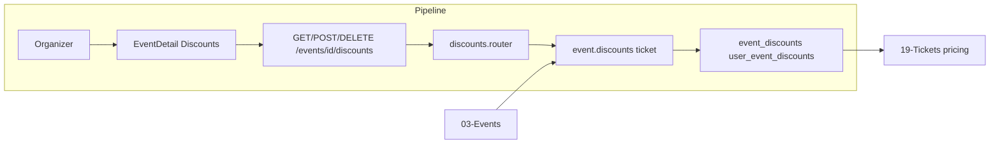

# Event Discounts

## Initiator

- **Who:** Organizer (create/delete event discount rules, set per-user selective discount); Customer (view my discounts).
- **When:** Event Detail management → Discounts; Create/Edit Event; Event Detail "Your Discounts" (customer).

## Frontend flow

- **Screen/Widget:** Event Detail (organizer: discount rules list, add rule; customer: "Your Discounts" section); Global Discounts screen; Claim Discounts screen.
- **User action:** Create event discount rule (ticket_percent, pledge_percent, fixed_cents; target: all/pledgers/non_pledgers); delete rule; set selective discount per user; customer views applicable discounts and amounts.
- **API calls:** `getEventDiscounts(eventId)`, `createEventDiscount(eventId, data)`, `deleteEventDiscount(eventId, discountId)`, `getMyDiscounts(eventId)`; selective: set_user_discount (POST), remove (DELETE) under events/discounts.

## Backend routing

- **Entry:** `events_router` → `discounts.router`.
- **Handler:** `events/discounts.py` → GET/POST `/{event_id}/discounts/rules`, DELETE `/{event_id}/discounts/rules/{discount_id}`, GET `/{event_id}/my-discounts`; POST/DELETE `/{event_id}/discounts` for user-specific discount.

## Service layer

- **Module(s):** `app.services.event.discounts`, `app.services.ticket` (pricing, set_user_discount).
- **Main functions:** `list_event_discounts()`, `create_event_discount()`, `delete_event_discount()`, `compute_event_discounts_for_user()`; ticket_service.set_user_discount, remove_user_discount.

## Models and DB

- **Models:** `EventDiscount`, `UserEventDiscount` (selective per user).
- **Tables updated/read:** `event_discounts`, `user_event_discounts`. Discount cap: total discount cannot exceed ticket price (enforced in pricing).

## Dependencies

- **Requires:** [Events](03-events-crud-lifecycle.md), [Tickets](19-tickets.md) (price computation). [Reusable Discount Strategies](16-reusable-discount-strategies.md) for attach/claim.
- **Triggers / side effects:** Discounts applied at ticket purchase; see [41-milestone-early-bird-discounts](41-milestone-early-bird-discounts.md) for stacking.

## Prompt

Implement **Event Discounts** for the Crowd Funding Event app. Backend: GET/POST/DELETE `/events/{id}/discounts/rules`, GET my-discounts, POST/DELETE user-specific discount; rules (ticket_percent, pledge_percent, fixed_cents; target all/pledgers/non_pledgers); cap total discount at ticket price. Frontend: Event Detail discounts (organizer rules, customer "Your Discounts"); claim/set selective. Follow the flow, dependencies, and diagrams in this document.

## Flow diagram

## Vulnerabilities

- Only organizer (or co-organizer with permission) can create/delete rules and set user discounts. get_my_discounts returns only current user's applicable discounts; no IDOR.
- Validate value ranges (e.g. percent 0–100, fixed_cents >= 0) and target consistency (e.g. pledge_percent and non_pledgers).

## Improvements

- Customer "Your Discounts" could show expiry or conditions (e.g. "Valid until event start") if business rule exists.
- Event discount rules and strategy-attached discounts both apply; ensure clear documentation of precedence and cap.

## Feedback

- Event discounts (rules + selective) and reusable strategies (attach/claim) are separate; both feed into ticket pricing. See [16](16-reusable-discount-strategies.md).
