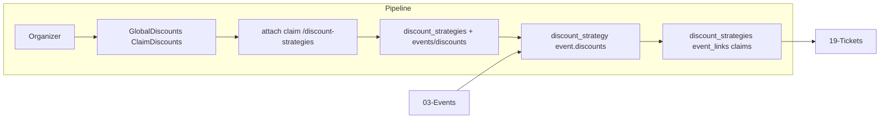

# Reusable Discount Strategies

## Initiator

- **Who:** Organizer (CRUD strategies, attach to events, set auto-apply or claim); Customer (claim non-auto-apply discounts).
- **When:** Manage → Discounts (global strategies); Event create/edit and Event Detail (attach strategy); Claim Discounts screen (customer).

## Frontend flow

- **Screen/Widget:** `GlobalDiscountsScreen`; Event Detail / Create Event (discount strategy dropdown, "Add + Apply" vs "Add"); `ClaimDiscountsScreen` (claimable discounts per event).
- **User action:** Create/delete discount strategy (ticket_percent or pledge_percent; target all/pledgers/non_pledgers); attach to event with auto_apply or not; customer claims discount.
- **API calls:** `getDiscountStrategies()`, `createDiscountStrategy(data)`, `deleteDiscountStrategy(id)`, `attachDiscountStrategy(eventId, strategyId, autoApply)`, `detachDiscountStrategy(eventId, strategyId)`, `getEventDiscountStrategies(eventId)`, `getClaimableDiscounts(eventId)`, `claimDiscount(eventId, linkId)`, `unclaimDiscount(eventId, linkId)`.

## Backend routing

- **Entry:** `api_router` → `discount_strategies.router` prefix `/discount-strategies`; event discount strategies and claim under `events/discounts.py`.
- **Handler:** `discount_strategies.py` → GET/POST/GET/PATCH/DELETE for strategies; `events/discounts.py` → GET `/{event_id}/discount-strategies`, POST `/{event_id}/discount-strategies/{strategy_id}`, DELETE, GET claimable, POST/DELETE claim.

## Service layer

- **Module(s):** `app.services.discount_strategy`, `app.services.event.discounts` (attach, claim).
- **Main functions:** Strategy CRUD; link strategy to event (EventDiscountStrategyLink); CustomerDiscountClaim for claimed links; compute applicable discounts in ticket pricing.

## Models and DB

- **Models:** `DiscountStrategy`, `EventDiscountStrategyLink`, `CustomerDiscountClaim`.
- **Tables updated/read:** `discount_strategies`, `event_discount_strategy_links`, `customer_discount_claims`. Max 3 links per event (or per product rule).

## Dependencies

- **Requires:** [Auth](01-auth-users.md), [Events](03-events-crud-lifecycle.md), [Event Discounts](15-event-discounts.md) (stacking), [Tickets](19-tickets.md) (pricing).
- **Triggers / side effects:** Attach with auto_apply applies to all eligible; claim creates CustomerDiscountClaim; both considered in compute_ticket_price.

## Flow diagram

## Vulnerabilities

- Organizer-only strategy CRUD; attach/claim require event access. Claim: ensure link_id belongs to event and user cannot claim twice (or update claim).
- Cap total discount at ticket price in pricing service; ensure all discount sources (common, pledge, selective, event rules, strategy) are summed and capped.

## Improvements

- Searchable dropdown (max 3 results) on frontend; backend could support ?search= and limit for strategy list when attaching.
- Claimable vs auto-apply is clear in API (attach body.auto_apply); document for support.

## Feedback

- Two attach modes (Add + Apply vs Add) and customer claim flow are documented in FEATURES. Discount strategies are organizer-scoped like ticket strategies.
