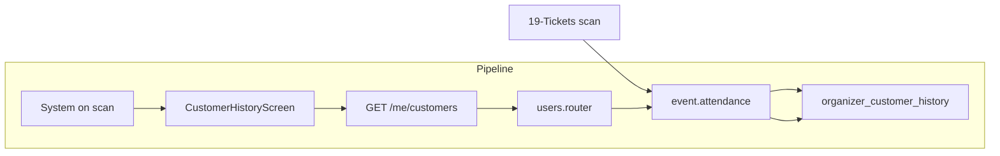

# Customer Loyalty Tracking

## Initiator

- **Who:** System (on ticket scan); Organizer/Admin (view customer list).
- **When:** Organizer scans ticket → attendance recorded; Manage → Customers screen.

## Frontend flow

- **Screen/Widget:** `CustomerHistoryScreen` or equivalent (`/manage/customers`); linked from Manage tab. No direct user action to "create" loyalty—scan creates it.
- **User action:** Organizer views list of customers who attended their events (event count, "Loyal" badge for 2+ events); search.
- **API calls:** `getOrganizerCustomers()` → GET `/api/v1/me/customers` (organizer only). Scan ticket is in [19-tickets](19-tickets.md) / sponsor scan in [39](39-sponsor-ticket-scan-count.md); backend records OrganizerCustomerHistory on scan.

## Backend routing

- **Entry:** `api_router` → `users.router` prefix `/me`.
- **Handler:** `users.py` → GET `/customers` (require_role organizer/admin); list built from OrganizerCustomerHistory or aggregated from ticket scans. Scan: `events/tickets.py` scan_ticket or sponsors/tickets.py scan_sponsor records attendance.

## Service layer

- **Module(s):** `app.services.event.attendance` (or equivalent); scan handler calls create/record attendance.
- **Main functions:** Record attendance (organizer_id, customer_id, event_id, scan time) on scan; list unique customers for organizer with event count, "Loyal" (2+ events).

## Models and DB

- **Models:** `OrganizerCustomerHistory`.
- **Tables updated/read:** `organizer_customer_history` (insert on scan); read for customers list with count and loyalty flag.

## Dependencies

- **Requires:** [Auth](01-auth-users.md), [Tickets](19-tickets.md) (scan triggers recording). Scan flow creates history entry.
- **Triggers / side effects:** None (read-only for organizer; write only via scan).

## Prompt

Implement **Customer Loyalty Tracking** for the Crowd Funding Event app. Backend: Record OrganizerCustomerHistory on ticket scan (organizer_id, customer_id, event_id); GET `/me/customers` (organizer) with event count and "Loyal" (2+ events). Frontend: CustomerHistoryScreen (/manage/customers) listing customers who attended organizer events. Follow the flow, dependencies, and diagrams in this document.

## Flow diagram

## Vulnerabilities

- Customers list is organizer-scoped (only customers who attended their events). Ensure no leakage of other organizers' customers. PII (email/name): per privacy rules, consider what is shown (display_name vs email).
- Scan must record attendance in same transaction as marking ticket scanned to avoid inconsistency.

## Improvements

- Aggregate query (count events per customer per organizer) could be cached or indexed for large histories. "Loyal" badge = count >= 2.
- Export customers list (CSV) for organizer marketing (optional, with consent).

## Feedback

- Loyalty is a side effect of scanning; no separate "loyalty" API. Single endpoint GET /me/customers for organizer dashboard.
