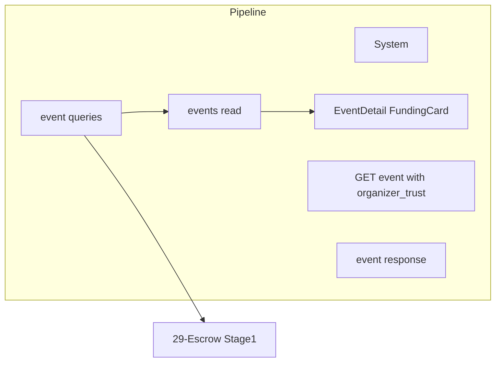

# Organizer Trust Score

## Initiator

- **Who:** System (computed on read); no direct write. Used in Event response and Escrow Stage 1.
- **When:** Event Detail (trust badge in hero); Funding Card (escrow message with trust); Escrow release (Stage 1: 30% default, 40% if trust > 0.8).

## Frontend flow

- **Screen/Widget:** Event Detail (trust badge pill: New/Low/Fair/Good/Excellent with percentage); Funding Card (trust line in escrow banner).
- **User action:** None (display only). Frontend receives organizer_trust in EventResponse.
- **API calls:** Event detail and list include `organizer_trust` in response; standalone GET `/api/v1/events/{id}/organizer-trust` may exist (plan says removed—data in EventResponse). No separate call if embedded.

## Backend routing

- **Entry:** Event response built in `events/_helpers.py` or crud; escrow service uses trust in release_stage1.
- **Handler:** Trust computed in event service (get_organizer_trust_score): completed_events / published_events; labels from percentage thresholds. Escrow: release_stage1() checks trust and releases 30% or 40%.

## Service layer

- **Module(s):** `app.services.event` (queries or crud), `app.services.escrow`.
- **Main functions:** `get_organizer_trust_score(db, organizer_id)` or equivalent; `release_stage1()` in escrow uses trust to decide amount (40% if score > 0.8).

## Models and DB

- **Models:** `Event` (status, organizer_id). No dedicated table; computed from events count (published = approved or beyond, completed = status completed).
- **Tables updated/read:** `events` (read-only for count by organizer and status).

## Dependencies

- **Requires:** [Events](03-events-crud-lifecycle.md), [Fund Escrow](29-fund-escrow.md).
- **Triggers / side effects:** Affects only display and Stage 1 release amount; no user-triggered action.

## Prompt

Implement **Organizer Trust Score** for the Crowd Funding Event app. Backend: Compute trust from completed_events / published_events; labels (New/Low/Fair/Good/Excellent) from thresholds; embed organizer_trust in EventResponse; escrow release_stage1 uses 40% if trust > 0.8 else 30%. Frontend: Event Detail trust badge; Funding Card escrow message. Follow the flow, dependencies, and diagrams in this document.

## Flow diagram

## Vulnerabilities

- Trust is derived from event data; no tampering. Ensure published/completed counts are correct (status enum consistent). New organizers (0 completed) get "New" label.
- No PII in trust score; safe to expose in public event response.

## Improvements

- Cache trust score per organizer with invalidation on event status change (completed) to avoid recomputing on every event fetch.
- Document thresholds (e.g. 80% for Excellent) in config or FEATURES for transparency.

## Feedback

- Trust score is a cross-cutting concern (event response + escrow). Single source of truth in event service keeps it maintainable.
