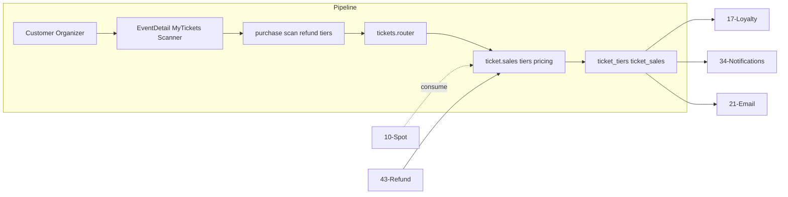

# Tickets

## Initiator

- **Who:** Customer (purchase, request refund, view receipts); Organizer/Admin (tier CRUD, sales list, scan, approve waitlist/refund).
- **When:** Event Detail (buy tickets, view your tickets); My Tickets; Ticket Sales / Scanned pages; Ticket Scanner; Refund Requests.

## Frontend flow

- **Screen/Widget:** Event Detail (ticket tiers section, purchase dialog with quantity, discount breakdown); `MyTicketsScreen` (stats chips: Total, Active, Pending/Refunded/Waitlist/Cancelled/Scanned; filter “Refund Pending” = refund_requested or refund_processing); `TicketSalesScreen`, `TicketScannerScreen`, `RefundRequestsScreen`; `TicketReceiptScreen` (customer: QR code + copyable ticket code + “Request Refund”; organizer view: no QR, ticket code not copyable).
- **User action:** Select tier and quantity, confirm purchase; view receipts (customer sees QR and can request refund from receipt; organizer sees receipt without QR); organizer scans QR; approve/reject waitlisted or refund requests.
- **API calls:** `getTicketTiers(eventId)`, `getTicketPrice(eventId, tierId, quantity)`, `purchaseTickets(eventId, tierId, quantity)`, `getTicketReceipt()` (backend omits `encrypted_qr_payload` when caller is organizer), `getPurchaseGroupReceipt()`, `getMyTickets()` (response includes `event_status` per ticket), `scanTicket()`, `getTicketSales()` / `getScannedTickets()` / `getWaitlistedTickets()` (organizer responses strip QR payload), `approveWaitlistedTicket()`, `rejectWaitlistedTicket()`; refund: `requestTicketRefund()` (called from receipt screen), `approveTicketRefund()`, `rejectTicketRefund()`, `getRefundRequests()`; tier CRUD: create/update/delete ticket tier.

## Backend routing

- **Entry:** `events_router` → `tickets.router`.
- **Handler:** `events/tickets.py` — GET `/{event_id}/ticket-tiers`, POST/PATCH/DELETE for tiers; GET ticket-price, POST purchase-ticket; GET receipts (when caller is not customer, `encrypted_qr_payload` is omitted for security), POST scan-ticket; GET ticket-sales, scanned-tickets, waitlisted, refund-requests (organizer-facing list endpoints use `_ticket_sale_to_organizer_response` so `encrypted_qr_payload` is never returned to organizers); POST approve/reject waitlist and refund; GET capacity-info, refund-requests.

## Service layer

- **Module(s):** `app.services.ticket.sales`, `app.services.ticket.tiers`, `app.services.ticket.pricing`, `app.services.ticket_crypto` (QR encryption).
- **Main functions:** `purchase_ticket()` (advisory lock, capacity check, reserved spot consumption, purchase_group_id); `compute_ticket_price()`; tier CRUD; `scan_ticket()` (mark scanned, record attendance); approve/reject waitlist and refund; ARQ refund tasks.

## Models and DB

- **Models:** `TicketTier` (price_cents, max_reserved_spots, display_order, **from_strategy** — bool, default false; true when tier was created from a [ticket strategy](14-ticket-strategies.md)), `TicketSale` (purchase_group_id, ticket_code, receipt_number, status, scanned_at), `UserEventDiscount`.
- **Tables updated/read:** `ticket_tiers`, `ticket_sales`, `user_event_discounts`, `organizer_customer_history` (on scan). Migration **zz05_ticket_tier_from_strategy** adds `from_strategy` to `ticket_tiers`. Capacity: tickets_sold + reserved_spots vs max_capacity; waitlist when full.

## Dependencies

- **Requires:** [Auth](01-auth-users.md), [Events](03-events-crud-lifecycle.md), [Event lifecycle](04-event-lifecycle-state-machine.md) (selling_tickets/live for purchase), [Spot Reservation](10-spot-reservation-funding.md) (consume reserved), [Event Discounts](15-event-discounts.md), [Refund Processing](43-refund-processing.md).
- **Triggers / side effects:** [Customer Loyalty](17-customer-loyalty.md) (scan), [Notifications](34-in-app-notifications.md), [Email](21-email-notifications.md) (purchase, waitlist, refund).

## Prompt

Implement **Tickets** for the Crowd Funding Event app. Backend: ticket tiers CRUD; GET ticket-price, POST purchase-ticket (advisory lock, capacity, consume reserved spots); receipts, POST scan-ticket; ticket-sales, scanned, waitlisted; approve/reject waitlist and refund; refund-requests; ARQ refund tasks. Frontend: Event Detail purchase flow, MyTicketsScreen, TicketSalesScreen, TicketScannerScreen, RefundRequestsScreen. Follow the flow, dependencies, and diagrams in this document.

## Flow diagram

## Recently implemented (organizer QR hiding and receipt refund)

- **Organizer never sees QR payload:** Backend uses `_ticket_sale_to_organizer_response()` (strips `encrypted_qr_payload`) for all organizer-facing ticket list and receipt responses: list ticket-sales, refund-requests, scanned-tickets, waitlisted-tickets, approve/reject responses, scan response, and GET receipt when `current_user.role != customer`. GET `/{event_id}/tickets/{sale_id}/receipt` sets `encrypted_qr_payload=None` when `is_organizer_view` so organizers cannot capture QR from receipt view.
- **Receipt screen:** `TicketReceiptScreen` has `isOrganizer`; when organizer, ticket code is not copyable and QR section is hidden. Customer view shows QR and a "Request Refund" button that calls `requestTicketRefund(eventId, saleId)` after confirmation. When not loading, receipt body is built only when `_receipt != null`; otherwise `SizedBox.shrink()` to avoid building receipt before data is ready.
- **My Tickets UX:** Refund request moved from list to receipt (open receipt → Request Refund). My Tickets stats chips: Total, Active, Pending (refund_requested/refund_processing), Refunded, Waitlist, Cancelled, Scanned (horizontal scroll). New filter "Refund Pending" shows tickets in refund_requested or refund_processing.
- **Offline scanning:** [Offline Sync & Local Cache](71-offline-sync-local-cache.md). Organizers can "Prepare Offline" to download ticket list for an event into local SQLite (OfflineTickets). When scanning without network, scans are stored in OfflineScans and pushed to the server when connectivity is restored. Ticket scanner uses AppDatabase for offline mode.
- **Event status on tickets:** GET my-tickets (and ticket sale response schema) now includes `event_status` (e.g. `selling_tickets`, `live`) per ticket so the frontend can filter or display by event lifecycle. Used by offline cache (only cache tickets for events in selling_tickets or live) and by `TicketsBottomSheet` (show only purchased tickets for active events).
- **from_strategy flag:** Ticket tiers can originate from a [ticket strategy](14-ticket-strategies.md) (apply strategy to event). Backend: `TicketTier.from_strategy` (bool, default false); when tiers are created from a strategy (via ticket strategy repo/service), `from_strategy` is set to true. `TicketTierResponse` includes `from_strategy`. **Delete tier:** `delete_tier()` raises `ConflictError` ("Cannot delete tiers that originated from a ticket strategy") when `tier.from_strategy` is true, so strategy-origin tiers cannot be removed (organizer can still edit price/name/order if allowed by business rules). Frontend: ticket model and `TicketTierManagement` (event detail) show/use `from_strategy` and prevent deletion of strategy-origin tiers; event_provider, event_repository, event_image_gallery, event_schedule_section, event_detail_screen, event_map_widget, shimmer_loaders updated for consistency.

## Vulnerabilities

- Purchase is rate-limited (15/min). Advisory lock (pg_advisory_xact_lock) on purchase and pledge prevents oversell. Ensure capacity check and reserved-spot consumption are atomic.
- QR payload encrypted (AES-256-GCM) when key set; scan validates and marks ticket. Organizers never receive `encrypted_qr_payload` in API responses (organizer-response helper and receipt is_organizer_view). Prevent replay (scanned_at set once) and ensure scan_count for sponsor tickets.
- Refund request: only ticket owner or organizer can approve; validate sale belongs to event.

## Improvements

- Single-query endpoint for organizer ticket sales (GET /me/organizer-ticket-sales) avoids N+1; use for global sales list.
- Ticket tier edit/delete blocked when sales exist in selling_tickets/live; enforce in service.

## QR Code Encryption (subsection)

**Service:** `Backend/app/services/ticket_crypto.py`

Ticket QR codes are encrypted with AES-256-GCM to prevent forgery. The encrypted payload contains `ticket_code`, `event_id`, and `sale_id`.

- `encrypt_ticket_qr(ticket_code, event_id, sale_id) -> str` — produces a URL-safe base64 string for embedding in a QR code.
- `decrypt_ticket_qr(encrypted_payload) -> dict` — decrypts and validates the QR payload, raising `ValueError` on tampered data.

**Configuration:** Set `TICKET_ENCRYPTION_KEY` env var to a 64-character hex string (32 bytes). When unset, the module falls back to plaintext JSON for local development.

**Encrypted format:** `base64(nonce_12B || ciphertext || tag_16B)`. Uses `cryptography.hazmat.primitives.ciphers.aead.AESGCM` with a random 96-bit nonce per encryption (NIST SP 800-38D compliant).

**Integration:** Called in `_ticket_sale_to_response()` (tickets.py) to generate `encrypted_qr_payload` for **customer** responses only. Organizer-facing endpoints use `_ticket_sale_to_organizer_response()` (same as `_ticket_sale_to_response` but sets `encrypted_qr_payload = None`) so organizers never receive QR payloads (list ticket-sales, refund-requests, scanned-tickets, waitlisted-tickets, and GET receipt when role ≠ customer). Receipt API sets `encrypted_qr_payload=None` when `is_organizer_view` (current_user.role != customer). Frontend: `TicketReceiptScreen` accepts `isOrganizer`; when true, QR section is hidden and ticket code is not copyable; customer can "Request Refund" from the receipt screen. `scan_ticket()` decrypts the scanned payload.

## Feedback

- Tickets are central: purchase, scan, waitlist, refund. Discount breakdown and free-ticket clamping documented in FEATURES. See [43-refund-processing](43-refund-processing.md) for ARQ refund flow.
