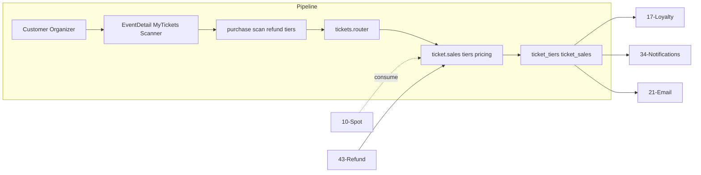

# Tickets

## Initiator

- **Who:** Customer (purchase, request refund, view receipts); Organizer/Admin (tier CRUD, sales list, scan, approve waitlist/refund).
- **When:** Event Detail (buy tickets, view your tickets); My Tickets; Ticket Sales / Scanned pages; Ticket Scanner; Refund Requests.

## Frontend flow

- **Screen/Widget:** Event Detail (ticket tiers section, purchase dialog with quantity, discount breakdown); `MyTicketsScreen`; `TicketSalesScreen`, `TicketScannerScreen`, `RefundRequestsScreen`; receipt screens (single + purchase group).
- **User action:** Select tier and quantity, confirm purchase; view receipts and QR codes; organizer scans QR; approve/reject waitlisted or refund requests.
- **API calls:** `getTicketTiers(eventId)`, `getTicketPrice(eventId, tierId, quantity)`, `purchaseTickets(eventId, tierId, quantity)`, `getTicketReceipt()`, `getPurchaseGroupReceipt()`, `scanTicket()`, `getTicketSales()`, `getScannedTickets()`, `getWaitlistedTickets()`, `approveWaitlistedTicket()`, `rejectWaitlistedTicket()`; refund: `requestTicketRefund()`, `approveTicketRefund()`, `rejectTicketRefund()`, `getRefundRequests()`; tier CRUD: create/update/delete ticket tier.

## Backend routing

- **Entry:** `events_router` → `tickets.router`.
- **Handler:** `events/tickets.py` — GET `/{event_id}/ticket-tiers`, POST/PATCH/DELETE for tiers; GET ticket-price, POST purchase-ticket; GET receipts, POST scan-ticket; GET ticket-sales, scanned-tickets, waitlisted; POST approve/reject waitlist and refund; GET capacity-info, refund-requests.

## Service layer

- **Module(s):** `app.services.ticket.sales`, `app.services.ticket.tiers`, `app.services.ticket.pricing`, `app.services.ticket_crypto` (QR encryption).
- **Main functions:** `purchase_ticket()` (advisory lock, capacity check, reserved spot consumption, purchase_group_id); `compute_ticket_price()`; tier CRUD; `scan_ticket()` (mark scanned, record attendance); approve/reject waitlist and refund; ARQ refund tasks.

## Models and DB

- **Models:** `TicketTier`, `TicketSale` (purchase_group_id, ticket_code, receipt_number, status, scanned_at), `UserEventDiscount`.
- **Tables updated/read:** `ticket_tiers`, `ticket_sales`, `user_event_discounts`, `organizer_customer_history` (on scan). Capacity: tickets_sold + reserved_spots vs max_capacity; waitlist when full.

## Dependencies

- **Requires:** [Auth](01-auth-users.md), [Events](03-events-crud-lifecycle.md), [Event lifecycle](04-event-lifecycle-state-machine.md) (selling_tickets/live for purchase), [Spot Reservation](10-spot-reservation-funding.md) (consume reserved), [Event Discounts](15-event-discounts.md), [Refund Processing](43-refund-processing.md).
- **Triggers / side effects:** [Customer Loyalty](17-customer-loyalty.md) (scan), [Notifications](34-in-app-notifications.md), [Email](21-email-notifications.md) (purchase, waitlist, refund).

## Prompt

Implement **Tickets** for the Crowd Funding Event app. Backend: ticket tiers CRUD; GET ticket-price, POST purchase-ticket (advisory lock, capacity, consume reserved spots); receipts, POST scan-ticket; ticket-sales, scanned, waitlisted; approve/reject waitlist and refund; refund-requests; ARQ refund tasks. Frontend: Event Detail purchase flow, MyTicketsScreen, TicketSalesScreen, TicketScannerScreen, RefundRequestsScreen. Follow the flow, dependencies, and diagrams in this document.

## Flow diagram

## Vulnerabilities

- Purchase is rate-limited (15/min). Advisory lock (pg_advisory_xact_lock) on purchase and pledge prevents oversell. Ensure capacity check and reserved-spot consumption are atomic.
- QR payload encrypted (AES-256-GCM) when key set; scan validates and marks ticket. Prevent replay (scanned_at set once) and ensure scan_count for sponsor tickets.
- Refund request: only ticket owner or organizer can approve; validate sale belongs to event.

## Improvements

- Single-query endpoint for organizer ticket sales (GET /me/organizer-ticket-sales) avoids N+1; use for global sales list.
- Ticket tier edit/delete blocked when sales exist in selling_tickets/live; enforce in service.

## QR Code Encryption (subsection)

**Service:** `Backend/app/services/ticket_crypto.py`

Ticket QR codes are encrypted with AES-256-GCM to prevent forgery. The encrypted payload contains `ticket_code`, `event_id`, and `sale_id`.

- `encrypt_ticket_qr(ticket_code, event_id, sale_id) -> str` — produces a URL-safe base64 string for embedding in a QR code.
- `decrypt_ticket_qr(encrypted_payload) -> dict` — decrypts and validates the QR payload, raising `ValueError` on tampered data.

**Configuration:** Set `TICKET_ENCRYPTION_KEY` env var to a 64-character hex string (32 bytes). When unset, the module falls back to plaintext JSON for local development.

**Encrypted format:** `base64(nonce_12B || ciphertext || tag_16B)`. Uses `cryptography.hazmat.primitives.ciphers.aead.AESGCM` with a random 96-bit nonce per encryption (NIST SP 800-38D compliant).

**Integration:** Called in `_ticket_sale_to_response()` (tickets.py) to generate `encrypted_qr_payload` on every ticket response, and in `scan_ticket()` to decrypt the scanned payload.

## Feedback

- Tickets are central: purchase, scan, waitlist, refund. Discount breakdown and free-ticket clamping documented in FEATURES. See [43-refund-processing](43-refund-processing.md) for ARQ refund flow.
