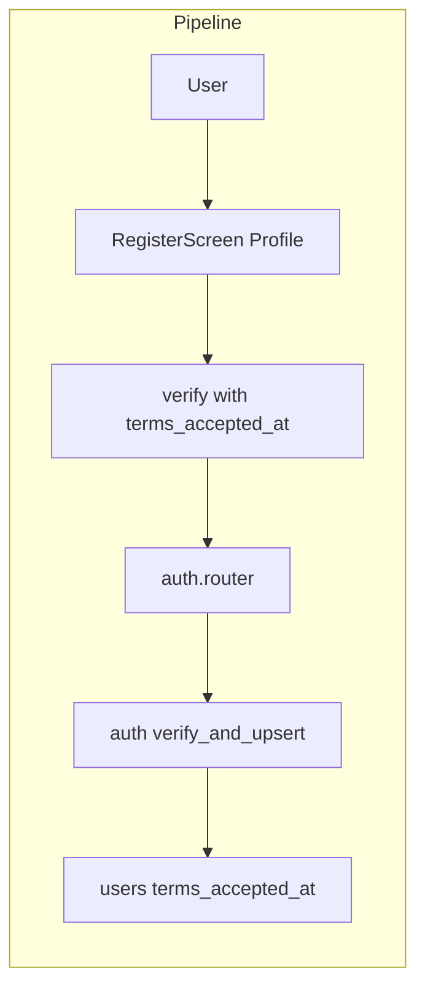

# Terms and Conditions Agreement

## Initiator

- **Who:** User (signup); User (view terms from profile).
- **When:** Register screen (checkbox + link to terms); Profile → Legal → Terms & Conditions.

## Frontend flow

- **Screen/Widget:** `RegisterScreen` (terms checkbox, tappable "Terms and Conditions" link); `TermsScreen` (`/terms?role=customer|organizer`); Profile screen Legal section → "Terms & Conditions" ListTile.
- **User action:** Accept terms at signup (required to create account); open terms page to read; open from profile.
- **API calls:** Terms content is frontend (e.g. `terms_content.dart`); signup sends `terms_accepted_at` in verify body. Backend: `verifyToken()` with `terms_accepted_at`; GET/PATCH `/api/v1/me` (profile, no terms re-accept).

## Backend routing

- **Entry:** Auth verify (POST `/api/v1/auth/verify`) accepts terms_accepted_at; stored on user create. No dedicated terms API (content is static in app).
- **Handler:** `auth.py` verify → `verify_and_upsert_user(..., terms_accepted_at=body.terms_accepted_at)`; User model has terms_accepted_at.

## Service layer

- **Module(s):** `app.services.auth`.
- **Main functions:** `verify_and_upsert_user()` stores terms_accepted_at for new users; existing users not updated (per product rule).

## Models and DB

- **Models:** `User` (terms_accepted_at: DateTime).
- **Tables updated/read:** `users` (terms_accepted_at set on insert for new user).

## Dependencies

- **Requires:** [Auth](01-auth-users.md). Terms content is role-specific (organizer vs customer) in frontend.
- **Triggers / side effects:** None (compliance and display only).

## Flow diagram

## Vulnerabilities

- Frontend could send terms_accepted_at without user actually accepting; ensure checkbox is required and not bypassable (backend accepts timestamp as attestation; legal may require storing IP or version). Consider storing terms version if terms change over time.
- Terms content in app can get out of date; consider version or "last updated" and backend-stored terms if legally required.

## Improvements

- Store terms_version or terms_url when accepted so future terms updates can prompt re-acceptance if needed.
- Profile could show "Terms accepted on {date}" for transparency.

## Feedback

- Role-specific terms (organizer: fees, escrow, clawback; customer: pledging, refund, tickets) are in frontend; single route /terms?role= for sharing. Backend only stores timestamp.
