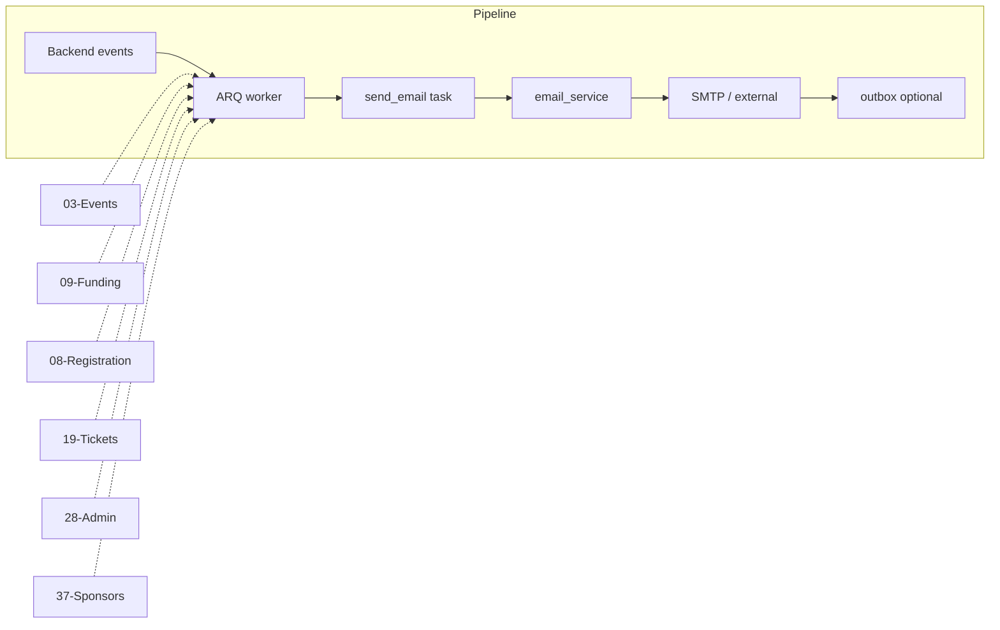

# Email Notifications

## Initiator

- **Who:** System (triggered by backend actions); no user-initiated "send email" action.
- **When:** Event cancelled, ticket purchased, unpledge/unregister refund, waitlist rejected/approved, ticket refund approved, sponsor bid approved/rejected/refunded.

## Frontend flow

- **Screen/Widget:** None (email is backend-triggered). User receives email at registered address; no in-app "email sent" beyond success toasts for the triggering action.
- **User action:** N/A.
- **API calls:** None from frontend for sending; emails enqueued via ARQ in backend after pledge, purchase, cancel, refund, etc.

## Backend routing

- **Entry:** No direct route; called from other handlers (lifecycle, pledge, registration, tickets, admin, sponsors). `enqueue("send_*_email", ...)` via worker.
- **Handler:** `app.services.email_notifications` (e.g. send_event_cancelled_email, send_ticket_purchased_email, ...); `app.services.email_service` (provider-agnostic: SendGrid or console); ARQ worker runs tasks.

## Service layer

- **Module(s):** `app.services.email_notifications`, `app.services.email_service`, `app.services.email_templates` (Uber-themed HTML). Worker: `app.worker.main` with registered email tasks.
- **Main functions:** High-level send_* functions (deduplicate recipients, choose template); EmailBackend (SendGrid v3, Console); enqueue() with Redis; graceful failure (try/except, no API break).

## Models and DB

- **Models:** None (email is side effect). Config: EMAIL_ENABLED, EMAIL_PROVIDER, EMAIL_API_KEY, etc.
- **Tables updated/read:** None. Optional: email_log for audit (not in plan).

## Dependencies

- **Requires:** [Backend scaling](44-backend-scaling-infra.md) (ARQ + Redis). Triggered by: [Events lifecycle](03-events-crud-lifecycle.md) (cancel), [Funding](09-funding-pledges.md) (unpledge), [Registration](08-registration-waitlist.md) (unregister), [Tickets](19-tickets.md) (purchase, waitlist, refund), [Admin](28-admin-dashboard.md), [Sponsors](37-sponsorship-prerequisites.md) (bid accept/reject/refund).
- **Triggers / side effects:** None (downstream only).

## Prompt

Implement **Email Notifications** for the Crowd Funding Event app. Backend: send_*_email functions (event cancelled, ticket purchased, unpledge/unregister refund, waitlist, ticket refund, sponsor bid); enqueue via ARQ; EmailBackend (SendGrid or console); templates (Uber-themed HTML). No frontend API; emails triggered by lifecycle, pledge, registration, tickets, admin. Follow the flow, dependencies, and diagrams in this document.

## Flow diagram

## Vulnerabilities

- Email content must not include sensitive data beyond what user already has (e.g. receipt number, amount). Avoid logging full email body. API keys in env only.
- ARQ failure: 3 retries; refund_failed or dead-letter for admin investigation. Ensure Redis and worker are monitored.

## Improvements

- Consider storing email_log (event_id, user_id, type, sent_at) for support and compliance. Optional.
- Templates: keep inline CSS and mobile-friendly; test with real SendGrid in staging.

## Feedback

- 11 email types documented in FEATURES; all sent via ARQ. Provider-agnostic design allows swapping to another provider via config.
