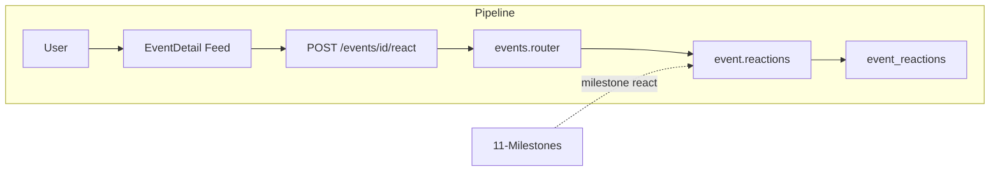

# Like / Dislike System

## Initiator

- **Who:** Customer, Organizer, Sponsor (react to event or milestone); Admin (view dislike count, no buttons).
- **When:** Event Detail (event reaction bar); Milestone Timeline (per-milestone like/dislike).

## Frontend flow

- **Screen/Widget:** Event Detail → `_ReactionBar` (self-contained: like/dislike buttons, counts); Milestone cards → per-milestone react. Admin: counts only, no buttons for dislike.
- **User action:** Tap Like or Dislike; toggle or switch (one reaction per user per event/milestone).
- **API calls:** `reactToEvent(eventId, reaction)`, `getMyReaction(eventId)` → POST/GET `/api/v1/events/{id}/react`, `/{id}/my-reaction`. Milestones: `reactToMilestone(eventId, milestoneId, reaction)`, `getMyMilestoneReaction()`.

## Backend routing

- **Entry:** `events_router` → `reactions.router`; milestones in `milestones.py`.
- **Handler:** `events/reactions.py` → POST `/{event_id}/react`, GET `/{event_id}/my-reaction`; milestone react in milestones router.

## Service layer

- **Module(s):** Event reactions: likely in `app.services.post` or dedicated reaction service; milestone: `app.services.milestone`.
- **Main functions:** Upsert event reaction (like/dislike), return like_count and dislike_count; same for milestone. Admin sees both counts; others see only like_count (dislike hidden in response or UI).

## Models and DB

- **Models:** `EventReaction` (event_id, user_id, reaction); `MilestoneReaction` (milestone_id, user_id, reaction).
- **Tables updated/read:** `event_reactions`, `milestone_reactions`. One row per user per event (or per milestone); toggle updates row.

## Dependencies

- **Requires:** [Auth](01-auth-users.md), [Events](03-events-crud-lifecycle.md), [Funding Milestones](11-funding-milestones.md) (for milestone react).
- **Triggers / side effects:** None (counts displayed only).

## Flow diagram

## Vulnerabilities

- Reaction is scoped to event/milestone; user can only set own reaction. No IDOR (user_id from token). Validate reaction value (like/dislike) and ensure unique constraint (event_id, user_id) to prevent duplicates.
- Dislike count hidden from non-admin in API or frontend; ensure response does not leak if admin-only.

## Improvements

- Self-contained reaction bar: only refreshes counts, not full page. Backend returns both counts so frontend can update locally; frontend hides dislike for non-admin.
- Consider rate limit on react endpoint to prevent spam (e.g. 30/min per user).

## Feedback

- Same toggle pattern for event and milestone reactions. Clear separation: event reactions in events/reactions.py, milestone in milestones.py.
