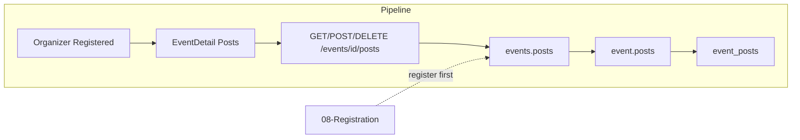

# Event Posts / Feed

## Initiator

- **Who:** Registered user (post, delete own); Organizer/Admin (delete any, toggle posts on/off).
- **When:** Event Detail → Event Feed section (when posts enabled).

## Frontend flow

- **Screen/Widget:** Event Detail → `_EventFeed` (self-contained: list posts, post form, delete, refresh button). Unregistered users see "Please register first" disclaimer.
- **User action:** Write post; submit; delete own post (or organizer/admin delete any); organizer toggles posts on/off for event.
- **API calls:** `getEventPosts(eventId)`, `createEventPost(eventId, content)`, `deleteEventPost(eventId, postId)`, `toggleEventPosts(eventId)` → GET/POST/DELETE `/api/v1/events/{id}/posts`, POST toggle.

## Backend routing

- **Entry:** `events_router` → `posts.router`.
- **Handler:** `events/posts.py` → GET `/{event_id}/posts`, POST `/{event_id}/posts`, DELETE `/{event_id}/posts/{post_id}`, POST `/{event_id}/toggle-posts`.

## Service layer

- **Module(s):** `app.services.post`.
- **Main functions:** List posts (author name, time-ago); create post (event_id, user_id, content); delete (author or organizer/admin); toggle posts (event.posts_enabled).

## Models and DB

- **Models:** `EventPost` (event_id, user_id, content, created_at). Event has posts_enabled toggle.
- **Tables updated/read:** `event_posts`, `events` (posts_enabled). Author name from User (display_name or email).

## Dependencies

- **Requires:** [Auth](01-auth-users.md), [Events](03-events-crud-lifecycle.md). Registration may be required to post (per FEATURES: "Please register first" for unregistered).
- **Triggers / side effects:** None (no notifications for new posts in plan).

## Flow diagram

## Vulnerabilities

- Delete: only author, organizer, or admin. Validate post_id belongs to event and user has permission. Posts are public to anyone viewing event; no PII beyond display_name. Sanitize content (XSS) if rendered as HTML.
- Toggle posts: only organizer/admin with edit permission.

## Improvements

- Pagination for feed if events can have many posts (limit/offset or cursor). Refresh button in UI reduces stale data.
- Consider soft-delete (is_deleted) for moderation audit; optional.

## Feedback

- Self-contained feed widget: post/delete only refresh feed section. Same pattern as Funding Card and Reaction Bar.
