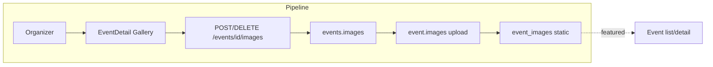

# Event Images / Gallery

## Initiator

- **Who:** Organizer or Admin (add/delete images); Anyone (view gallery).
- **When:** Event Detail (horizontal scrollable gallery); Event create/edit (add image by URL or upload).

## Frontend flow

- **Screen/Widget:** Event Detail (image gallery); Create/Edit Event (add image: URL or file upload).
- **User action:** Add image (URL + optional caption, or upload file); delete image; view gallery.
- **API calls:** `getEventImages(eventId)`, `addEventImage(eventId, imageUrl, caption?)`, `uploadEventImage(eventId, fileBytes, fileName, caption?)`, `deleteEventImage(eventId, imageId)` → GET/POST/DELETE `/api/v1/events/{id}/images`, POST upload.

## Backend routing

- **Entry:** `events_router` → `images.router`.
- **Handler:** `events/images.py` → GET `/{event_id}/images`, POST `/{event_id}/images` (URL), POST `/{event_id}/images/upload`, DELETE `/{event_id}/images/{image_id}`.

## Service layer

- **Module(s):** Event images: stored in DB with url or path; upload may use static folder or future S3.
- **Main functions:** List images for event; add (url, caption, display_order); upload (save file, create record); delete (remove file if local, delete row).

## Models and DB

- **Models:** `EventImage` (event_id, url or file path, caption, display_order).
- **Tables updated/read:** `event_images`. Static files in Backend/static/uploads if upload used.

## Dependencies

- **Requires:** [Auth](01-auth-users.md), [Events](03-events-crud-lifecycle.md). Only organizer/admin can add/delete.
- **Triggers / side effects:** First image used as featured in list/detail (see event _get_first_images).

## Flow diagram

## Vulnerabilities

- Upload: validate file type and size; store outside web root or serve via safe path. URL add: validate URL scheme (https) and optionally domain allowlist to prevent SSRF or malicious redirects.
- Delete: ensure image_id belongs to event and user has permission; orphaned files if delete only from DB.

## Improvements

- FEATURES says "File upload for images" is Phase 21 (unimplemented); current may be URL-only. When adding upload, use S3 or dedicated storage and presigned URLs for production.
- Gallery order: display_order in model; ensure consistent sort in list.

## Feedback

- Images are optional; featured image for event cards comes from first image. Add/delete require edit permission.
