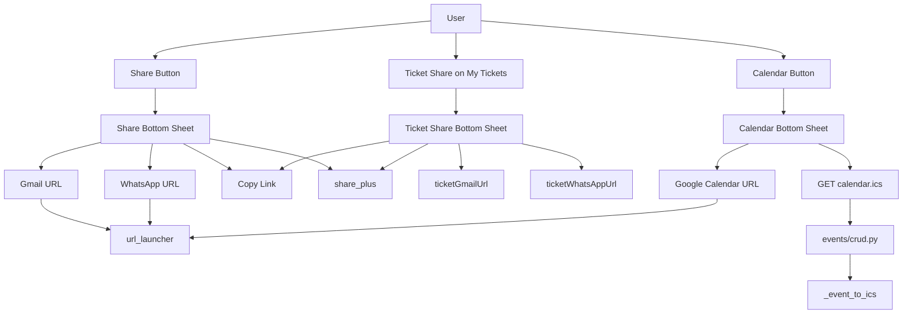

# Sharing & Calendar

## Initiator

- **Who:** User viewing Event Detail (share or add to calendar); User viewing My Tickets (share a ticket).
- **When:** Event Detail → Quick Action Bar (Share, Calendar buttons); My Tickets → Share icon on a purchased ticket card.

## Frontend flow

### Event share and calendar

- **Screen/Widget:** Event Detail → Quick Action Bar (Share, Calendar). Tapping **Share** opens a **Share bottom sheet** with four options: **Gmail** (opens Gmail compose with pre-filled subject/body), **WhatsApp** (opens wa.me with share text), **Copy Link** (copies event URL to clipboard), **More...** (native OS share sheet via `share_plus`). Tapping **Calendar** opens a **Calendar bottom sheet** with two options: **Google Calendar** (opens Google Calendar with event pre-filled via URL params), **Download .ics** (launches backend `.ics` URL in browser for Outlook/Apple Calendar etc.).
- **User action:** Tap Share → choose option from sheet; Tap Calendar → choose Google Calendar or .ics download.
- **API calls:** Share options use client-side URL schemes only (no API). Calendar: **Google Calendar** uses a client-built `calendar.google.com/calendar/render?action=TEMPLATE&...` URL; **Download .ics** uses GET `/api/v1/events/{id}/calendar.ics` (opened via `url_launcher`).

### Ticket social sharing

- **Screen/Widget:** My Tickets (`lib/screens/profile/my_tickets_screen.dart`) — each purchased ticket card shows a **Share** icon (next to View Receipt). Tapping it opens a **Ticket Share bottom sheet** with the same four options (Gmail, WhatsApp, Copy Link, More...) using ticket-specific text (event title, tier, receipt, event URL).
- **User action:** Tap Share on a ticket card → choose option from sheet.
- **API calls:** None; all client-side URL schemes and `share_plus`.
- **Frontend modules:**
  - `lib/utils/share_utils.dart` — URL builders: `eventUrl()`, `gmailUrl()`, `whatsAppUrl()`, `googleCalendarUrl()`, `shareText()`, venue/date helpers; **ticket:** `ticketShareText()`, `ticketGmailUrl()`, `ticketWhatsAppUrl()`.
  - `lib/widgets/share_bottom_sheet.dart` — `showShareSheet(context, event)` (event); **`showTicketShareSheet(context, ticket)`** (ticket); Gmail, WhatsApp, Copy Link, More (share_plus).
  - `lib/widgets/calendar_bottom_sheet.dart` — `showCalendarSheet(context, event)`; Google Calendar, Download .ics.
- **Dependencies:** `share_plus`, `url_launcher`. Event Detail and My Tickets import the share bottom sheet; ticket share uses `TicketSale` from `lib/models/ticket.dart`.

## Backend routing

- **Entry:** `events_router` → `crud.router`.
- **Handler:** `events/crud.py` → GET `/{event_id}/calendar.ics` → returns Response with content-type `text/calendar`, body from `_event_to_ics(event)`, `Content-Disposition: attachment` with sanitized filename.

## Service layer

- **Module(s):** Helpers in `events/_helpers.py` (e.g. `_event_to_ics`). Event loaded via `event_service.get_by_id(..., load_venue=True)`.
- **Main functions:** Build ICS string (VCALENDAR, VEVENT with DTSTART, DTEND, SUMMARY, DESCRIPTION, LOCATION in UTC); return as file download.

## Models and DB

- **Models:** `Event`, `Venue` (for location).
- **Tables updated/read:** `events`, `venues` (read-only for ICS generation).

## Dependencies

- **Requires:** [Events](03-events-crud-lifecycle.md). Public endpoint (no auth required for .ics so shared links work).
- **Triggers / side effects:** None.

## Prompt

Implement **Sharing and Calendar** for the Crowd Funding Event app. Backend: GET `/events/{id}/calendar.ics` returning ICS with VEVENT and location. Frontend: Event Detail Quick Action Bar; Share opens a bottom sheet (Gmail, WhatsApp, Copy Link, More via share_plus); Calendar opens a bottom sheet (Google Calendar URL, Download .ics). **Ticket share:** My Tickets screen shows a Share icon on each purchased ticket card; tapping it opens the same-style bottom sheet with ticket-specific text (event title, tier, receipt, event URL) via `showTicketShareSheet(context, ticket)` and `share_utils.dart` helpers `ticketShareText()`, `ticketGmailUrl()`, `ticketWhatsAppUrl()`. Use `url_launcher` and `share_plus`. Follow the flow, dependencies, and diagrams in this document.

## Flow diagram

## Vulnerabilities

- calendar.ics is public (anyone with link can get event details). Ensure only public event info (title, date, venue) is in ICS; no PII. If event is draft or cancelled, consider returning 404 or limited info.
- Share link: same as event detail URL; auth may be required to view event depending on status. Document behavior (e.g. public events viewable without login).

## Improvements

- ICS could include timezone (DTSTART with TZID) for multi-timezone support. Validate event has start_time/end_time before generating (frontend already shows a warning toast when event has no date and user taps Google Calendar).
- Google Calendar URL uses UTC; clients display in local time. No backend change required.

## Feedback

- Quick Action Bar holds Share and Calendar; each opens a dedicated bottom sheet (Option A UX). Gmail and Google Calendar integration are client-side URL schemes; no backend changes. Both flows are read-only.
