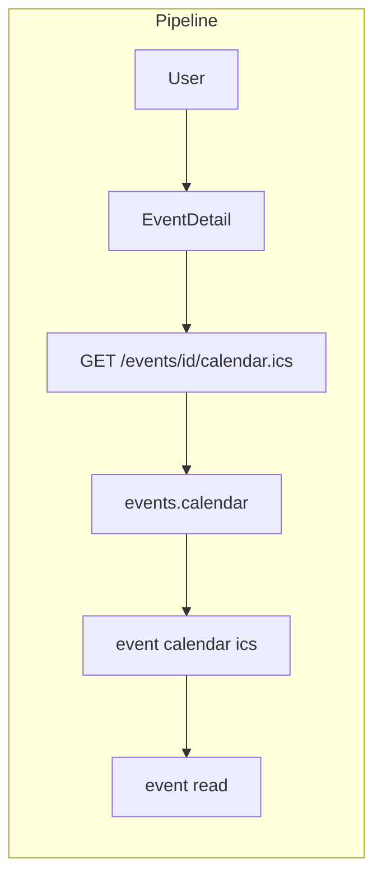

# Sharing & Calendar

## Initiator

- **Who:** User viewing Event Detail (share or add to calendar).
- **When:** Event Detail → Quick Action Bar (Share, Calendar buttons).

## Frontend flow

- **Screen/Widget:** Event Detail → Quick Action Bar (Share, Add to Calendar). Share copies event link to clipboard; Calendar copies .ics URL or opens download.
- **User action:** Tap Share (copy link); Tap Calendar (copy .ics URL or trigger download for import into calendar app).
- **API calls:** Share: frontend builds URL (e.g. origin + /events/{id}) and copies to clipboard; no API. Calendar: GET `/api/v1/events/{id}/calendar.ics` returns ICS file (or redirect). Frontend may use that URL for "Add to Calendar" (copy link or fetch and offer file).

## Backend routing

- **Entry:** `events_router` → `crud.router`.
- **Handler:** `events/crud.py` → GET `/{event_id}/calendar.ics` → returns Response with content-type text/calendar, body from _event_to_ics(event).

## Service layer

- **Module(s):** Helpers in `events/_helpers.py` (e.g. _event_to_ics). Event data from get_event.
- **Main functions:** Build ICS string (VTIMEZONE, VEVENT with start, end, summary, description, location); return as file download or inline.

## Models and DB

- **Models:** `Event`, `Venue` (for location).
- **Tables updated/read:** `events`, `venues` (read-only for ICS generation).

## Dependencies

- **Requires:** [Events](03-events-crud-lifecycle.md). Public endpoint (no auth required for .ics so users can share link).
- **Triggers / side effects:** None.

## Prompt

Implement **Sharing and Calendar** for the Crowd Funding Event app. Backend: GET `/events/{id}/calendar.ics` returning ICS with VEVENT and location. Frontend: Event Detail Quick Action Bar with Share (copy URL) and Add to Calendar (copy or download .ics). Follow the flow, dependencies, and diagrams in this document.

## Flow diagram

## Vulnerabilities

- calendar.ics is public (anyone with link can get event details). Ensure only public event info (title, date, venue) is in ICS; no PII. If event is draft or cancelled, consider returning 404 or limited info.
- Share link: same as event detail URL; auth may be required to view event depending on status. Document behavior (e.g. public events viewable without login).

## Improvements

- ICS could include timezone (DTSTART with TZID) for multi-timezone support. Validate event has start_time/end_time before generating.
- "Add to Calendar" UX: copy .ics URL vs download file—clarify in UI for mobile (e.g. open in calendar app).

## Feedback

- Quick Action Bar holds Share and Calendar; keeps AppBar clean. Both are read-only, no backend state change.
