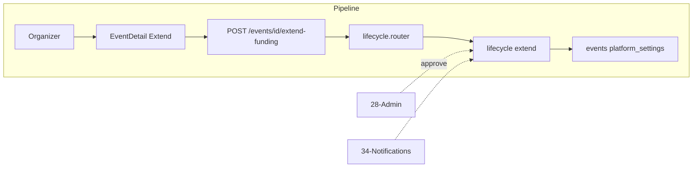

# Extend Funding (with Admin Approval)

## Initiator

- **Who:** Organizer (request extend); Admin (approve/reject extension, or apply directly).
- **When:** Event in waiting_event_date status; Admin Dashboard → Extensions tab or inline on event.

## Frontend flow

- **Screen/Widget:** Event Detail (Extend Funding dialog when status is waiting_event_date); Admin Dashboard → Extensions tab (list pending, approve/reject).
- **User action:** Organizer: open Extend Funding, enter new funding deadline and/or new goal, submit; Admin: approve or reject with optional note; or admin applies extension directly (no pending).
- **API calls:** `extendFunding(eventId, fundingEndAt?, fundingGoalCents?)`, `decideExtension(eventId, action)` (admin) → POST `/api/v1/events/{id}/extend-funding`, POST `/{id}/extension-decision`.

## Backend routing

- **Entry:** `events_router` → `lifecycle.router`.
- **Handler:** `events/lifecycle.py` → POST `/{event_id}/extend-funding`, POST `/{event_id}/extension-decision`. Admin may have separate "apply extension" path or same with role check.

## Service layer

- **Module(s):** `app.services.event.lifecycle`.
- **Main functions:** `extend_funding()` (organizer: set pending_extension with new deadline/goal; admin: apply directly and set status back to approved). `approve_extension()` / `reject_extension()` (admin clears pending_extension, applies or not).

## Models and DB

- **Models:** `Event` (pending_extension: JSON with new_funding_end_at, new_funding_goal_cents; funding_end_at, funding_goal_cents).
- **Tables updated/read:** `events`. On approve: update funding fields, clear pending_extension, set status to approved (re-open funding).

## Dependencies

- **Requires:** [Auth](01-auth-users.md), [Events](03-events-crud-lifecycle.md), [Event lifecycle](04-event-lifecycle-state-machine.md) (waiting_event_date only), [Admin Dashboard](28-admin-dashboard.md).
- **Triggers / side effects:** [Notifications](34-in-app-notifications.md) (notify organizer on approve/reject if applicable). Status approved re-opens pledging.

## Flow diagram

## Vulnerabilities

- Only organizer (with edit permission) can request; only admin can approve/reject. Validate event is in waiting_event_date for request. Admin bypass: apply without pending state. Ensure pending_extension is cleared on reject and on approve (single source of truth).
- New deadline must be in future; new goal must be >= current pledged. Enforce in service.

## Improvements

- Extensions tab in admin: filter events by pending_extension not null. Show requested values and current values for clarity.
- Optional: notify organizer when admin approves/rejects (in-app + email).

## Feedback

- Separate from "Set Event Date" (no admin approval). Extend funding is the only funding change that requires admin approval per FEATURES.
