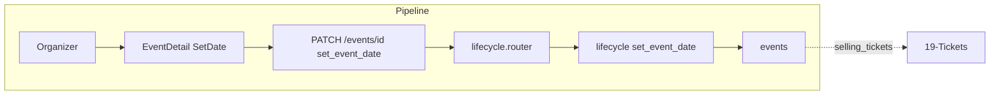

# Set Event Date (Direct Action)

## Initiator

- **Who:** Organizer (or Admin) when event is in waiting_event_date.
- **When:** Event Detail → Set Event Date dialog (no admin approval needed).

## Frontend flow

- **Screen/Widget:** Event Detail (Set Event Date button/dialog when status is waiting_event_date). Dialog: start time, end time pickers.
- **User action:** Open Set Event Date, choose start and end time, submit. Event transitions to selling_tickets.
- **API calls:** `setEventDate(eventId, startTime, endTime)` → POST `/api/v1/events/{id}/set-event-date`.

## Backend routing

- **Entry:** `events_router` → `lifecycle.router`.
- **Handler:** `events/lifecycle.py` → POST `/{event_id}/set-event-date` → set_event_date_endpoint.

## Service layer

- **Module(s):** `app.services.event.lifecycle`.
- **Main functions:** `set_event_date()` (validate event status is waiting_event_date; set start_time, end_time; set status to selling_tickets).

## Models and DB

- **Models:** `Event` (start_time, end_time, status).
- **Tables updated/read:** `events`. Single update: start_time, end_time, status = selling_tickets.

## Dependencies

- **Requires:** [Auth](01-auth-users.md), [Events](03-events-crud-lifecycle.md), [Event lifecycle](04-event-lifecycle-state-machine.md).
- **Triggers / side effects:** Event moves to selling_tickets; ticket sales and pledge block apply. No notification required (organizer action).

## Flow diagram

## Vulnerabilities

- Only organizer with edit permission or admin; event must be waiting_event_date. Validate end_time >= start_time and times in reasonable range (e.g. not in past for start).
- Grace period (event_date_grace_days): if organizer does not set date before grace expires, event may auto-cancel; that logic is in lifecycle check, not this endpoint.

## Improvements

- Frontend could show "Set Event Date By {date}" (deadline from grace period) to encourage timely action. Backend can return grace deadline in event response if needed.
- Reuse same date/time pickers as event create for consistency.

## Feedback

- Distinct from Extend Funding (which needs admin approval). Set Event Date is self-service for organizer and immediate.
