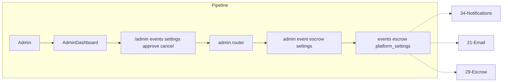

# Admin Dashboard

## Initiator

- **Who:** Admin only.
- **When:** Manage tab → Admin card (or direct route); tabs: Overview, Pending Approval, Extensions, Drafts, Users, Settings, Escrow, Requests.

## Frontend flow

- **Screen/Widget:** `AdminDashboardScreen` with section tabs and drawer navigation: Overview (stats), Events (pending approval, extensions, drafts), Financial (banking), Email, Settings, Mock, ARQ Control, KYC Review. Dedicated full-screen routes: `/admin/payouts` (payout status), `/admin/transactions` (transaction ledger), `/admin/escrow-pipeline` (escrow pipeline; linked from Banking tab), `/admin/run-logs` (ARQ worker run log; linked from ARQ Control tab), `/admin/users/:id` (user detail).
- **User action:** View stats; approve/reject events and extensions; publish/delete drafts; view users; open Financial tab (banking overview, payouts/transactions/escrow-pipeline links); open Email tab (templates, logo upload); edit settings; Mock controls; ARQ toggles and run-logs link; KYC review; escrow release/freeze/unfreeze; approve/reject cancellation requests.
- **API calls:** `adminGetUsers()`, `adminGetEvents(status?)`, `adminApproveEvent(id, approved)`, `adminGetStats()`, GET/PATCH settings (including getFeatureFlags()), GET escrows, POST escrows/{id}/release/{stage}, POST freeze/unfreeze, POST freeze-payouts for organizer; lifecycle cancellation/approve; banking/email/mock/worker endpoints as per [Banking](53-banking-financial-management.md), [ARQ Worker Control](65-arq-worker-control.md). Various admin endpoints under `/api/v1/admin/*`.

## Backend routing

- **Entry:** `api_router` → `admin.router` prefix `/admin`.
- **Handler:** `admin.py` → GET `/users`, GET `/events`, POST `/events/{id}/approve`, GET `/stats`, GET/PATCH `/settings`, GET `/escrows`, POST `/escrows/{event_id}/release/{stage}`, POST `/escrows/{event_id}/freeze`, `/unfreeze`, POST `/organizers/{id}/freeze-payouts`. Cancellation approve: `events/lifecycle.py` POST `/{id}/cancellation/approve`.

## Service layer

- **Module(s):** `app.services.admin`, `app.services.platform_settings`, `app.services.escrow`.
- **Main functions:** `list_users`, `list_events_for_admin`, `approve_or_reject_event`, `get_stats`; settings get/set; escrow list, release_stage1/2/3, freeze, unfreeze, freeze_organizer_payouts.

## Models and DB

- **Models:** `User`, `Event`, `PlatformSetting`, `FundEscrow`, `EscrowRelease`.
- **Tables updated/read:** `users`, `events`, `platform_settings`, `fund_escrows`, `escrow_releases`. Stats aggregate from events, fundings, ticket_sales, etc.

## Dependencies

- **Requires:** [Auth](01-auth-users.md) (admin role only). Touches [Events](03-events-crud-lifecycle.md), [Fund Escrow](29-fund-escrow.md), [Feature Flags](12-feature-flags.md), [Event lifecycle](04-event-lifecycle-state-machine.md) (cancellation approve).
- **Triggers / side effects:** Notifications to organizers (approve/reject event, extension, cancellation); email on cancel; escrow state changes.

## Prompt

Implement **Admin Dashboard** for the Crowd Funding Event app. Backend: GET `/admin/users`, `/events`, `/stats`, `/settings`, `/escrows`; POST approve event, extension-decision, escrow release/freeze/unfreeze, freeze-payouts, cancellation/approve; PATCH settings. Frontend: AdminDashboardScreen with tabs (Overview, Pending Approval, Extensions, Drafts, Users, Settings, Escrow, Requests). Follow the flow, dependencies, and diagrams in this document.

## Flow diagram

## Vulnerabilities

- All admin routes must use require_role(UserRole.admin). No privilege escalation (e.g. organizer must not access admin endpoints). Mask email for non-admin in user list if needed (FEATURES says email visible only in admin).
- Escrow release: ensure stage order (1 then 2 then 3) and amount consistency. Freeze prevents further releases; unfreeze does not auto-release.

## Recently implemented (admin navigation and screens)

- **Drawer navigation:** Dashboard uses a drawer for section switching: Events, Financial, Email, Settings, Mock, ARQ Control, KYC Review (in addition to bottom/section tabs where applicable).
- **Dedicated admin routes:** Router registers `/admin/escrow-pipeline` → `AdminEscrowPipelineScreen` (full-screen escrow pipeline; Banking tab links via "View pipeline"); `/admin/run-logs` → `AdminRunLogsScreen` (full-screen ARQ run log; ARQ Control tab links). Payouts and Transactions screens remain at `/admin/payouts` and `/admin/transactions`.

## Improvements

- Settings tab: format values (cents → dollars, percent, days) and distinct icons/colors per setting. Boolean settings as switches (already in plan).
- Requests tab: show context (e.g. funding % or selling_tickets) for cancellation requests so admin can decide.

## Feedback

- Dashboard is the single admin surface; tabs map to backend endpoints. Escrow and extension/cancellation flows are critical for trust.
