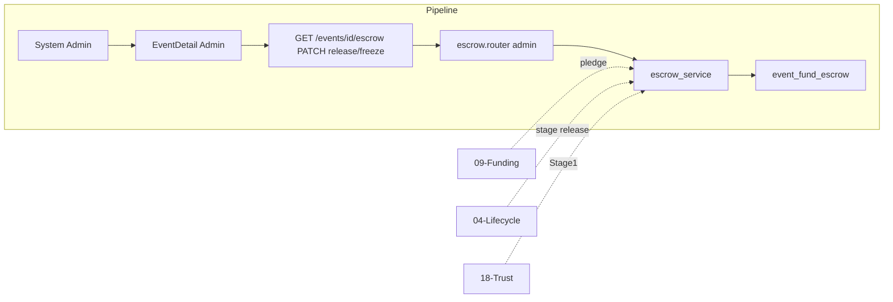

# Fund Escrow

## Initiator

- **Who:** System (create escrow on first pledge, release stages by time/event state); Admin (freeze/unfreeze, release stages manually).
- **When:** First pledge to an event creates FundEscrow; Stage 1/2/3 released automatically or by admin; Admin Dashboard → Escrow tab.

## Frontend flow

- **Screen/Widget:** Event Detail Funding Card (escrow message/trust line); Admin Dashboard → Escrow tab (list escrows, stage timeline, freeze/unfreeze, release stage).
- **User action:** Customer sees escrow message (funds held, release stages); Admin views escrows and freezes/unfreezes or triggers release.
- **API calls:** GET `/api/v1/events/{id}/escrow` (organizer/admin) for escrow status; Admin: GET `/api/v1/admin/escrows`, POST `release/{stage}`, POST `freeze`, `unfreeze`, POST `organizers/{id}/freeze-payouts`.

## Backend routing

- **Entry:** Escrow read: `events/pledge.py` GET `/{event_id}/escrow`. Admin: `admin.py` GET `/escrows`, POST `/escrows/{event_id}/release/{stage}`, `/freeze`, `/unfreeze`, POST `/organizers/{organizer_id}/freeze-payouts`.
- **Handler:** pledge.py returns escrow status; admin delegates to escrow_service.

## Service layer

- **Module(s):** `app.services.escrow`.
- **Main functions:** `get_or_create()` (on first pledge), `refresh_total()`, `release_stage1()` (30% or 40% if trust > 0.8), `release_stage2()`, `release_stage3()`, `freeze()`, `unfreeze()`, `list_all_escrows()`, `check_and_release_stage1/3()` (auto on event fetch or cron).

### Shared Escrow Base

- **Path:** `app.services.escrow_base`
- **Key functions:** `reject_if_frozen(escrow, label)` (raises if status frozen), `generic_freeze(db, model_class, event_id, get_or_create_fn)`, `generic_unfreeze(db, model_class, event_id, get_or_create_fn, label)` (restores status from stage1/2/3 released flags), `generic_release_stage(db, event_id, stage, settings_key, get_or_create_fn, reject_fn, released_by, label)` (releases one stage using platform percentage), `generic_list_all(db, model_class, offset, limit, search)` (paginated list with event title and organizer name/email).
- **Integration:** Fund, ticket, and sponsor escrow services keep their own `get_or_create` and `refresh_total` (different total calculation and triggers) but use these helpers for freeze, unfreeze, release_stage, and list_all to avoid duplication. Each service passes its model class and get_or_create function.

## Models and DB

- **Models:** `FundEscrow` (event_id, total_held_cents, status: active/frozen), `EscrowRelease` (escrow_id, stage, amount_cents, released_by, reason).
- **Tables updated/read:** `fund_escrows`, `escrow_releases`. Escrow created when first pledge is committed; total_held updated from sum of net pledge amounts.

## Dependencies

- **Requires:** [Funding](09-funding-pledges.md) (pledge creates/updates escrow), [Event lifecycle](04-event-lifecycle-state-machine.md) (stage release triggers), [Organizer Trust Score](18-organizer-trust-score.md) (Stage 1 bump), [Admin](28-admin-dashboard.md).
- **Triggers / side effects:** Payout to organizer (logical; actual payout may be manual or future integration). Freeze blocks all releases until unfreeze.

## Prompt

Implement **Fund Escrow** for the Crowd Funding Event app. Backend: get_or_create on first pledge; refresh_total; release_stage1 (30% or 40% if trust > 0.8), stage2, stage3; freeze/unfreeze; GET `/events/{id}/escrow`, admin GET/POST escrows, release, freeze, freeze-payouts. Frontend: Event Detail Funding Card escrow message; Admin Escrow tab. Follow the flow, dependencies, and diagrams in this document.

## Flow diagram

## Vulnerabilities

- Only admin can freeze/unfreeze and release. Ensure release_stage is idempotent or guarded (e.g. do not double-release Stage 1). total_held must be consistent with actual pledged amounts (refresh_total).
- Freeze organizer payouts: sets payout_frozen on all their events; escrow release checks this.

## Improvements

- Stage release reasons and released_by (system vs admin) stored in EscrowRelease for audit. Consider timestamps for each stage for reporting.
- Auto-release (Stage 1 when funding ends, Stage 3 when event completed) may run on event fetch; document trigger in lifecycle.

## Feedback

- Escrow is central to trust: funds held until stages. Trust score integration (40% Stage 1 for high-trust organizers) is in escrow service.
