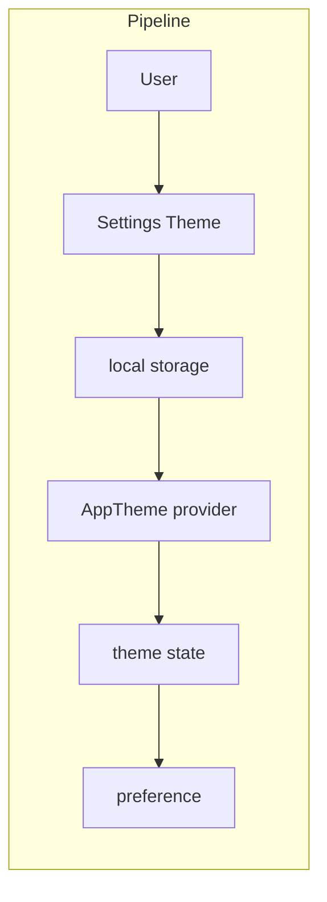

# Dark Mode

## Initiator

- **Who:** User (toggle in Profile). System (restore saved preference on launch).
- **When:** Profile screen → theme toggle; app launch (SharedPreferences).

## Frontend flow

- **Screen/Widget:** Profile screen (theme switch: light/dark). All screens use AppTheme context-aware helpers (cardOf, textPrimaryOf, surfaceOf, etc.) so dark mode applies everywhere. QR code on receipt forced to white background.
- **User action:** Toggle dark mode; preference persisted. No API call for theme (local only).
- **API calls:** None. Theme is frontend-only (ThemeProvider, SharedPreferences).

## Backend routing

- N/A (no backend).

## Service layer

- N/A. Frontend: ThemeProvider (ChangeNotifier), AppTheme class with dark palette (_dkSurface, _dkCard, _dkTextPrimary, ...) and helpers. SharedPreferences key for theme. Theme loading in ThemeProvider uses a **switch expression** on the stored value (`'dark'` → ThemeMode.dark, `'system'` → ThemeMode.system, `_` → ThemeMode.light) and calls **notifyListeners() only when the resolved mode actually changes**, avoiding unnecessary rebuilds.

## Models and DB

- None.

## Dependencies

- **Requires:** None. Independent feature.
- **Triggers / side effects:** None. All screens and components that use AppTheme automatically respect dark mode.

## Prompt

Implement **Dark Mode** for the Crowd Funding Event app. Frontend only: ThemeProvider (e.g. ChangeNotifier), AppTheme with dark palette and helpers (cardOf, textPrimaryOf, surfaceOf); Profile theme toggle; persist preference (e.g. SharedPreferences isDark); QR on receipt forced white background. No backend. Follow the flow, dependencies, and diagrams in this document.

## Flow diagram

## Vulnerabilities

- None (UI only). Ensure no hardcoded light colors in critical components; use theme helpers so dark mode is consistent. Contrast (e.g. near-black chips) handled by swapping to accentColor in dark mode.

## Improvements

- Document palette tokens and usage (e.g. when to use cardOf vs surfaceOf) for new screens. Test all screens in both modes (list in FEATURES).
- Optional: system theme detection (follow device) with override in Profile.

## Feedback

- Full coverage per FEATURES (Home, Explore, Manage, Profile, Event Detail, Ticket Sales, Receipts, etc.). Single source of truth: AppTheme + ThemeProvider.
