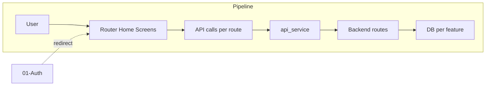

# Frontend Screens & UX

## Initiator

- **Who:** User (navigation, tabs, actions). App (initial route, deep links).
- **When:** App open; tab switch; open/close screens; wizard steps; toasts.

## Frontend flow

- **Screen/Widget:** `HomeScreen` (tabs: Home, Explore, Manage/My Events, Profile); FAB "New Event" (organizer/admin); bottom nav; inner screens (event detail, create, edit, venues, ticket strategies, admin, etc.) with close (X) and safe pop. Create Event: 5-step wizard (IndexedStack). Toasts: AppToast (success, error, warning, info). Loading: `LoadingSwitcher` (animated transition between shimmer placeholder and content); shimmer loaders use `AppTheme.shimmerOf` and `AppTheme.shimmerHighlightOf` for dark/light consistency. **Design tokens:** AppIcons (single source for icon+color tokens: event detail rows, stat chips, pledge status, donation, filter chips); AppTheme (frostedBg/Fg/FgSub, onColor, chipActive, glowHeaderDecoration). **EventCard:** Premium redesign — colored icon containers on info rows, row separators, colored status badge with icon + live pulse dot, stat chip borders, Option A gradient funding bar with glow (guard when fundingEndAt set), capacity row removed. **EventLifecycleBar:** Full-width breadcrumb stepper with icon circles and connector lines. **EventDetailScreen:** Title clipping fix when hasHero=false; like/dislike moved to title card corner (compact ReactionBar); Backers/Days Left removed for funding events. **ReactionBar:** Compact mode (heart/broken-heart icons; broken heart uses errorColor when active). **FundingCard:** Light mode gradient (warm amber cream); backers row restored. **AppChip** widget (app_chip.dart) for consistent chip styling. **Event card:** Sold Out badge in red (errorColor). Tabs and manage/profile screens refined to use semantic tokens.
- **User action:** Switch tabs; tap cards to open detail; tap X to close (pop to previous tab/page); next/back in wizard; trigger toasts on success/error.
- **API calls:** Various (each screen calls its own APIs via providers). Under [Three-Layer Architecture](75-three-layer-architecture.md), screens use providers, providers use repositories (Dio from dio_factory); ApiService removed. Error extraction: ApiError.extractMessage (base_repository) for backend detail message.

## Backend routing

- N/A (frontend-only). Backend is called per feature (see other docs).

## Service layer

- Frontend: `GoRouter` (router.dart), `AuthProvider` (redirect, refresh), repositories (Dio from `dio_factory.createAuthDio()`). No backend service for "UX" itself.
- **App root:** `CrowdFundApp` is a **StatefulWidget**; Dio (or auth Dio from dio_factory), `ChatSocketService`, `AppDatabase`, and `SyncService` are created/obtained in `initState()` and held as instance variables so providers and repositories get a shared HTTP client and services. Provider values in `build()` use these so services are initialized once and survive rebuilds. This improves lifecycle management and avoids recreating services on every build.
- **AppShell:** Uses `context.watch<AuthProvider>()` and `context.watch<ThemeProvider>()` in `build()` so the shell rebuilds when auth or theme changes. Auth transition side-effects (chat connect/disconnect, sync) and the loading check are performed in `build()`; the router is created from the watched auth provider. Route `/account` uses **_AccountShell** (in router.dart): a Scaffold with an AppBar (close button, title "Account") wrapping **ProfileTab**, so the account view can be closed or popped. Profile screen (when used as main tab) uses a close-style leading button for consistency.

## Models and DB

- None. Frontend state: tab index, wizard step, form state (e.g. create event steps).

## Dependencies

- **Requires:** [Auth](01-auth-users.md) (redirect to login if unauthenticated). All feature screens depend on router and home structure.
- **Triggers / side effects:** Navigation triggers feature-specific API loads (e.g. event detail loads event, funding, tiers).

## Prompt

Implement **Frontend Screens and UX** for the Crowd Funding Event app. Frontend: GoRouter with tabs (Home, Explore, Manage, Profile); FAB New Event for organizer/admin; 5-step Create Event wizard (IndexedStack); AppToast; close and safe pop; ApiError.extractMessage for errors (repositories use Dio from dio_factory). No new backend; ensure all feature screens plug into router and home structure. Follow the flow, dependencies, and diagrams in this document.

## Flow diagram

## Vulnerabilities

- Safe pop: ensure back stack does not leave user on broken state (e.g. after logout, clear stack). Deep links (e.g. /events/123) should resolve with auth.
- No sensitive data in route path (event id is fine); query params (e.g. tab=explore) for tab index.

## Recently implemented (theme, loading, admin UI)

- **Theme:** `AppTheme.shimmerHighlightOf(context)` — dark `0xFF3A3A3A`, light `0xFFF5F5F5`; used by shimmer loaders for consistent highlight in dark/light mode. Shimmer loaders (`shimmer_loaders.dart`) now use `AppTheme.shimmerOf` and `AppTheme.shimmerHighlightOf` instead of hardcoded colors.
- **LoadingSwitcher:** New widget (`widgets/loading_switcher.dart`) wrapping `AnimatedSwitcher` for smooth transition between a loading placeholder (e.g. shimmer) and content. Uses `ValueKey` on loading vs content; duration `AppDuration.normal`, curves `AppCurve.enter`/`exit`. Used in event receipt screens (ticket, pledge, purchase group) and elsewhere for loading-state UX.
- **Admin UI:** Admin screens use the new shimmer highlight colors; toggle components across admin tabs use `activeTrackColor` for clearer visual feedback; admin dashboard and transactions screens simplified data handling (removed unnecessary type casting).

## Recently implemented (typography, schedule, event detail, funding card, reserved spots UI)

- **AppTypography:** Single source of truth in `FrontEnd/lib/config/app_typography.dart`. **Font pairing:** Plus Jakarta Sans (w700–w800) for display/headline/title/app bar; Inter for body/labels/buttons/inputs/nav/chips. Body line-height 1.5→1.6. All `GoogleFonts.inter()` removed from theme — theme references `AppTypography.*`.
- **Schedule section (Design A — Vertical Timeline):** Day pill tabs (horizontal scroll, indigo tint when selected); each session: right-aligned time → colored dot with card-bg ring + shadow → vertical connector → surface card with 3px left accent; session colors cycle blue→green→orange→purple; overlap badge uses `orangeAccent` token.
- **Ticket tier cards:** Scheme 3 index-cycle colors (blue→green→orange→purple per position); 6px top accent bar in cycle color; featured card: colored border + glow + POPULAR badge; price in cycle color (FREE stays green); AppTheme tokens replace hardcoded gradients.
- **Event detail — premium card-over-hero:** Hero moved from `SliverAppBar.flexibleSpace` into `SliverToBoxAdapter` Stack so title card floats over hero (28 dp overlap); SliverAppBar is thin pinned nav (back, share, bookmark, collapse); scroll threshold and layout spacing adjusted; full shadow and rounded corners on title card.
- **Event card overflow:** mainAxisExtent 320→330; tighter body padding and guard after Plus Jakarta Sans; label font sizes increased in event detail card for hierarchy.
- **Manage tab event photos:** Backend fix — `first_image_url` now included in `/me/events`, `/me/co-organized-events`, and `/me/bookmarks` via `_get_first_images()` so event cards show event photo instead of placeholder gradient.
- **Funding card refactor:** Helpers extracted to `funding_card_helpers.dart`; **FundingResultsCard** for post-funding summary; inline registration via `onRegistrationChanged`; milestone list loaded and displayed in funding card; `_registering` state for registration button spinner. Event bottom strip respects **canRegisterViaBottomStrip** (hides register during approved/funding).
- **Reserved spots release (UI):** Event model fields `reservedSpotsReleasePercent`, `releaseTierSpotLimits`; create/edit event policies: reserved spots release percent input and release_tier_spot_limits toggle; statusPill and modernInfoRow spacing tweaks; schedule milestone dialogs layout polish.
- **Project structure:** `screens/event/` grouped into `receipts/`, `management/`, `pickers/`; event_card, lifecycle_bar, bottom_strip, map_widget under `widgets/event/`; design mockups in `docs/designs/` (schedule_designs, ticket_tier_colors, event_detail_selling_tickets, etc.); root HTML/MD and START_COMMANDS moved to `docs/`.

## Improvements

- Wizard unsaved-changes dialog: prevent accidental close. Step validation and error indicators on steps (red circle) improve UX. Contextual "Next: Funding" button label.
- AppToast and ApiError.extractMessage: consistent error handling across app; ensure all catch blocks use them.

## Feedback

- Uber-inspired UI (black/white/green, Inter, rounded containers) and bottom nav with 4 tabs are documented in FEATURES. Manage tab cards (Create Event, Venues, Tickets, Admin, Sales, Scanned, Waitlist, Discounts) map to routes. Close (X) and safe pop are consistent.
