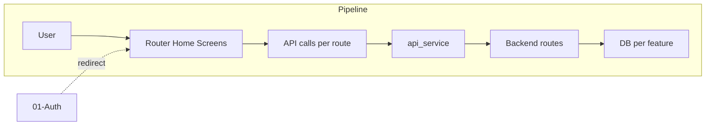

# Frontend Screens & UX

## Initiator

- **Who:** User (navigation, tabs, actions). App (initial route, deep links).
- **When:** App open; tab switch; open/close screens; wizard steps; toasts.

## Frontend flow

- **Screen/Widget:** `HomeScreen` (tabs: Home, Explore, Manage/My Events, Profile); FAB "New Event" (organizer/admin); bottom nav; inner screens (event detail, create, edit, venues, ticket strategies, admin, etc.) with close (X) and safe pop. Create Event: 5-step wizard (IndexedStack). Toasts: AppToast (success, error, warning, info). Loading: `LoadingSwitcher` (animated transition between shimmer placeholder and content); shimmer loaders use `AppTheme.shimmerOf` and `AppTheme.shimmerHighlightOf` for dark/light consistency.
- **User action:** Switch tabs; tap cards to open detail; tap X to close (pop to previous tab/page); next/back in wizard; trigger toasts on success/error.
- **API calls:** Various (each screen calls its own APIs). Router and navigation do not call API directly; ApiService used by providers/screens. Error extraction: ApiService.extractError for backend detail message.

## Backend routing

- N/A (frontend-only). Backend is called per feature (see other docs).

## Service layer

- Frontend: `GoRouter` (router.dart), `AuthProvider` (redirect, refresh), `ApiService` (extractError). No backend service for "UX" itself.

## Models and DB

- None. Frontend state: tab index, wizard step, form state (e.g. create event steps).

## Dependencies

- **Requires:** [Auth](01-auth-users.md) (redirect to login if unauthenticated). All feature screens depend on router and home structure.
- **Triggers / side effects:** Navigation triggers feature-specific API loads (e.g. event detail loads event, funding, tiers).

## Prompt

Implement **Frontend Screens and UX** for the Crowd Funding Event app. Frontend: GoRouter with tabs (Home, Explore, Manage, Profile); FAB New Event for organizer/admin; 5-step Create Event wizard (IndexedStack); AppToast; close and safe pop; ApiService.extractError for errors. No new backend; ensure all feature screens plug into router and home structure. Follow the flow, dependencies, and diagrams in this document.

## Flow diagram

## Vulnerabilities

- Safe pop: ensure back stack does not leave user on broken state (e.g. after logout, clear stack). Deep links (e.g. /events/123) should resolve with auth.
- No sensitive data in route path (event id is fine); query params (e.g. tab=explore) for tab index.

## Recently implemented (theme, loading, admin UI)

- **Theme:** `AppTheme.shimmerHighlightOf(context)` — dark `0xFF3A3A3A`, light `0xFFF5F5F5`; used by shimmer loaders for consistent highlight in dark/light mode. Shimmer loaders (`shimmer_loaders.dart`) now use `AppTheme.shimmerOf` and `AppTheme.shimmerHighlightOf` instead of hardcoded colors.
- **LoadingSwitcher:** New widget (`widgets/loading_switcher.dart`) wrapping `AnimatedSwitcher` for smooth transition between a loading placeholder (e.g. shimmer) and content. Uses `ValueKey` on loading vs content; duration `AppDuration.normal`, curves `AppCurve.enter`/`exit`. Used in event receipt screens (ticket, pledge, purchase group) and elsewhere for loading-state UX.
- **Admin UI:** Admin screens use the new shimmer highlight colors; toggle components across admin tabs use `activeTrackColor` for clearer visual feedback; admin dashboard and transactions screens simplified data handling (removed unnecessary type casting).

## Improvements

- Wizard unsaved-changes dialog: prevent accidental close. Step validation and error indicators on steps (red circle) improve UX. Contextual "Next: Funding" button label.
- AppToast and extractError: consistent error handling across app; ensure all catch blocks use them.

## Feedback

- Uber-inspired UI (black/white/green, Inter, rounded containers) and bottom nav with 4 tabs are documented in FEATURES. Manage tab cards (Create Event, Venues, Tickets, Admin, Sales, Scanned, Waitlist, Discounts) map to routes. Close (X) and safe pop are consistent.
