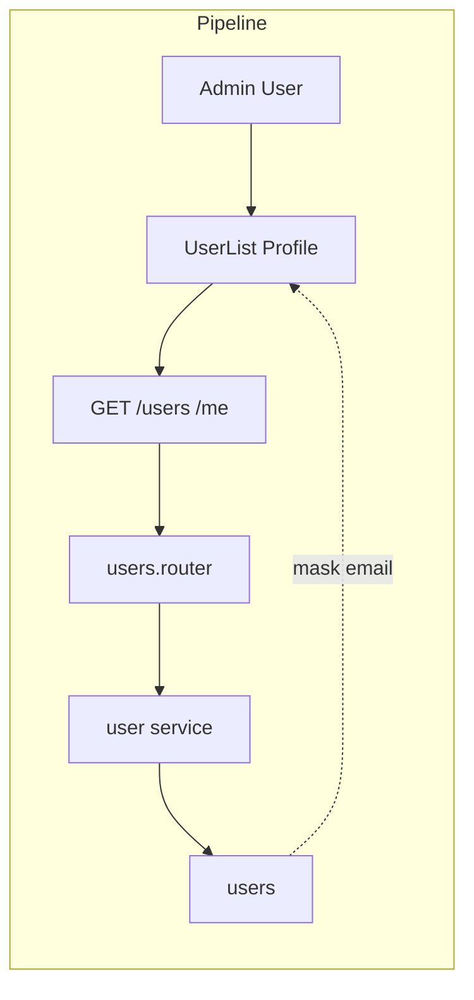

# Privacy Rules

## Initiator

- **Who:** System (response shaping); no user action to "enable" privacy.
- **When:** Every API response that includes user/attendee/organizer data (receipts, profiles, etc.).

## Frontend flow

- **Screen/Widget:** All receipt screens, sponsor/organizer display. Attendee email hidden; organizer/sponsor shown by display_name where applicable.
- **User action:** None (display follows backend response). Frontend does not show email for attendees; shows display_name for organizer/sponsor.
- **API calls:** No dedicated "privacy" endpoint. All affected endpoints return schemas that omit attendee email (TicketReceiptResponse, PurchaseGroupReceiptResponse) and use display_name fallback (events, users, sponsors responses).

## Backend routing

- **Entry:** All routes that return user/attendee/organizer data. Not a single router; schema and serialization rules across events, users, sponsors.
- **Handler:** Response schemas (Pydantic) and _event_to_response / receipt builders exclude email for attendees; use display_name (with email fallback only where needed, e.g. admin).

## Service layer

- **Module(s):** N/A (schema and helper level). Event/user/sponsor response builders in api layer or _helpers.
- **Main functions:** Ensure TicketReceiptResponse, PurchaseGroupReceiptResponse do not include attendee email; organizer_name and sponsor display use display_name in events.py, users.py, sponsors endpoints (5 fallback points per FEATURES).

## Models and DB

- **Models:** User has email; it is not exposed in receipt and public profile responses except admin.
- **Tables updated/read:** No change to DB; only response shape.

## Dependencies

- **Requires:** [Auth](01-auth-users.md). Admin may still see email in user list (dashboard). Other roles do not.
- **Triggers / side effects:** None. Reduces PII exposure and complies with privacy expectations.

## Prompt

Implement **Privacy Rules** for the Crowd Funding Event app. Backend: Response schemas and builders must omit attendee email in TicketReceiptResponse and PurchaseGroupReceiptResponse; use display_name for organizer and sponsor in events, users, sponsors (email fallback only for admin). Frontend: Do not show attendee email; show display_name. Follow the flow, dependencies, and diagrams in this document.

## Flow diagram

## Vulnerabilities

- Ensure no endpoint leaks attendee email to other attendees or organizers beyond what is necessary (e.g. organizer might need email for refunds—consider using masked or no email in receipt). Document which roles can see email (admin only per FEATURES).
- display_name fallback: if null, some endpoints may have used email; verify all 5 fallback points use display_name and only then email for admin/internal.

## Improvements

- ~~Centralize "safe user display" helper (e.g. get_display_name(user, viewer_role)) so new endpoints do not forget.~~ **Resolved:** Centralized `safe_display_name()` helper in `events/_helpers.py` (and equivalent where used) for consistent display name with role-aware fallback; use in response builders to avoid leaking email. Optional: audit all response schemas for email fields.
- Organizer email/phone on receipts for contact: acceptable per FEATURES; keep minimal.

## Feedback

- Privacy is cross-cutting (multiple routers and schemas). Single doc helps; implementation is in response builders and schema definitions.
