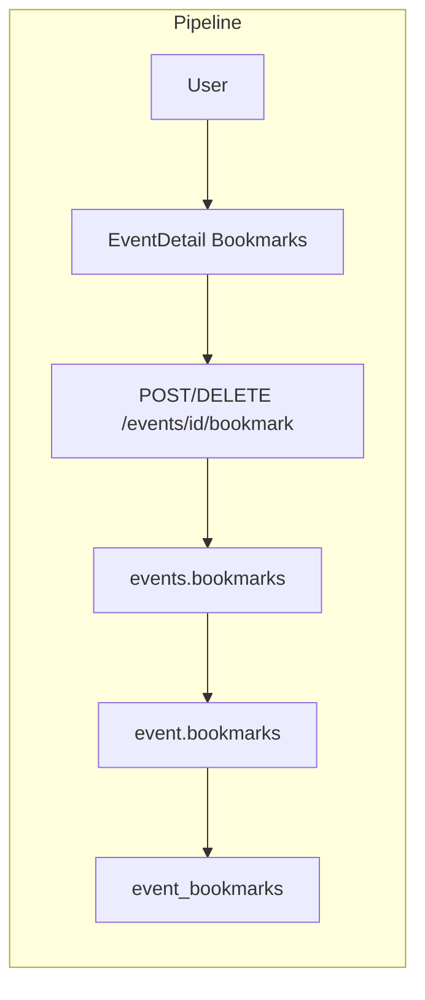

# Event Bookmarks

## Initiator

- **Who:** Customer (bookmark/unbookmark). Any authenticated user viewing event list/detail.
- **When:** Event cards (Home, Explore, Manage) and Event Detail (bookmark icon); Bookmarked Events screen.

## Frontend flow

- **Screen/Widget:** Event cards and Event Detail (bookmark icon: filled when bookmarked, outline when not); `BookmarkedEventsScreen` (`/bookmarks`) with search and status filter.
- **User action:** Tap bookmark to toggle; open Bookmarked Events from Manage. Local Set<int> for instant UI before server response.
- **API calls:** `toggleBookmark(eventId)` POST `/api/v1/me/bookmarks/{event_id}`; `checkBookmarks(eventIds)` POST `/api/v1/me/bookmarks/check`; `getBookmarkedEvents()` GET `/api/v1/me/bookmarks`.

## Backend routing

- **Entry:** `api_router` → `users.router` prefix `/me`.
- **Handler:** `users.py` → POST `/bookmarks/{event_id}` (toggle), POST `/bookmarks/check`, GET `/bookmarks`.

## Service layer

- **Module(s):** Bookmark logic in users route; unique constraint user_id + event_id.
- **Main functions:** Toggle: insert or delete bookmark; Check: return which event_ids are bookmarked; List: Bookmark join Event with filters.

## Models and DB

- **Models:** `Bookmark` (user_id, event_id). Unique (user_id, event_id).
- **Tables updated/read:** `bookmarks`.

## Dependencies

- **Requires:** [Auth](01-auth-users.md), [Events](03-events-crud-lifecycle.md).
- **Triggers / side effects:** None.

## Prompt

Implement **Event Bookmarks** for the Crowd Funding Event app. Backend: POST `/me/bookmarks/{event_id}` toggle, POST `/me/bookmarks/check`, GET `/me/bookmarks`; unique user_id plus event_id. Frontend: Bookmark icon on event cards and Event Detail; BookmarkedEventsScreen with search and status filter; optimistic Set for instant UI. Follow the flow, dependencies, and diagrams in this document.

## Flow diagram

## Vulnerabilities

- User-scoped; no IDOR. Batch check: limit event_ids array size.

## Improvements

- Batch check avoids N+1; local Set for instant toggle UX.

## Feedback

- Single table, /me scope. "Bookmarks" quick action in Manage.
