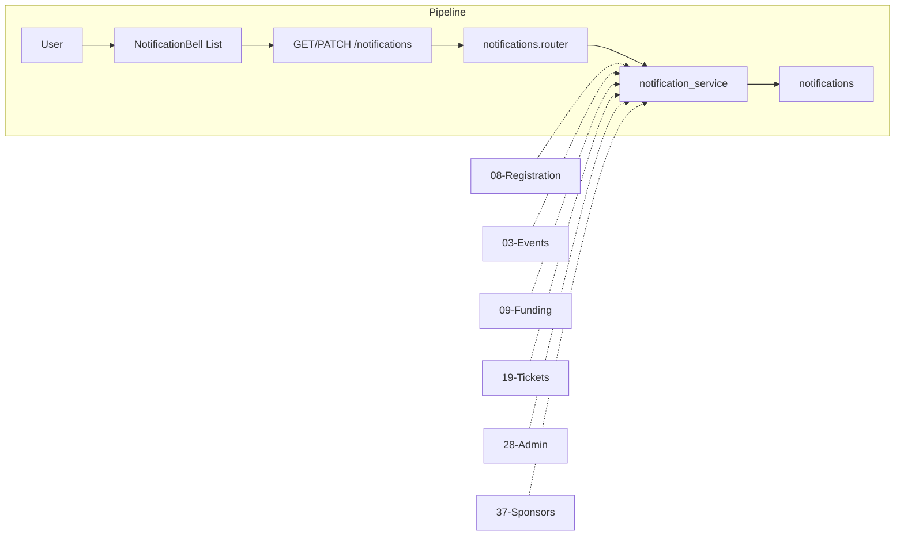

# In-App Notification System

## Initiator

- **Who:** System (create on backend events); User (view list, mark read).
- **When:** Register, waitlist, cancel, purchase, refund, bid actions, event approval/rejection. User opens Notification screen or sees bell badge.

## Frontend flow

- **Screen/Widget:** Home AppBar (notification bell, unread badge); `NotificationScreen` (list, mark-all-read, tap to event).
- **User action:** Tap bell; pull-to-refresh; mark all read; tap to navigate.
- **API calls:** GET `/api/v1/me/notifications`, GET unread-count, PATCH mark-read, PATCH read-all. NotificationProvider 30s polling.

## Backend routing

- **Entry:** `api_router` → `notifications.router` prefix `/me`.
- **Handler:** `notifications.py` → GET list, GET unread-count, PATCH read, PATCH read-all.

## Service layer

- **Module(s):** `app.services.notification_service`.
- **Main functions:** create_notification, create_bulk_notifications, list_notifications, unread_count, mark_read, mark_all_read. 13 trigger points across events, registration, tickets, admin, sponsors.

## Models and DB

- **Models:** `Notification` (user_id, type, title, message, data, is_read, created_at). 23 NotificationType enum values.
- **Tables updated/read:** `notifications`.

## Dependencies

- **Requires:** [Auth](01-auth-users.md). Triggered by Registration, Events, Funding, Tickets, Admin, Sponsors.
- **Triggers / side effects:** None.

## Flow diagram

## Vulnerabilities

- List/mark_read user-scoped only. Validate notification_id belongs to current_user.

## Improvements

- data JSON for event_id navigation. Per-type icons/colors in frontend.

## Feedback

- Central service; 13 trigger points. Keep trigger list updated.
