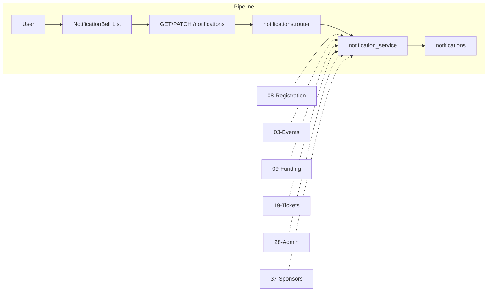

# In-App Notification System

## Initiator

- **Who:** System (create on backend events); User (view list, mark read).
- **When:** Register, waitlist, cancel, purchase, refund, bid actions, event approval/rejection. User opens Notification screen or sees bell badge.

## Frontend flow

- **Screen/Widget:** Home AppBar (notification bell, unread badge); `NotificationScreen` (list, mark-all-read, tap to event).
- **User action:** Tap bell; pull-to-refresh; mark all read; tap to navigate.
- **API calls:** GET `/api/v1/me/notifications`, GET unread-count, PATCH mark-read, PATCH read-all; POST/DELETE `/me/device-tokens` for FCM. NotificationProvider 30s polling; FCM push when enabled (see [FCM Push Notifications](62-fcm-push-notifications.md)). NotificationProvider uses **_safeNotify()** instead of notifyListeners() so updates are deferred when the framework is in a build phase (SchedulerPhase.persistentCallbacks), avoiding mid-build rebuilds.

## Frontend (NotificationProvider)

- **Build-phase-safe updates:** `_safeNotify()` checks `SchedulerBinding.instance.schedulerPhase`; when it is `SchedulerPhase.persistentCallbacks` (build phase), it schedules `notifyListeners()` in a post-frame callback instead of calling it immediately, preventing "setState or markNeedsBuild called during build" and unnecessary mid-frame rebuilds. All state changes (unread count, loadNotifications, markRead, etc.) call `_safeNotify()` instead of `notifyListeners()`.

## Backend routing

- **Entry:** `api_router` → `notifications.router` prefix `/me`.
- **Handler:** `notifications.py` → GET list, GET unread-count, PATCH read, PATCH read-all; POST/DELETE device-tokens for FCM registration.

## Service layer

- **Module(s):** `app.services.notification_service`.
- **Main functions:** create_notification, create_bulk_notifications (both enqueue FCM push via ARQ when push_notifications_enabled), list_notifications, unread_count, mark_read, mark_all_read. 13 trigger points across events, registration, tickets, admin, sponsors.

## Models and DB

- **Models:** `Notification` (user_id, type, title, message, data, is_read, created_at). 23 NotificationType enum values. `DeviceToken` (user_id, token, platform) for FCM — see [62-fcm-push-notifications.md](62-fcm-push-notifications.md).
- **Tables updated/read:** `notifications`, `device_tokens` (for push).

## Dependencies

- **Requires:** [Auth](01-auth-users.md). Triggered by Registration, Events, Funding, Tickets, Admin, Sponsors.
- **Triggers / side effects:** None.

## Prompt

Implement **In-App Notification System** for the Crowd Funding Event app. Backend: GET/PATCH `/me/notifications` (list, unread-count, mark-read, read-all); create_notification at 13 trigger points (register, waitlist, cancel, purchase, refund, bid, approval). Frontend: AppBar notification bell with badge; NotificationScreen list and mark-all-read; 30s polling. Follow the flow, dependencies, and diagrams in this document.

## Flow diagram

## Vulnerabilities

- List/mark_read user-scoped only. Validate notification_id belongs to current_user.

## Improvements

- data JSON for event_id navigation. Per-type icons/colors in frontend. Deep-link and modern UI: see [Clickable Notifications Redesign](57-clickable-notifications-redesign.md). ~~Push notification support~~ **Resolved:** [FCM Push Notifications](62-fcm-push-notifications.md) delivers push to devices alongside in-app notifications; admin toggle `push_notifications_enabled`.

## Feedback

- Central service; 13 trigger points. Keep trigger list updated.
