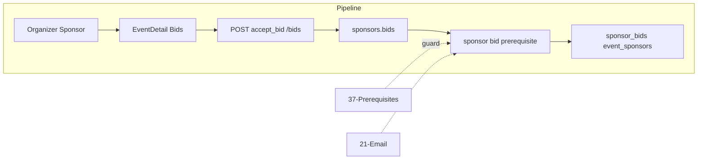

# Sponsorship Category Prerequisites

## Initiator

- **Who:** Organizer (CRUD prerequisites, review uploads); Sponsor (upload documents).
- **When:** Sponsorship categories (prerequisite CRUD); Bid management (review); Sponsor bid card (upload, status).

## Frontend flow

- **Screen/Widget:** Categories (prerequisite CRUD sheet); Bid cards (approve/reject upload + notes); Sponsor (upload sheet, status: pending/approved/rejected).
- **User action:** Organizer: add/delete prerequisite, review uploads. Sponsor: upload doc per prerequisite.
- **API calls:** Create/list/delete prerequisites; upload; list uploads per bid; review. Endpoints in sponsors/organizer_views.py (events/{id}/sponsorships/{cat_id}/prerequisites, bids/{id}/prerequisites).

## Backend routing

- **Entry:** `sponsors.router` → organizer_views.
- **Handler:** GET/POST/DELETE prerequisites; POST upload; GET uploads; PATCH review.

## Service layer

- **Module(s):** `app.services.sponsor`.
- **Main functions:** CRUD CategoryPrerequisite; BidPrerequisiteUpload (upload, review); accept_bid() blocked if required not approved.

## Models and DB

- **Models:** `CategoryPrerequisite`, `BidPrerequisiteUpload`. Tables: category_prerequisites, bid_prerequisite_uploads.
- **Tables updated/read:** category_prerequisites, bid_prerequisite_uploads.

## Dependencies

- **Requires:** [Auth](01-auth-users.md), [Sponsors](36-sponsor-info-organizers.md). Bid acceptance guard.
- **Triggers / side effects:** accept_bid blocked when required prerequisite not approved.

## Flow diagram

## Vulnerabilities

- Upload: validate file type/size; safe storage. Organizer only for their events; sponsor only own bids.

## Improvements

- file_type allowlist. Reviewer notes to sponsor on reject.

## Feedback

- 6 API endpoints; organizer review UI and sponsor upload UI. Guard on bid acceptance.
