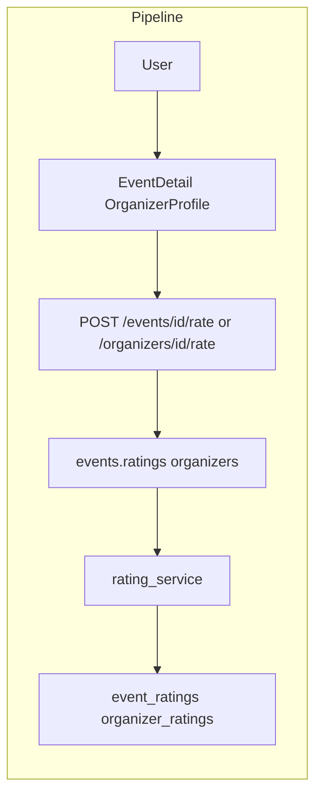

# Multi-Directional Rating System

## Initiator

- **Who:** Customer, Organizer, Sponsor (submit after event completed); Anyone (view).
- **When:** Completed event Reviews; Organizer/Sponsor profile (average).

## Frontend flow

- **Screen/Widget:** Event Detail completed → Reviews (star + description, submit; top 5); Profile screens (average).
- **User action:** Submit rating 1–5 + description; view summary/list.
- **API calls:** createRating; getEventRatingsSummary, getEventRatings; getUserRatingsSummary. POST /events/{id}/ratings, GET summary/list, GET users/{id}/ratings-received.

## Backend routing

- **Entry:** ratings.router; public_profiles for user ratings.
- **Handler:** POST /events/{id}/ratings; GET summary, list; GET users/{id}/ratings-received.

## Service layer

- **Module(s):** Rating service.
- **Main functions:** Create (unique event, rater, rated, direction); list/summary. Directions: customer_to_organizer, organizer_to_customer, organizer_to_sponsor, sponsor_to_organizer.

## Models and DB

- **Models:** Rating (event_id, rater_user_id, rated_user_id, direction, score 1–5, description).
- **Tables updated/read:** ratings.

## Dependencies

- **Requires:** [Auth](01-auth-users.md), [Events](03-events-crud-lifecycle.md), [35](35-organizer-public-profile.md), [36](36-sponsor-info-organizers.md).
- **Triggers / side effects:** None.

## Flow diagram

## Vulnerabilities

- One rating per (event, rater, rated, direction). No self-rating; validate participant.

## Improvements

- StarRating/StarRatingDisplay widgets. Summary for profile.

## Feedback

- Four directions; events + profiles.
