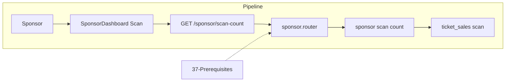

# Sponsor Ticket Scan Count

## Initiator

- **Who:** Organizer/Admin (scan); System (increment scan_count).
- **When:** Ticket scanner sponsor mode; sponsor ticket card/receipt.

## Frontend flow

- **Screen/Widget:** TicketScannerScreen (sponsor mode); Sponsor ticket card/receipt (scanCount).
- **User action:** Scan sponsor QR; view count.
- **API calls:** scanSponsorTicket POST. Response includes scan_count.

## Backend routing

- **Entry:** sponsors.router → tickets.
- **Handler:** POST scan-sponsor. Increment scan_count; scanned_at on first scan.

## Service layer

- **Module(s):** app.services.sponsor.tickets.
- **Main functions:** scan_sponsor_ticket: validate, find ticket, increment scan_count, set scanned_at if first.

## Models and DB

- **Models:** SponsorTicket (scan_count, scanned_at).
- **Tables updated/read:** sponsor_tickets.

## Dependencies

- **Requires:** [Auth](01-auth-users.md), [37](37-sponsorship-prerequisites.md).
- **Triggers / side effects:** None.

## Flow diagram

## Vulnerabilities

- Organizer/admin only. Payload validation. Multiple scans by design.

## Improvements

- Show first scanned at + count.

## Feedback

- Scanner: customer and sponsor modes.
