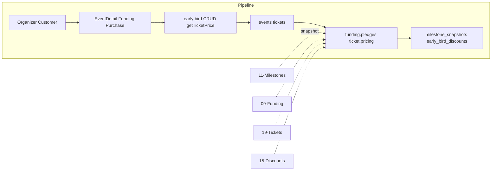

# Milestone Discounts & Early Bird Discounts

## Initiator

- **Who:** System (milestone snapshot when funding crosses threshold); Organizer (configure early bird, discount cap); Customer (benefits at purchase).
- **When:** Pledge (snapshot); Event create/edit (early bird, max_discount_percent); Ticket purchase (apply milestone + early bird).

## Frontend flow

- **Screen/Widget:** Create/Edit (Funding: milestone config, early bird section, cap slider); Event Detail (early bird banner, milestone badges); Ticket purchase (discount breakdown).
- **User action:** Organizer: set milestone %, early bird windows, cap. Customer: sees discounts at purchase.
- **API calls:** Milestones: [11](11-funding-milestones.md). Early bird: getEarlyBirdDiscounts, create/update/deleteEarlyBirdDiscount. getTicketPrice reflects stacking.

## Backend routing

- **Entry:** Early bird under events; ticket price in events/tickets.py.
- **Handler:** Early bird CRUD; _check_milestone_snapshots() on pledge; compute_ticket_price() applies milestone + early bird + cap.

## Service layer

- **Module(s):** funding.pledges (snapshot), ticket.pricing (apply), event/discounts or milestone (early bird CRUD).
- **Main functions:** FundingMilestoneSnapshot/User on milestone cross; EarlyBirdDiscount CRUD; compute_ticket_price() with best milestone and early bird; max_discount_percent cap.

## Models and DB

- **Models:** FundingMilestoneSnapshot, FundingMilestoneUser, EarlyBirdDiscount; Event.max_discount_percent.
- **Tables updated/read:** funding_milestone_snapshots, funding_milestone_users, early_bird_discounts, events.

## Dependencies

- **Requires:** [Funding Milestones](11-funding-milestones.md), [Funding](09-funding-pledges.md), [Tickets](19-tickets.md), [Event Discounts](15-event-discounts.md).
- **Triggers / side effects:** Snapshot on pledge; discount at purchase.

## Prompt

Implement **Milestone and Early Bird Discounts** for the Crowd Funding Event app. Backend: FundingMilestoneSnapshot/User on milestone cross; EarlyBirdDiscount CRUD; compute_ticket_price applies milestone plus early bird with max_discount_percent cap. Frontend: Create/Edit Funding (milestone config, early bird, cap); Event Detail early bird banner; purchase discount breakdown. Follow the flow, dependencies, and diagrams in this document.

## Flow diagram

## Vulnerabilities

- Snapshot idempotent per milestone cross. Early bird time windows validated. Cap enforced in pricing.

## Improvements

- Document stack order and cap. Early bird countdown; milestone badges for user qualification.

## Feedback

- Milestone snapshot + early bird both feed pricing. See [11](11-funding-milestones.md), [15](15-event-discounts.md).
