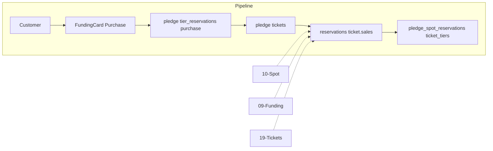

# Tier-Linked Funding (Spot Reservation by Tier)

## Initiator

- **Who:** Customer (reserve spots per tier during pledge); System (consume by tier on purchase).
- **When:** Pledge when link_funding_to_tiers=true; Ticket purchase (consume reserved by tier).

## Frontend flow

- **Screen/Widget:** Funding Card → Pledge: tier-specific spot selectors; Ticket purchase: "Using X of Y reserved spot(s)".
- **User action:** Select spots per tier; amount >= sum(spots × tier price); confirm. Purchase consumes reserved first by tier.
- **API calls:** Pledge with body.tier_reservations (tier_id, spots); getPledgePreview with tier availability; purchaseTickets consumes by tier.

## Backend routing

- **Entry:** Same as pledge and tickets.
- **Handler:** create_pledge(tier_reservations); purchase_ticket → consume_reserved_spots_for_tier().

## Service layer

- **Module(s):** app.services.funding.reservations, app.services.ticket.sales.
- **Main functions:** get_reserved_spots_for_tier, consume_reserved_spots_for_tier; TicketTier.max_reserved_spots; validate amount >= sum(spots × tier.price).

## Models and DB

- **Models:** PledgeSpotReservation (pledge_id, tier_id, spots), TicketTier (max_reserved_spots), Event (link_funding_to_tiers).
- **Tables updated/read:** pledge_spot_reservations, ticket_tiers, fundings, ticket_sales. Legacy: link_funding_to_tiers=false uses global reserved_spots.

## Dependencies

- **Requires:** [Spot Reservation](10-spot-reservation-funding.md), [Funding](09-funding-pledges.md), [Tickets](19-tickets.md). Wizard: Dates & Tickets before Funding.
- **Triggers / side effects:** Capacity per tier; total still event-level.

## Flow diagram

## Vulnerabilities

- Validate tier_id belongs to event; amount covers each tier. Advisory lock; atomic consume.

## Improvements

- Tier availability in preview; clear UX for "Reserve 2 General, 1 VIP." Backward compatible.

## Feedback

- Extension of spot reservation; [10](10-spot-reservation-funding.md), [40](40-event-creation-wizard.md).
