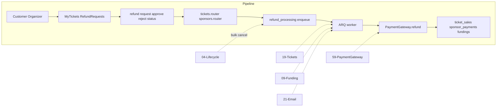

# Refund Processing (ARQ + Redis)

## Initiator

- **Who:** Customer (request ticket refund); Organizer (approve/reject); System (bulk refund on cancel, ARQ worker).
- **When:** My Tickets (Request Refund); Refund Requests screen; Event cancellation (bulk).

## Frontend flow

- **Screen/Widget:** My Tickets (stats: Pending/Refunded; filter "Refund Pending"; open receipt to request refund); Ticket Receipt screen (customer: "Request Refund" button); Refund Requests screen (organizer: list, approve/reject); Funding card (Refund Processing + poll refund-status).
- **User action:** Customer opens ticket receipt from My Tickets (or event) and taps "Request Refund" (confirmation dialog → requestTicketRefund); organizer approves/rejects (approve returns refund_processing; worker completes asynchronously). Poll getRefundStatus(eventId) until completed after cancel.
- **API calls:** requestTicketRefund (invoked from receipt screen), getRefundRequests, approveTicketRefund, rejectTicketRefund, getRefundStatus (poll 3s). Backend enqueues ARQ refund + email tasks.

## Backend routing

- **Entry:** events/tickets.py (refund request, approve, reject); sponsors/payments.py and admin (sponsor refund); events/pledge.py GET refund-status. Lifecycle cancel enqueues bulk refund.
- **Handler:** POST tickets/{id}/refund, GET refund-requests, POST approve-refund (sets refund_processing, enqueues process_ticket_refund), POST reject-refund; sponsor POST .../refund (sets refund_processing, enqueues process_sponsor_refund); GET refund-status. ARQ worker: process_ticket_refund and process_sponsor_refund call PaymentGateway.refund(); on success set refunded, on failure set refund_failed; email tasks (8), 3 retries.

## Service layer

- **Module(s):** ticket.sales (request_refund, approve_refund, reject_refund); sponsor.payments (refund_bid); funding/sponsor refund tasks; app.worker.main, redis_pool; app.services.payment_gateway (get_gateway).
- **Main functions:** request_refund (refund_requested); approve_refund → set refund_processing, enqueue process_ticket_refund → worker calls gateway.refund() → refunded/refund_failed; reject_refund; refund_bid (sponsor) → set refund_processing, enqueue process_sponsor_refund → worker calls gateway.refund(); refund_all_tickets/pledges/sponsor_payments for event (cancel). Worker tasks are the only place that set refunded or refund_failed after gateway call.

## Models and DB

- **Models:** TicketSale, Funding, SponsorPayment (status: refund_processing, refunded, refund_failed). Enums extended.
- **Tables updated/read:** ticket_sales, fundings, sponsor_payments. Redis for ARQ.

## Dependencies

- **Requires:** [Auth](01-auth-users.md), [Tickets](19-tickets.md), [Funding](09-funding-pledges.md), [Event lifecycle](03-events-crud-lifecycle.md), [Email](21-email-notifications.md), [Payment Gateway Mock](59-payment-gateway-mock.md). Redis + ARQ worker.
- **Triggers / side effects:** Approve/sponsor refund sets refund_processing and enqueues worker; notifications say "is being processed". Worker calls gateway then sets refunded/refund_failed. Email on approve; bulk on cancel. Frontend can poll until status is refunded or refund_failed.

## Prompt

Implement **Refund Processing** for the Crowd Funding Event app. Backend: POST ticket refund request/approve/reject; GET refund-requests and refund-status; ARQ worker for refund and email tasks (3 retries, refund_failed for admin); bulk refund on event cancel. Frontend: My Tickets Request Refund; Refund Requests screen; poll getRefundStatus until completed. Follow the flow, dependencies, and diagrams in this document.

## Flow diagram

## Vulnerabilities

- Only owner can request; only organizer/admin approve/reject. ARQ idempotent or guarded. Redis down: enqueue fallback. refund_failed: admin investigate.

## Improvements

- Refunds flow through payment gateway (mock): API only sets refund_processing and enqueues worker; worker calls gateway.refund() then sets refunded or refund_failed. Eliminates race where status was set to refunded before worker ran. Ledger entries and configurable latency/failure in mock. Bulk: enqueue per payment/ticket; worker processes each with gateway. Optional: retry endpoint for refund_failed.

## Feedback

- Customer-initiated + organizer approval; bulk on cancel. [05](05-refund-policy.md), [19](19-tickets.md).
