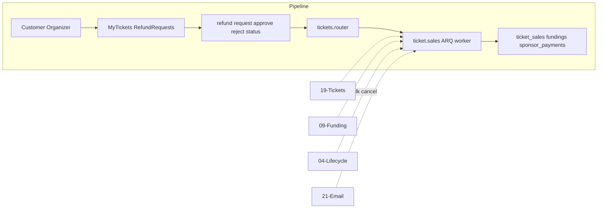

# Refund Processing (ARQ + Redis)

## Initiator

- **Who:** Customer (request ticket refund); Organizer (approve/reject); System (bulk refund on cancel, ARQ worker).
- **When:** My Tickets (Request Refund); Refund Requests screen; Event cancellation (bulk).

## Frontend flow

- **Screen/Widget:** My Tickets (Request Refund; Refund Pending banner); Refund Requests screen (organizer: list, approve/reject); Funding card (Refund Processing + poll refund-status).
- **User action:** Customer requests; organizer approves/rejects. Poll getRefundStatus(eventId) until completed after cancel.
- **API calls:** requestTicketRefund, getRefundRequests, approveTicketRefund, rejectTicketRefund, getRefundStatus (poll 3s). Backend enqueues ARQ refund + email tasks.

## Backend routing

- **Entry:** events/tickets.py (refund request, approve, reject); events/pledge.py GET refund-status. Lifecycle cancel enqueues bulk refund.
- **Handler:** POST tickets/{id}/refund, GET refund-requests, POST approve/reject; GET refund-status. ARQ worker: refund tasks (5) + email (8), 3 retries, refund_failed for admin.

## Service layer

- **Module(s):** ticket.sales (request_refund, approve_refund, reject_refund); funding/sponsor refund tasks; app.worker.main, redis_pool.
- **Main functions:** request_refund (refund_requested); approve → enqueue ARQ → refunded; reject; refund_all_tickets/pledges/sponsor_payments for event (cancel).

## Models and DB

- **Models:** TicketSale, Funding, SponsorPayment (status: refund_processing, refunded, refund_failed). Enums extended.
- **Tables updated/read:** ticket_sales, fundings, sponsor_payments. Redis for ARQ.

## Dependencies

- **Requires:** [Auth](01-auth-users.md), [Tickets](19-tickets.md), [Funding](09-funding-pledges.md), [Event lifecycle](03-events-crud-lifecycle.md), [Email](21-email-notifications.md). Redis + ARQ worker.
- **Triggers / side effects:** Email on approve; bulk on cancel. Frontend polling until completed.

## Prompt

Implement **Refund Processing** for the Crowd Funding Event app. Backend: POST ticket refund request/approve/reject; GET refund-requests and refund-status; ARQ worker for refund and email tasks (3 retries, refund_failed for admin); bulk refund on event cancel. Frontend: My Tickets Request Refund; Refund Requests screen; poll getRefundStatus until completed. Follow the flow, dependencies, and diagrams in this document.

## Flow diagram

## Vulnerabilities

- Only owner can request; only organizer/admin approve/reject. ARQ idempotent or guarded. Redis down: enqueue fallback. refund_failed: admin investigate.

## Improvements

- Immediate completion (no gateway yet); ARQ ready for gateway. Bulk: enqueue all; worker order.

## Feedback

- Customer-initiated + organizer approval; bulk on cancel. [05](05-refund-policy.md), [19](19-tickets.md).
