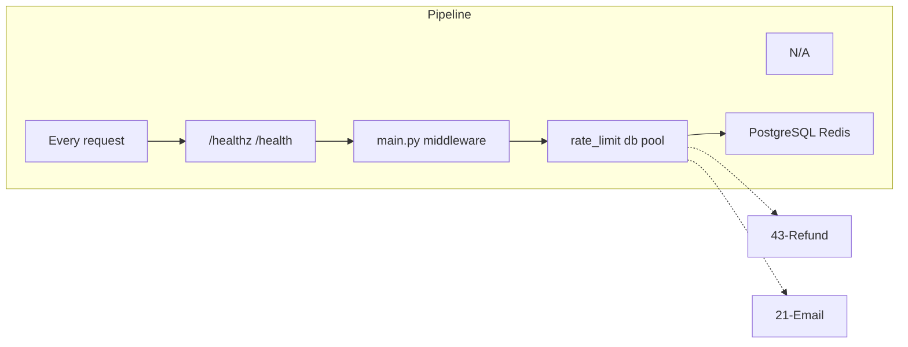

# Backend Scaling & Infrastructure Hardening

## Initiator

- **Who:** System (every request: rate limit, DB pool, health); Developer/Ops (deploy, config).
- **When:** All API requests; health checks (K8s liveness/readiness); capacity-sensitive operations (advisory lock).

## Frontend flow

- **Screen/Widget:** N/A (infrastructure). Frontend may see 429 (rate limit) or 503 (health fail); connection timeouts on network issues.
- **User action:** N/A.
- **API calls:** GET `/healthz` (liveness), GET `/health` (readiness, pings DB). Rate limits apply **per person** (per user ID or per IP); values are configurable in admin. See [Configurable API Rate Limits](61-configurable-rate-limits.md).

## Backend routing

- **Entry:** `main.py`: mount api_router, rate limit middleware (slowapi), CORS, lifespan (DB pool, Redis pool for ARQ). Health: `/healthz` and `/health` (may be on main app or router). **Nginx (deploy):** `location /static/` uses **^~** prefix so it is preferred over regex locations (e.g. `~* \.(png|jpg|...)$`); upload URLs (`/static/uploads/*`) are proxied to the FastAPI backend instead of returning 404 from the Flutter web bundle.
- **Handler:** Rate limit key: **per person** — user_id (authenticated) or IP (unauthenticated); limits are admin-configurable. Advisory lock: pg_advisory_xact_lock(event_id) in purchase_ticket() and create_pledge() to serialize capacity-sensitive ops per event.

## Service layer

- **Module(s):** `app.rate_limit` (dynamic limits from platform_settings; see [61-configurable-rate-limits.md](61-configurable-rate-limits.md)), `app.db.base` (pool: pool_size=10, max_overflow=20, pool_timeout=30, pool_recycle=1800), `app.worker.redis_pool`. Email migrated to ARQ (no BackgroundTasks).
- **Main functions:** limiter with dynamic_limit() per route; get_db_session from pool; get_arq_pool/close_arq_pool in lifespan; enqueue() with Redis-down fallback.

## Models and DB

- **Models:** N/A. PostgreSQL connection pool; Redis for ARQ.
- **Tables updated/read:** Health check: simple SELECT or text("SELECT 1") to verify DB. No schema change for scaling.

## Dependencies

- **Requires:** All features (rate limit and pool affect every request). ARQ and Redis for [Refund](43-refund-processing.md) and [Email](21-email-notifications.md).
- **Triggers / side effects:** Rate limit returns 429; health readiness returns 503 if DB unreachable. Advisory lock blocks concurrent pledge/purchase for same event (other events not blocked).

## Prompt

Implement **Backend Scaling and Infrastructure** for the Crowd Funding Event app. Backend: Rate limit middleware (e.g. slowapi; global, auth, purchase, pledge/register limits); GET /healthz and /health (DB ping); DB pool (pool_size, max_overflow, pool_recycle); Redis and ARQ in lifespan; pg_advisory_xact_lock for purchase and pledge. No frontend change. Follow the flow, dependencies, and diagrams in this document.

## Flow diagram

## Vulnerabilities

- Rate limit by IP can be bypassed by distributed clients; user_id-based limit is better for authenticated routes. Ensure auth and sensitive endpoints have stricter limits (10/min verify, 15/min purchase).
- DB pool exhaustion: pool_size and max_overflow should match expected concurrency; pool_recycle avoids stale connections. Health check should not hold connections long.
- Advisory lock: same event_id blocks; ensure lock is released on commit/rollback (transaction-scoped).

## Improvements

- Remove duplicate endpoints (e.g. capacity-summary vs capacity-info) and unused (e.g. standalone organizer-trust) to reduce surface. Document rate limits in API docs.
- Consider Redis for caching (featured events, event detail) in future; not in current plan.

## Feedback

- Concurrency fix (advisory lock) prevents oversell under burst. Single-query organizer ticket sales and health probes are production-ready steps. Email migration to ARQ makes notifications resilient to restarts.
