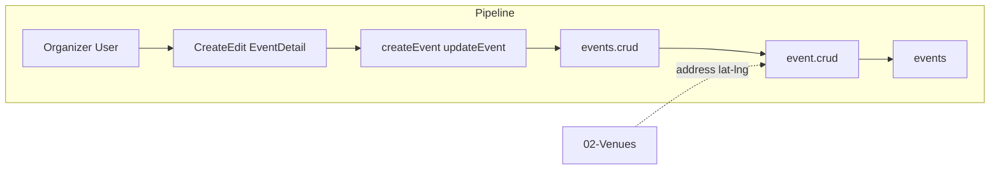

# Parking & Transport / "Getting There"

## Initiator

- **Who:** Organizer (set parking, transit, rideshare, accessibility info); User (view "Getting There" card, tap Get Directions).
- **When:** Event create/edit (transport section); Event Detail ("Getting There" card with icon rows and Get Directions button).

## Frontend flow

- **Screen/Widget:** Create/Edit Event (collapsible transport: parking_info, transit_info, rideshare_info, accessibility_info); Event Detail → "Getting There" card (icon rows for each non-empty field, "Get Directions" button to Google Maps or directions URL).
- **User action:** Fill transport fields (optional); view Getting There; tap Get Directions (opens URL from backend or frontend-built from venue address/lat-lng).
- **API calls:** Transport fields are part of `createEvent()` and `updateEvent()`; event response includes parking_info, transit_info, rideshare_info, accessibility_info and computed directions_url (or frontend builds from venue address). No dedicated transport endpoint.

## Backend routing

- **Entry:** Event create/update in `events/crud.py`; response in _helpers (event_to_response includes transport fields).
- **Handler:** `events/crud.py` create/update accept parking_info, transit_info, rideshare_info, accessibility_info; `_helpers` or schema includes them and directions_url (computed from venue address or lat/lng for Google Maps).

## Service layer

- **Module(s):** `app.services.event.crud`, schema and response helpers.
- **Main functions:** Pass-through for transport fields; directions_url = f"https://www.google.com/maps/dir/?api=1&destination=..." from venue address or lat,lng.

## Models and DB

- **Models:** `Event` (parking_info, transit_info, rideshare_info, accessibility_info). Migration dd4e5f6a7b8c (transport_info).
- **Tables updated/read:** `events`. Four nullable text columns.

## Dependencies

- **Requires:** [Events CRUD](03-events-crud-lifecycle.md), [Venues](02-venues.md) (for address/lat-lng for directions).
- **Triggers / side effects:** None.

## Flow diagram

## Vulnerabilities

- Transport fields are free text; no XSS if rendered as plain text. If ever rendered as HTML, sanitize. directions_url: ensure URL is safe (https, allowlisted domain) to prevent open redirect.
- No PII in transport; safe to show publicly.

## Improvements

- Collapsible section in create/edit keeps form manageable. "Getting There" card only shows when at least one field or directions_url is present (hasTransportInfo getter in Dart).
- Optional: validate URL format for directions_url if stored; else compute on read from venue.

## Feedback

- Four fields + directions_url; simple and clear. Documented in FEATURES as Phase 14. Event create wizard step "Location & Sponsors" includes parking/transport.
